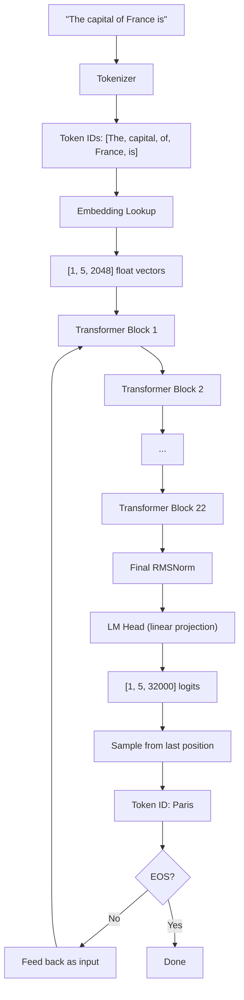
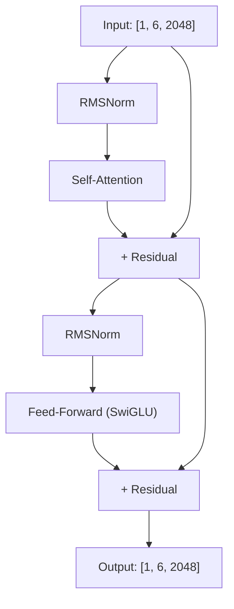

## Introduction

When you type "The capital of France is" into an LLM and it responds "Paris", what actually happened? Not at the API level - at the tensor level. What math ran, what shapes flowed where, and how did a stack of matrix multiplications produce a coherent English word?

This post follows a single prompt through every operation inside a decoder-only transformer. We'll use concrete tensor dimensions from a real model architecture (1.5B parameters, 22 layers, 32 attention heads) so you can see the exact shapes at each step. No hand-waving, no "and then magic happens" - every layer, every reshape, every multiply.

Here's the full journey:



## The Model We're Walking Through

For concrete numbers, we'll use this architecture:

| Parameter | Value |
|-----------|-------|
| `vocab_size` | 32,000 |
| `hidden_size` | 2,048 |
| `num_hidden_layers` | 22 |
| `num_attention_heads` | 32 (query heads) |
| `num_key_value_heads` | 4 (KV heads - this is GQA) |
| `head_dim` | 64 (= 2048 / 32) |
| `intermediate_size` | 5,632 |
| `max_position_embeddings` | 2,048 |
| `rope_theta` | 10,000.0 |

This is a ~1.5B parameter model. Every dimension in this post is real and follows from these numbers.

## Step 1: Tokenization

The model doesn't see text. It sees integers. A **tokenizer** converts the input string into a sequence of token IDs - indices into a fixed vocabulary of 32,000 entries.

```
Input:  "The capital of France is"
Output: [464, 6361, 302, 6629, 374]
```

Tokens don't map 1:1 to words. Common words like "The" are single tokens. Uncommon words get split into subword pieces: "tokenization" might become `["token", "ization"]`. The tokenizer was trained (using BPE or similar) to find the most efficient decomposition of training text into ~32K pieces.

A special **BOS (beginning of sequence)** token is prepended:

```
[1, 464, 6361, 302, 6629, 374]
 ^BOS
```

This gives us 6 tokens. In tensor form: `[1, 6]` - batch size 1, sequence length 6.

## Step 2: Embedding Lookup

Each token ID indexes into an **embedding table** - a learned matrix of shape `[32000, 2048]`. Each of the 32,000 tokens in the vocabulary has a 2,048-dimensional vector that represents its meaning in the model's internal space.

```
embed_tokens.weight: [32000, 2048]

Token 464 ("The")    → row 464    → [2048] vector
Token 6361 ("capital") → row 6361  → [2048] vector
Token 302 ("of")     → row 302    → [2048] vector
Token 6629 ("France") → row 6629  → [2048] vector
Token 374 ("is")     → row 374    → [2048] vector
```

This is a simple table lookup, not a computation. The output is a tensor of shape `[1, 6, 2048]` - 6 tokens, each represented as a 2,048-dimensional vector. These vectors are dense, learned representations where similar concepts end up near each other in the high-dimensional space.

At this point, the model has no idea about **word order** - it just has 6 vectors with no position information. That comes next.

## Step 3: Positional Encoding (RoPE)

Position information isn't added as a separate vector (like the original transformer). Modern models use **Rotary Positional Embeddings (RoPE)**, which encode position by rotating query and key vectors inside the attention mechanism. We'll see this in action during the attention step.

RoPE precomputes cos/sin tables for each position and dimension pair:

```
For head_dim = 64, we have 32 dimension pairs.
Each pair gets a frequency: freq_i = 1 / (10000^(2i/64))

Pair 0:  freq = 1.0          (fast rotation)
Pair 1:  freq = 0.68
Pair 2:  freq = 0.46
...
Pair 31: freq = 0.00001      (very slow rotation)
```

Low-frequency pairs change slowly across positions (capturing coarse distance), high-frequency pairs change quickly (capturing fine-grained ordering). These frequencies are combined with position indices to produce rotation angles.

## Step 4: The Transformer Block (×22)

The embedding tensor now passes through 22 identical transformer blocks. Each block has the same structure:



The input and output of every block have the same shape: `[1, 6, 2048]`. The information gets richer and more contextual with each layer, but the tensor dimensions never change.

Let's walk through every operation inside one block.

### 4a: RMSNorm (Pre-Attention)

Before attention, the input is normalized. **RMSNorm** scales each vector so its root-mean-square equals 1, then multiplies by a learned weight vector:

```
Input x: [1, 6, 2048]

Step 1: Square each element
  x² = x.pow(2)                          → [1, 6, 2048]

Step 2: Mean across the last dimension
  mean_sq = x².mean(dim=-1, keepdim=True) → [1, 6, 1]

Step 3: Add epsilon for stability, take reciprocal square root
  norm = (mean_sq + 1e-5).rsqrt()        → [1, 6, 1]

Step 4: Scale and apply learned weights
  output = (x * norm) * weight            → [1, 6, 2048]
```

The `weight` vector is `[2048]` - one learnable scale per dimension. This normalization stabilizes training by preventing activations from growing or shrinking as they pass through layers.

Why not LayerNorm? RMSNorm skips the mean-centering step (subtracting the mean before scaling). This is simpler, faster, and works just as well in practice.

### 4b: Self-Attention

This is the core mechanism - where each token looks at all previous tokens and decides what's relevant. It has five sub-steps.

#### 4b-i: QKV Projections

Three linear projections create **queries**, **keys**, and **values** from the normalized input:

```
Input: [1, 6, 2048]

Q = input @ W_q    W_q: [2048, 2048]  → Q: [1, 6, 2048]
K = input @ W_k    W_k: [2048, 256]   → K: [1, 6, 256]
V = input @ W_v    W_v: [2048, 256]   → V: [1, 6, 256]
```

Notice K and V are much smaller than Q. This is **Grouped-Query Attention (GQA)**: 32 query heads but only 4 KV heads. Each KV head is shared by 8 query heads. This cuts KV memory by 8× with minimal quality loss.

The projections are reshaped into multi-head format:

```
Q: [1, 6, 2048] → [1, 6, 32, 64]    (32 query heads × 64 dims each)
K: [1, 6, 256]  → [1, 6, 4, 64]     (4 KV heads × 64 dims each)
V: [1, 6, 256]  → [1, 6, 4, 64]     (4 KV heads × 64 dims each)
```

Each head operates on 64 dimensions independently. The idea is that different heads learn to attend to different types of relationships - one head might track syntactic dependencies, another semantic similarity, another coreference.

#### 4b-ii: RoPE (Position Encoding)

Now RoPE is applied to Q and K (not V - values carry content, not position):

```
For each token at position p:
  For each dimension pair (d, d+32) in the 64-dim head:
    angle = p * freq_d
    q_rotated[d]    = q[d] * cos(angle) - q[d+32] * sin(angle)
    q_rotated[d+32] = q[d+32] * cos(angle) + q[d] * sin(angle)
```

After rotation, the dot product between any two queries/keys depends on their **relative** distance, not their absolute positions. Token at position 3 attending to position 1 produces the same geometric relationship as position 100 attending to position 98.

Shapes are unchanged: Q stays `[1, 6, 32, 64]`, K stays `[1, 6, 4, 64]`.

#### 4b-iii: KV Cache Write

During generation, we don't want to recompute K and V for every previous token on every step. The **KV cache** stores them:

```
cache_k: [1, 2048, 4, 64]   (pre-allocated for max sequence length)
cache_v: [1, 2048, 4, 64]

Write K and V into positions 0–5:
  cache_k[:, 0:6] = K
  cache_v[:, 0:6] = V

Read back full history:
  K = cache_k[:, 0:6]  → [1, 6, 4, 64]
  V = cache_v[:, 0:6]  → [1, 6, 4, 64]
```

During prefill (first pass), this is a no-op - we write and immediately read back the same values. The cache pays off during decode, when we only compute K and V for the one new token and read the rest from cache.

#### 4b-iv: Attention Score Computation

Now Q and K are transposed to put the head dimension first, and we compute attention scores:

```
Q: [1, 6, 32, 64] → transpose → [1, 32, 6, 64]
K: [1, 6, 4, 64]  → expand to match Q heads → [1, 32, 6, 64]
V: [1, 6, 4, 64]  → expand to match Q heads → [1, 32, 6, 64]
```

The GQA expansion repeats each KV head 8 times to match the 32 query heads. Head 0's K/V is shared by query heads 0–7, head 1's by query heads 8–15, etc.

Scaled dot-product attention:

```
scores = (Q @ K^T) / sqrt(64)    → [1, 32, 6, 6]
```

This is a 6×6 matrix for each of the 32 heads. Entry `[i, j]` is how much token `i` attends to token `j`. The `sqrt(64)` scaling prevents the dot products from becoming too large (which would push softmax into saturation, producing near-one-hot attention patterns).

#### 4b-v: Causal Mask and Softmax

A **causal mask** prevents tokens from attending to future positions. This is what makes the model autoregressive - token 3 can only see tokens 0, 1, 2, and 3:

```
mask = [
  [  0, -inf, -inf, -inf, -inf, -inf],
  [  0,    0, -inf, -inf, -inf, -inf],
  [  0,    0,    0, -inf, -inf, -inf],
  [  0,    0,    0,    0, -inf, -inf],
  [  0,    0,    0,    0,    0, -inf],
  [  0,    0,    0,    0,    0,    0],
]

scores = scores + mask
```

Adding negative infinity before softmax ensures those positions get zero attention weight:

```
attn_weights = softmax(scores, dim=-1)  → [1, 32, 6, 6]
```

Each row sums to 1.0. The last token ("is") can attend to all 6 tokens, but the first token ("The") can only attend to itself.

#### 4b-vi: Weighted Sum and Output Projection

The attention weights select a weighted combination of value vectors:

```
attn_output = attn_weights @ V    → [1, 32, 6, 64]
```

For the "is" token (position 5), this is a weighted sum of all 6 value vectors, where the weights reflect which tokens the model decided are most relevant for predicting what comes after "is".

Reshape back and project:

```
attn_output: [1, 32, 6, 64] → transpose → [1, 6, 32, 64] → reshape → [1, 6, 2048]

output = attn_output @ W_o    W_o: [2048, 2048]  → [1, 6, 2048]
```

The output projection `W_o` mixes information across heads, allowing them to collaborate.

### 4c: Residual Connection (Post-Attention)

The attention output is **added** to the original block input:

```
h = x + attention(RMSNorm(x))    → [1, 6, 2048]
```

The residual connection is critical. It creates a direct path for gradients to flow backward through the entire network, enabling deep models (22+ layers) to train effectively. It also means each layer only needs to learn the *difference* from the input, not the entire representation from scratch.

### 4d: RMSNorm (Pre-FFN)

Another normalization, identical in structure to 4a, with its own learned weights:

```
normed = RMSNorm(h)    → [1, 6, 2048]
```

### 4e: Feed-Forward Network (SwiGLU)

The FFN is where the model does its "thinking" - transforming each token's representation independently (no cross-token interaction, unlike attention). Modern LLMs use **SwiGLU**, a gated variant:

```
Input: [1, 6, 2048]

gate = input @ W_gate    W_gate: [2048, 5632]  → [1, 6, 5632]
up   = input @ W_up      W_up:   [2048, 5632]  → [1, 6, 5632]

activated = SiLU(gate) * up                     → [1, 6, 5632]

output = activated @ W_down  W_down: [5632, 2048]  → [1, 6, 2048]
```

Three things happen here:

1. **Expansion.** The hidden dimension expands from 2,048 to 5,632 (2.75×). This gives the model more room to compute - more dimensions means more capacity to represent complex functions.

2. **Gating.** `SiLU(gate) * up` is element-wise multiplication. The gate projection, after passing through the SiLU activation (a smooth version of ReLU), learns *which dimensions to activate*. Dimensions where the gate is near zero are suppressed. This is more expressive than applying a single activation function to everything.

3. **Compression.** The result is projected back down to 2,048 dimensions.

SiLU (Sigmoid Linear Unit) is defined as `x * sigmoid(x)`. Unlike ReLU, it's smooth and allows small negative values through, which empirically helps training.

### 4f: Residual Connection (Post-FFN)

```
output = h + FFN(RMSNorm(h))    → [1, 6, 2048]
```

Same pattern as post-attention. The block output has the same shape as the input: `[1, 6, 2048]`.

### What 22 Layers Do

This block repeats 22 times. Each layer refines the token representations:

- **Early layers** (1–5) tend to handle local syntax - part of speech, basic phrase structure, token-level patterns
- **Middle layers** (6–16) build compositional meaning - relating "capital" to "France", understanding "is" as a copula that expects a noun phrase
- **Late layers** (17–22) form the final prediction - converging on "Paris" as the most likely next token given the full context

The residual connections mean information from early layers persists through the entire stack. The model doesn't have to "re-learn" that the input contains "France" at every layer - that information flows directly through the residual stream.

## Step 5: Final Normalization

After all 22 blocks, one more RMSNorm:

```
h: [1, 6, 2048]  →  RMSNorm  →  [1, 6, 2048]
```

This stabilizes the final hidden states before they're projected to vocabulary logits.

## Step 6: The LM Head

The **language model head** is a linear projection from the hidden dimension back to the vocabulary size:

```
lm_head.weight: [32000, 2048]

logits = h @ lm_head.weight^T    → [1, 6, 32000]
```

Each of the 6 token positions now has 32,000 scores - one for every token in the vocabulary. The score at position `[0, 5, 8756]` represents how strongly the model believes token 8756 should follow the "is" token, given all the context.

Many models **tie** the LM head weights to the embedding table. The embedding matrix maps token IDs to vectors; the LM head maps vectors back to token IDs. Using the same matrix for both ensures the input and output spaces are consistent.

## Step 7: Sampling

We only care about the logits at the **last position** - position 5, after "is". This gives us a vector of 32,000 raw scores:

```
last_logits = logits[0, -1, :]    → [32000]
```

These raw logits might look like:

```
Token 1 (""):       -2.1
Token 2 ("the"):    -1.3
...
Token 8756 ("Paris"):  8.7    ← highest
Token 8757 ("Lyon"):   4.2
Token 8758 ("Berlin"): 3.1
...
Token 31999 ("zzz"):  -15.3
```

### Temperature

Temperature scales the logits before converting to probabilities. It controls randomness:

```
scaled = last_logits / temperature
```

- `temperature = 0` → pick the argmax (greedy, deterministic)
- `temperature = 0.7` → sharpen the distribution, favor high-probability tokens
- `temperature = 1.5` → flatten the distribution, more randomness

### Softmax

Logits are converted to a probability distribution:

```
probs = softmax(scaled)    → [32000], sums to 1.0
```

After softmax with temperature 0.7, "Paris" might have probability 0.82, "Lyon" 0.05, "Berlin" 0.03, etc.

### Top-k and Top-p Filtering

Before sampling, low-probability tokens are removed:

**Top-k** keeps only the k highest-scoring tokens:
```
Keep top 50 tokens, set the rest to probability 0.
```

**Top-p** (nucleus sampling) keeps the smallest set whose cumulative probability exceeds p:
```
Sort by probability descending.
Token "Paris" (0.82) - cumulative: 0.82 → keep
Token "Lyon" (0.05) - cumulative: 0.87 → keep
Token "Berlin" (0.03) - cumulative: 0.90 → keep (just crossed p=0.9)
Token "Rome" (0.02) - cumulative: 0.92 → remove
...all remaining → remove
```

Top-p is adaptive - when the model is confident, only 1–3 tokens survive. When it's uncertain, dozens might pass.

### Token Selection

Finally, a token is sampled from the filtered distribution:

```
next_token = multinomial(filtered_probs)    → 8756 ("Paris")
```

With greedy decoding (temperature 0), this is always the argmax. With stochastic sampling, it's random weighted by the probabilities.

## Step 8: The Autoregressive Decode Loop

We have our first generated token: "Paris" (ID 8756). Now the process repeats - but with a critical optimization.

### Prefill vs. Decode

The first pass (processing the full prompt) is called **prefill**. It processes all 6 tokens in parallel - a single batched forward pass through all 22 layers. This is fast because modern GPUs excel at large matrix multiplications.

Every subsequent pass is a **decode** step. We only feed the single newly generated token:

```
Input: [1, 1]  (just token 8756, "Paris")
```

This single token passes through all 22 layers, but at each attention step:

1. Compute Q, K, V for this one token
2. Write K, V into the cache at position 6
3. Read the **full** cache (positions 0–6) for K, V
4. Compute attention: this token attending to all 7 tokens (6 prompt + 1 new)

```
Q: [1, 1, 32, 64]    (one token's queries)
K: [1, 7, 4, 64]     (seven tokens' keys, from cache)
V: [1, 7, 4, 64]     (seven tokens' values, from cache)

scores = Q @ K^T      → [1, 32, 1, 7]   (one query attending to 7 keys)
attn = softmax(scores) @ V  → [1, 32, 1, 64]
```

No causal mask is needed during decode - there's only one query position, and it's allowed to see everything before it.

The KV cache is why decode is fast: we compute Q, K, V for **one** token instead of recomputing for all previous tokens. Without the cache, generating N tokens would require O(N²) compute because you'd reprocess the full sequence at each step. With the cache, each step is O(N) - read the cached keys/values, compute one new attention.

### The Full Loop

```
Step 0 (prefill):  Input [1, 464, 6361, 302, 6629, 374]  → Predict: "Paris"
Step 1 (decode):   Input [8756]                           → Predict: "."
Step 2 (decode):   Input [13]                             → Predict: EOS
```

At each decode step:
1. Feed the last generated token through all 22 layers
2. Use the KV cache for all previous context
3. Extract logits at the last (only) position
4. Sample the next token
5. Check if it's EOS - if yes, stop. If no, go to step 1.

### The Speed Profile

The two phases have very different performance characteristics:

| Phase | Tokens Processed | Bottleneck | Speed |
|-------|-----------------|------------|-------|
| Prefill | All prompt tokens at once | Compute (large matmuls) | Fast (thousands of tok/s on GPU) |
| Decode | One token at a time | Memory bandwidth (reading KV cache) | Slow (tens of tok/s on GPU) |

Prefill is **compute-bound** - the GPU does massive matrix multiplications on all prompt tokens in parallel. Decode is **memory-bandwidth-bound** - the GPU reads the entire KV cache from memory for each token, but only does a small amount of compute. This is why you see much higher tokens/second for prefill than decode in inference benchmarks.

## Step 9: EOS - When to Stop

The model has a special **end-of-sequence (EOS)** token in its vocabulary. When this token is sampled as the next prediction, generation stops:

```
if next_token == tokenizer.eos_token_id:
    break
```

If the model doesn't produce EOS, generation continues until it hits the configured `max_tokens` limit. Different models use different EOS tokens - some use `</s>`, others use `<|endoftext|>`, others use `<|im_end|>`. The tokenizer knows which one to look for.

## The Complete Data Flow

Let's trace the exact tensor shapes through the entire forward pass for our 6-token prompt:

```
"The capital of France is"
    ↓ tokenizer
[1, 464, 6361, 302, 6629, 374]           → [1, 6]         int64
    ↓ embedding lookup
embed_tokens([1, 6])                      → [1, 6, 2048]   float
    ↓ transformer block (×22)
    │
    ├─ RMSNorm                            → [1, 6, 2048]
    ├─ Q = W_q @ x                        → [1, 6, 2048] → reshape [1, 6, 32, 64]
    ├─ K = W_k @ x                        → [1, 6, 256]  → reshape [1, 6, 4, 64]
    ├─ V = W_v @ x                        → [1, 6, 256]  → reshape [1, 6, 4, 64]
    ├─ RoPE(Q, K)                         → shapes unchanged
    ├─ cache_k[:, 0:6] = K
    ├─ K expand (GQA 4→32)               → [1, 6, 32, 64]
    ├─ V expand (GQA 4→32)               → [1, 6, 32, 64]
    ├─ scores = Q @ K^T / 8              → [1, 32, 6, 6]
    ├─ scores += causal_mask
    ├─ attn = softmax(scores) @ V         → [1, 32, 6, 64]
    ├─ reshape + W_o                      → [1, 6, 2048]
    ├─ + residual                         → [1, 6, 2048]
    ├─ RMSNorm                            → [1, 6, 2048]
    ├─ gate = W_gate @ x                  → [1, 6, 5632]
    ├─ up = W_up @ x                      → [1, 6, 5632]
    ├─ SiLU(gate) * up                    → [1, 6, 5632]
    ├─ W_down                             → [1, 6, 2048]
    └─ + residual                         → [1, 6, 2048]
    ↓
final RMSNorm                             → [1, 6, 2048]
    ↓
lm_head (linear)                          → [1, 6, 32000]
    ↓
logits[:, -1, :]                          → [32000]
    ↓ temperature + top-k + top-p + softmax + sample
next_token                                → scalar (e.g., 8756)
```

## Parameter Count

Where do the 1.5 billion parameters live?

| Component | Shape | Params | Count |
|-----------|-------|--------|-------|
| Embedding | [32000, 2048] | 65.5M | ×1 |
| Per layer: Q proj | [2048, 2048] | 4.2M | ×22 |
| Per layer: K proj | [2048, 256] | 524K | ×22 |
| Per layer: V proj | [2048, 256] | 524K | ×22 |
| Per layer: O proj | [2048, 2048] | 4.2M | ×22 |
| Per layer: Gate proj | [2048, 5632] | 11.5M | ×22 |
| Per layer: Up proj | [2048, 5632] | 11.5M | ×22 |
| Per layer: Down proj | [5632, 2048] | 11.5M | ×22 |
| Per layer: 2× RMSNorm | [2048] × 2 | 4K | ×22 |
| Final RMSNorm | [2048] | 2K | ×1 |
| LM Head | [32000, 2048] | 65.5M | ×1 (often tied to embedding) |

The bulk of parameters (~96%) are in the per-layer weight matrices, with the attention projections and FFN projections roughly equal in size. The embedding/LM head tables are large but shared (tied), so they count once.

## What Each Layer Contributes

A natural question: what does each of the 22 layers actually *do*? Research on LLM interpretability suggests a rough division:

**Layers 1–3: Token-level features.** The model identifies basic properties - is this a noun, a verb, a punctuation mark? Is it capitalized? What language is it?

**Layers 4–8: Local patterns.** Bigram and trigram patterns emerge. The model recognizes "capital of" as a prepositional phrase, "France" as a proper noun entity.

**Layers 9–16: Relational reasoning.** The model connects "capital" to "France" across the attention mechanism. It retrieves the factual association: France → capital → Paris. The attention heads in these layers show strong entity-attribute patterns.

**Layers 17–20: Prediction formation.** The representation at the "is" position converges toward tokens that complete the sentence. Multiple candidate predictions are refined across layers.

**Layers 21–22: Final refinement.** The model commits to "Paris" and adjusts the logit distribution to give it high confidence. These layers often sharpen the prediction rather than changing it.

The residual stream carries all of this forward. Information from layer 3 ("France is an entity") is still present in layer 22 - it doesn't need to be recomputed, just refined.

## Key Takeaways

**An LLM is a giant lookup table followed by a cascade of matrix multiplications.** Embedding is a lookup. Attention is matrix multiply + softmax + matrix multiply. FFN is matrix multiply + activation + matrix multiply. That's it - repeated 22 times with residual connections.

**The model never "understands" text.** It operates on vectors - 2,048-dimensional points in a learned space. The fact that "Paris" emerges as the prediction is because the training process arranged the weight matrices such that this specific cascade of multiplications, applied to this specific input, produces a high score for token 8756.

**The KV cache is the key inference optimization.** Without it, generating 100 tokens requires processing ~100 + 99 + 98 + ... + 1 = ~5,000 token forward passes. With it, you process ~100 + 1 + 1 + ... + 1 = ~200 forward passes. That's a 25× reduction.

**Attention is where tokens interact.** The FFN processes each token independently. Only the attention mechanism allows information to flow between token positions. This is why attention patterns are so studied - they reveal what the model considers relevant.

**Every generated token is a fresh decision.** The model doesn't have a "plan" for the full response. It generates "Paris", feeds it back in, and then decides what comes next. The appearance of coherent multi-sentence responses emerges from the model consistently making good single-token predictions conditioned on the growing context.
