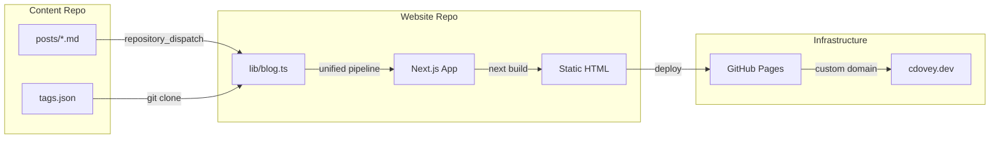
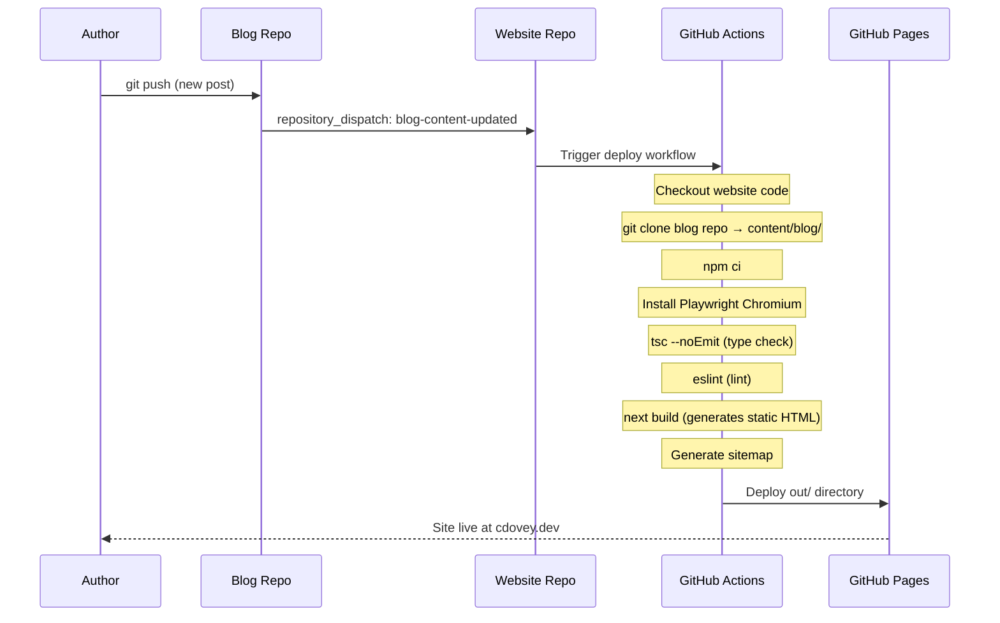

## Who I Am

I'm Chase Dovey — a cloud architect and AI engineer based in Houston, Texas. I came up through systems administration, moved into cloud engineering, and now spend most of my time designing scalable infrastructure and building intelligent systems. My work sits at the intersection of cloud platforms and artificial intelligence — I like building things that are powerful, maintainable, and well-documented.

This blog is where I write about what I'm learning, building, and thinking about. No fluff, no listicles — just technical depth on the things I actually work with.

## What I Write About

Every post on this blog is tagged with one or more of the following categories. This list is the canonical set of topics I cover, and it updates automatically as I expand into new areas:

<!-- TAG_CATALOG -->

If you're here for a specific topic, the [blog index](/blog/) lets you filter by tag.

## How This Site Is Built

I built this site as a two-repo architecture, and it's a good example of the kind of engineering I write about — so let me walk through it in detail.

### Architecture Overview

The system is split into two independent GitHub repositories with a clear separation of concerns:



| Repo | Purpose | Contains |
|------|---------|----------|
| [`mrcloudchase-blog`](https://github.com/mrcloudchase/mrcloudchase-blog) | Content | Markdown posts, tag definitions, rebuild trigger workflow |
| [`mrcloudchase.github.io`](https://github.com/mrcloudchase/mrcloudchase.github.io) | Application | Next.js site, Markdown processing pipeline, components, CI/CD |

The content repo has no build system, no dependencies, and no configuration beyond a single GitHub Actions workflow. It's just Markdown. The website repo is a full TypeScript application with strict type checking, linting, and a multi-stage build pipeline.

### The Content Pipeline

Every blog post starts as a Markdown file with YAML frontmatter:

```yaml
---
title: "Post Title"
date: "2026-03-02"
excerpt: "Short description for cards and SEO."
author: "Chase Dovey"
tags: ["AI", "Architecture"]
draft: false
---

## Post content starts here...
```

At build time, the website clones the content repo into a gitignored `content/blog/` directory. From there, `lib/blog.ts` processes every `.md` file through a pipeline that parses the frontmatter, transforms the Markdown into HTML, and generates static pages.

The Markdown processing uses the [unified](https://unifiedjs.com/) ecosystem — a pipeline of parsers and transformers that convert Markdown to an abstract syntax tree, transform it, and serialize it to HTML:

```
┌─────────────────────────────────────────────────────────────┐
│                    Markdown Processing                       │
├─────────────────────────────────────────────────────────────┤
│                                                             │
│  raw .md file                                               │
│       │                                                     │
│       ▼                                                     │
│  ┌──────────┐   Parse Markdown into AST                     │
│  │  remark   │                                              │
│  │  -parse   │                                              │
│  └────┬─────┘                                               │
│       │                                                     │
│       ▼                                                     │
│  ┌──────────┐   Add tables, strikethrough, task lists,      │
│  │  remark   │   autolinks (GitHub Flavored Markdown)       │
│  │  -gfm     │                                              │
│  └────┬─────┘                                               │
│       │                                                     │
│       ▼                                                     │
│  ┌──────────┐   Convert Markdown AST → HTML AST             │
│  │  remark   │   (preserves raw HTML via                    │
│  │  -rehype  │    allowDangerousHtml: true)                 │
│  └────┬─────┘                                               │
│       │                                                     │
│       ▼                                                     │
│  ┌──────────┐   Process raw HTML fragments                  │
│  │  rehype   │   into proper HTML AST nodes                 │
│  │  -raw     │                                              │
│  └────┬─────┘                                               │
│       │                                                     │
│       ▼                                                     │
│  ┌──────────┐   Render Mermaid code blocks into             │
│  │  rehype   │   inline SVGs using Playwright               │
│  │  -mermaid │   (headless Chromium at build time)          │
│  └────┬─────┘                                               │
│       │                                                     │
│       ▼                                                     │
│  ┌──────────┐   Serialize HTML AST back to                  │
│  │  rehype   │   an HTML string                             │
│  │  -stringify│                                             │
│  └────┬─────┘                                               │
│       │                                                     │
│       ▼                                                     │
│  contentHtml string → dangerouslySetInnerHTML               │
│                                                             │
└─────────────────────────────────────────────────────────────┘
```

Each plugin in the chain does one thing. `remark-parse` tokenizes Markdown into an AST. `remark-gfm` extends it with GitHub Flavored Markdown features. `remark-rehype` bridges the Markdown AST to an HTML AST. `rehype-raw` handles inline HTML that was passed through. `rehype-mermaid` finds fenced code blocks tagged as `mermaid` and renders them to inline SVGs using a headless Chromium instance via Playwright — so diagrams are baked into the HTML at build time, not rendered client-side. `rehype-stringify` serializes the final AST to an HTML string.

The resulting HTML is injected into the page component via `dangerouslySetInnerHTML` and styled by a `.prose-blog` CSS class that applies the site's terminal aesthetic to all standard HTML elements.

### The CI/CD Pipeline

Two workflows coordinate the build and deploy cycle:



The website also rebuilds on direct pushes to its own `main` branch and on a daily cron schedule. The cron catches anything that might have been missed — like updated GitHub project data that's fetched from the API at build time.

### The Tag System

Tags aren't freeform strings — they're validated at build time against a central definition. The content repo has a `tags.json` file at its root that defines every valid tag:

```json
{
  "tags": [
    { "name": "AI", "description": "AI engineering, LLM integrations, and agentic systems" },
    { "name": "Security", "description": "Application security, prompt injection, ..." }
  ]
}
```

When the site builds, `lib/blog.ts` loads this file and does two things:

1. **Validates** every post's frontmatter tags against the defined set — any undefined tag produces a build warning
2. **Injects** the full tag catalog into posts that contain a `<!-- TAG_CATALOG -->` marker (like this one)

This means the "What I Write About" section above is generated at build time from `tags.json`. I add a tag to the JSON, push, and it appears here on the next deploy. No manual updates to blog posts required.

On the website side, `app/blog/page.tsx` aggregates all tags from published posts into a deduplicated, sorted list and passes them to a client-side `BlogPostGrid` component that renders interactive tag filter pills. Clicking a tag filters the post grid to show only matching posts.

### The Stack

| Layer | Technology | Details |
|-------|-----------|---------|
| **Framework** | Next.js 16 | App Router, `output: 'export'` (fully static, no Node.js server) |
| **Language** | TypeScript 5.9 | Strict mode, path aliases (`@/*`) |
| **Styling** | Tailwind CSS 4 | Custom dark terminal theme with neon/cyber/surface color palettes |
| **Markdown** | unified ecosystem | remark-parse, remark-gfm, remark-rehype, rehype-raw, rehype-mermaid, rehype-stringify |
| **Diagrams** | Mermaid + Playwright | Server-side SVG rendering via headless Chromium at build time |
| **Hosting** | GitHub Pages | Custom domain at [cdovey.dev](https://cdovey.dev), HTTPS via GitHub |
| **CI/CD** | GitHub Actions | Type check → lint → build → deploy on every push and `repository_dispatch` |
| **Runtime** | Node.js 22 LTS | Build-time only — no runtime server |

### Why Two Repos?

Separating content from code gives me a clean boundary:

- **Publish a post** without touching the website codebase
- **Refactor the site** without content commits cluttering the history
- **Different CI concerns** — the content repo only needs to fire a dispatch event; the website repo runs type checking, linting, and a full Next.js build
- **Different access patterns** — the content repo is just Markdown that any editor can write to; the website repo is a TypeScript application with strict tooling

The tradeoff is coordination. When both repos have changes, the website must be pushed first so that the blog push (which triggers a rebuild) picks up the latest site code. That ordering is enforced by convention, not automation — but it's a small price for the separation.

### The Aesthetic

The terminal theme is intentional. I spend most of my day in a terminal, so it felt right to build a site that reflects that. The design system uses three custom color palettes — `neon` (green), `cyber` (cyan), and `surface` (dark grays) — with a purple accent. Headings and code use JetBrains Mono. Body text uses Inter. Everything sits on dark backgrounds with subtle borders and glow effects.

The CSS is built on Tailwind CSS 4 with a set of reusable component classes (`terminal-card`, `terminal-window`, `tag-pill`, `prose-blog`) defined in `globals.css` using Tailwind's `@layer components`. The `.prose-blog` class handles all Markdown-rendered content — headings, links, code blocks, tables, blockquotes, and Mermaid SVGs — so blog posts get consistent styling without per-element class injection.

## What's Next

Check out the [blog](/blog/) to see what I've published so far, take a look at my [projects](/projects/), or connect with me on [GitHub](https://github.com/mrcloudchase).

```bash
$ echo "Let's build something."
Let's build something.
```
