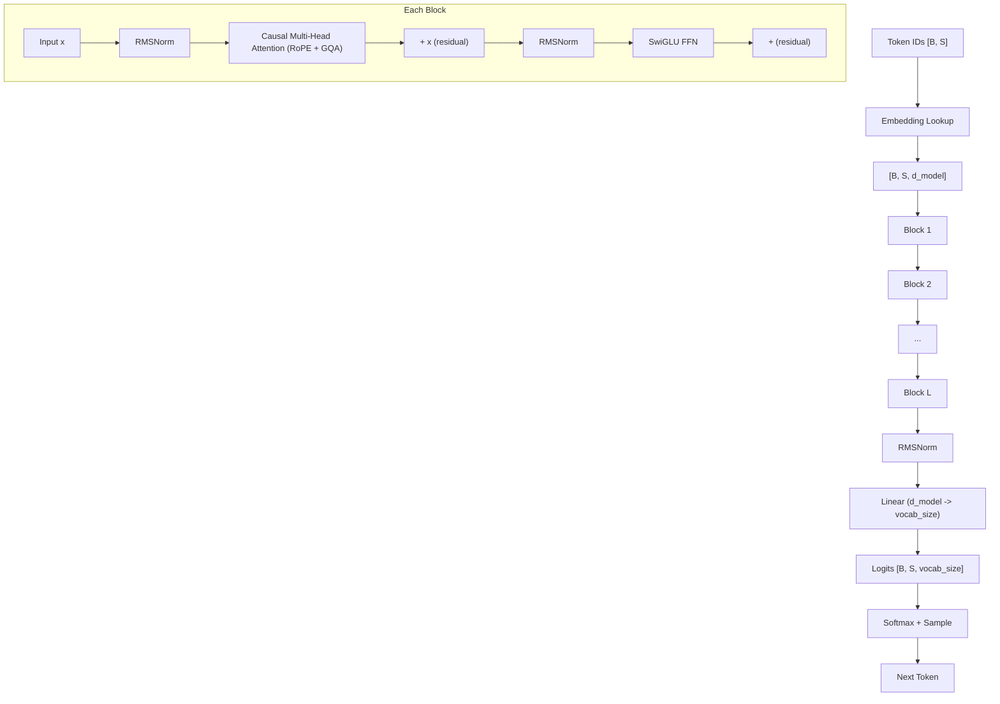

## Introduction

Every modern LLM (GPT, Claude, LLaMA) traces back to a single equation from 1943. The path from that equation to a decoder-only transformer is surprisingly direct: each generation solves a specific limitation of the previous one, and the math builds on itself cleanly.

This post walks that path. Start with a single neuron. Build through perceptrons, multilayer networks, and backpropagation. Arrive at the transformer. The goal: show that a transformer is not a magical black box. It is the logical endpoint of solving one problem at a time, for 80 years.

## The Calculus of Neural Activity (1943)

McCulloch and Pitts published "A Logical Calculus of the Ideas Immanent in Nervous Activity" in 1943, proposing the first mathematical model of a neuron. The idea: a neuron receives inputs, weights them, sums the result, and fires if the sum exceeds a threshold:

```
y = f(w1*x1 + w2*x2 + ... + wn*xn + b)
```

Where:
- `xi` are the inputs (signals from other neurons)
- `wi` are the weights (how much each input matters)
- `b` is the bias (the threshold, shifted)
- `f` is the activation function (the firing rule)
- `y` is the output

A weighted sum followed by a nonlinear function. That is it. Everything in deep learning, every layer of every transformer, is a variation of this equation.

<svg viewBox="0 0 440 140" xmlns="http://www.w3.org/2000/svg" style="max-width:520px;width:100%;height:auto;display:block;margin:1.5em auto;">
  <rect width="440" height="140" rx="8" fill="#181818"/>
  <!-- input nodes -->
  <circle cx="40" cy="30" r="14" fill="#333" stroke="#888" stroke-width="1.5"/>
  <text x="40" y="35" fill="#ccc" font-family="monospace" font-size="12" text-anchor="middle">x₁</text>
  <circle cx="40" cy="70" r="14" fill="#333" stroke="#888" stroke-width="1.5"/>
  <text x="40" y="75" fill="#ccc" font-family="monospace" font-size="12" text-anchor="middle">x₂</text>
  <circle cx="40" cy="110" r="14" fill="#333" stroke="#888" stroke-width="1.5"/>
  <text x="40" y="115" fill="#ccc" font-family="monospace" font-size="12" text-anchor="middle">xₙ</text>
  <!-- weight labels -->
  <text x="105" y="24" fill="#999" font-family="monospace" font-size="9" text-anchor="middle">w₁</text>
  <text x="105" y="68" fill="#999" font-family="monospace" font-size="9" text-anchor="middle">w₂</text>
  <text x="105" y="108" fill="#999" font-family="monospace" font-size="9" text-anchor="middle">wₙ</text>
  <!-- edges: inputs to sum -->
  <line x1="54" y1="30" x2="156" y2="65" stroke="#555" stroke-width="1.5"/>
  <line x1="54" y1="70" x2="156" y2="70" stroke="#555" stroke-width="1.5"/>
  <line x1="54" y1="110" x2="156" y2="75" stroke="#555" stroke-width="1.5"/>
  <!-- signal pulses on edges -->
  <circle r="4" fill="#4ade80" opacity="0">
    <animateMotion path="M54,30 L156,65" dur="3s" repeatCount="indefinite" keyTimes="0;0.3;1" keyPoints="0;1;1" calcMode="linear"/>
    <animate attributeName="opacity" values="0;0.9;0.9;0;0" keyTimes="0;0.01;0.28;0.3;1" dur="3s" repeatCount="indefinite"/>
  </circle>
  <circle r="4" fill="#4ade80" opacity="0">
    <animateMotion path="M54,70 L156,70" dur="3s" repeatCount="indefinite" keyTimes="0;0.3;1" keyPoints="0;1;1" calcMode="linear"/>
    <animate attributeName="opacity" values="0;0.9;0.9;0;0" keyTimes="0;0.01;0.28;0.3;1" dur="3s" repeatCount="indefinite"/>
  </circle>
  <circle r="4" fill="#4ade80" opacity="0">
    <animateMotion path="M54,110 L156,75" dur="3s" repeatCount="indefinite" keyTimes="0;0.3;1" keyPoints="0;1;1" calcMode="linear"/>
    <animate attributeName="opacity" values="0;0.9;0.9;0;0" keyTimes="0;0.01;0.28;0.3;1" dur="3s" repeatCount="indefinite"/>
  </circle>
  <!-- sum node -->
  <circle cx="170" cy="70" r="18" fill="#333" stroke="#888" stroke-width="1.5">
    <animate attributeName="stroke" values="#888;#888;#4ade80;#4ade80;#888;#888" keyTimes="0;0.29;0.31;0.5;0.52;1" dur="3s" repeatCount="indefinite"/>
  </circle>
  <text x="170" y="75" fill="#ccc" font-family="monospace" font-size="11" text-anchor="middle">E + b</text>
  <!-- edge: sum to activation -->
  <line x1="188" y1="70" x2="256" y2="70" stroke="#555" stroke-width="1.5"/>
  <!-- signal pulse: sum to activation -->
  <circle r="4" fill="#22d3ee" opacity="0">
    <animateMotion path="M188,70 L256,70" dur="3s" repeatCount="indefinite" keyTimes="0;0.5;0.7;1" keyPoints="0;0;1;1" calcMode="linear"/>
    <animate attributeName="opacity" values="0;0;0.9;0.9;0;0" keyTimes="0;0.49;0.5;0.68;0.7;1" dur="3s" repeatCount="indefinite"/>
  </circle>
  <!-- activation node -->
  <circle cx="270" cy="70" r="18" fill="#333" stroke="#888" stroke-width="1.5">
    <animate attributeName="stroke" values="#888;#888;#22d3ee;#22d3ee;#888;#888" keyTimes="0;0.69;0.71;0.82;0.84;1" dur="3s" repeatCount="indefinite"/>
  </circle>
  <text x="270" y="75" fill="#ccc" font-family="monospace" font-size="11" text-anchor="middle">f(x)</text>
  <!-- edge: activation to output -->
  <line x1="288" y1="70" x2="366" y2="70" stroke="#555" stroke-width="1.5"/>
  <!-- signal pulse: activation to output -->
  <circle r="4" fill="#fbbf24" opacity="0">
    <animateMotion path="M288,70 L366,70" dur="3s" repeatCount="indefinite" keyTimes="0;0.82;0.97;1" keyPoints="0;0;1;1" calcMode="linear"/>
    <animate attributeName="opacity" values="0;0;0.9;0.9;0" keyTimes="0;0.81;0.82;0.96;0.97" dur="3s" repeatCount="indefinite"/>
  </circle>
  <!-- output node -->
  <circle cx="380" cy="70" r="14" fill="#333" stroke="#888" stroke-width="1.5">
    <animate attributeName="stroke" values="#888;#888;#fbbf24;#fbbf24;#888" keyTimes="0;0.96;0.97;0.99;1" dur="3s" repeatCount="indefinite"/>
  </circle>
  <text x="380" y="75" fill="#ccc" font-family="monospace" font-size="12" text-anchor="middle">y</text>
</svg>

The McCulloch-Pitts neuron used a step function for `f`: output 1 if the sum exceeds the threshold, 0 otherwise. This models the all-or-nothing firing of biological neurons. The weights were **hand-set**, not learned. There was no training algorithm, no automatic way to find the right weights. That limitation would take 15 years to solve.

## The Perceptron (1958)

Rosenblatt took the McCulloch-Pitts model, called it the **perceptron**, and added the missing piece: a **learning rule**. Instead of hand-setting weights, the perceptron adjusts them automatically based on errors:

```
wi ← wi + α * (y_true - y_pred) * xi
```

Where `α` is the learning rate. The logic:
- If the prediction is correct, `y_true - y_pred = 0`, no update
- If the prediction is too low, increase weights for active inputs
- If the prediction is too high, decrease weights for active inputs

A single perceptron can learn any **linearly separable** function: AND, OR, NOT. It finds a hyperplane that separates two classes.

Geometrically, the learned weights define a line (or hyperplane in higher dimensions) that separates two classes. Everything on one side maps to class 1, the other side to class 0:

<svg viewBox="0 0 400 320" xmlns="http://www.w3.org/2000/svg" style="max-width:460px;width:100%;height:auto;display:block;margin:1.5em auto;">
  <!-- background -->
  <rect width="400" height="320" rx="8" fill="#181818"/>
  <!-- axes -->
  <line x1="60" y1="270" x2="370" y2="270" stroke="#555" stroke-width="1.5"/>
  <line x1="60" y1="270" x2="60" y2="30" stroke="#555" stroke-width="1.5"/>
  <!-- axis labels -->
  <text x="370" y="290" fill="#999" font-family="monospace" font-size="13" text-anchor="end">x₁</text>
  <text x="40" y="35" fill="#999" font-family="monospace" font-size="13" text-anchor="end">x₂</text>
  <!-- grid lines -->
  <line x1="60" y1="210" x2="370" y2="210" stroke="#333" stroke-width="0.5" stroke-dasharray="4"/>
  <line x1="60" y1="150" x2="370" y2="150" stroke="#333" stroke-width="0.5" stroke-dasharray="4"/>
  <line x1="60" y1="90" x2="370" y2="90" stroke="#333" stroke-width="0.5" stroke-dasharray="4"/>
  <line x1="140" y1="270" x2="140" y2="30" stroke="#333" stroke-width="0.5" stroke-dasharray="4"/>
  <line x1="220" y1="270" x2="220" y2="30" stroke="#333" stroke-width="0.5" stroke-dasharray="4"/>
  <line x1="300" y1="270" x2="300" y2="30" stroke="#333" stroke-width="0.5" stroke-dasharray="4"/>
  <!-- class 0 points (red) -->
  <circle cx="90" cy="250" r="7" fill="#ef4444" opacity="0.9"/>
  <circle cx="110" cy="240" r="7" fill="#ef4444" opacity="0.9"/>
  <circle cx="130" cy="230" r="7" fill="#ef4444" opacity="0.9"/>
  <circle cx="160" cy="215" r="7" fill="#ef4444" opacity="0.9"/>
  <circle cx="190" cy="200" r="7" fill="#ef4444" opacity="0.9"/>
  <circle cx="220" cy="195" r="7" fill="#ef4444" opacity="0.9"/>
  <circle cx="250" cy="180" r="7" fill="#ef4444" opacity="0.9"/>
  <circle cx="280" cy="160" r="7" fill="#ef4444" opacity="0.9"/>
  <!-- class 1 points (green) -->
  <circle cx="90" cy="160" r="7" fill="#4ade80" opacity="0.9"/>
  <circle cx="110" cy="100" r="7" fill="#4ade80" opacity="0.9"/>
  <circle cx="120" cy="140" r="7" fill="#4ade80" opacity="0.9"/>
  <circle cx="150" cy="110" r="7" fill="#4ade80" opacity="0.9"/>
  <circle cx="170" cy="80" r="7" fill="#4ade80" opacity="0.9"/>
  <circle cx="140" cy="60" r="7" fill="#4ade80" opacity="0.9"/>
  <circle cx="200" cy="70" r="7" fill="#4ade80" opacity="0.9"/>
  <circle cx="230" cy="55" r="7" fill="#4ade80" opacity="0.9"/>
  <!--
    Animated decision boundary: 4 steps over 10s
    Step 0 (0-20%):   y1=110, y2=190  - wrong tilt, 3 misclassified
    Step 1 (25-45%):  y1=155, y2=155  - flat, 1 misclassified
    Step 2 (50-70%):  y1=200, y2=110  - close, 0 misclassified
    Step 3 (75-100%): y1=240, y2=64   - converged
  -->
  <line x1="60" x2="320" stroke="#22d3ee" stroke-width="2.5" stroke-dasharray="8,4">
    <animate attributeName="y1" values="110;110;155;155;200;200;240;240" keyTimes="0;0.2;0.25;0.45;0.5;0.7;0.75;1" dur="10s" repeatCount="indefinite"/>
    <animate attributeName="y2" values="190;190;155;155;110;110;64;64" keyTimes="0;0.2;0.25;0.45;0.5;0.7;0.75;1" dur="10s" repeatCount="indefinite"/>
  </line>
  <!-- misclassification rings: yellow highlight on wrong-side points -->
  <!-- green (90,160): misclassified in steps 0 and 1 -->
  <circle cx="90" cy="160" r="13" fill="none" stroke="#fbbf24" stroke-width="2">
    <animate attributeName="opacity" values="0.9;0.9;0.9;0.9;0;0;0;0" keyTimes="0;0.2;0.25;0.45;0.5;0.7;0.75;1" dur="10s" repeatCount="indefinite"/>
  </circle>
  <!-- green (120,140): misclassified in step 0 only -->
  <circle cx="120" cy="140" r="13" fill="none" stroke="#fbbf24" stroke-width="2">
    <animate attributeName="opacity" values="0.9;0.9;0;0;0;0;0;0" keyTimes="0;0.2;0.25;0.45;0.5;0.7;0.75;1" dur="10s" repeatCount="indefinite"/>
  </circle>
  <!-- red (280,160): misclassified in step 0 only -->
  <circle cx="280" cy="160" r="13" fill="none" stroke="#fbbf24" stroke-width="2">
    <animate attributeName="opacity" values="0.9;0.9;0;0;0;0;0;0" keyTimes="0;0.2;0.25;0.45;0.5;0.7;0.75;1" dur="10s" repeatCount="indefinite"/>
  </circle>
  <!-- step counter: cycles through Update 1/2/3 then equation at convergence -->
  <text x="385" y="48" fill="#fbbf24" font-family="monospace" font-size="10" text-anchor="end">
    Update 1
    <animate attributeName="opacity" values="1;1;0;0;0;0;0;0" keyTimes="0;0.2;0.25;0.45;0.5;0.7;0.75;1" dur="10s" repeatCount="indefinite"/>
  </text>
  <text x="385" y="48" fill="#fbbf24" font-family="monospace" font-size="10" text-anchor="end">
    Update 2
    <animate attributeName="opacity" values="0;0;0;1;1;0;0;0" keyTimes="0;0.19;0.25;0.26;0.45;0.5;0.7;1" dur="10s" repeatCount="indefinite"/>
  </text>
  <text x="385" y="48" fill="#fbbf24" font-family="monospace" font-size="10" text-anchor="end">
    Update 3
    <animate attributeName="opacity" values="0;0;0;0;0;1;1;0" keyTimes="0;0.2;0.25;0.45;0.5;0.51;0.7;1" dur="10s" repeatCount="indefinite"/>
  </text>
  <text x="385" y="48" fill="#4ade80" font-family="monospace" font-size="10" text-anchor="end">
    Converged
    <animate attributeName="opacity" values="0;0;0;0;0;0;0;1" keyTimes="0;0.2;0.25;0.45;0.5;0.7;0.75;1" dur="10s" repeatCount="indefinite"/>
  </text>
  <!-- equation label: appears only at convergence -->
  <text x="310" y="56" fill="#22d3ee" font-family="monospace" font-size="9" text-anchor="end">
    w₁x₁ + w₂x₂ + b = 0
    <animate attributeName="opacity" values="0;0;0;0;0;0;0;1" keyTimes="0;0.2;0.25;0.45;0.5;0.7;0.75;1" dur="10s" repeatCount="indefinite"/>
  </text>
  <!-- legend -->
  <circle cx="60" cy="305" r="5" fill="#4ade80"/>
  <text x="72" y="309" fill="#ccc" font-family="monospace" font-size="11">Class 1</text>
  <circle cx="150" cy="305" r="5" fill="#ef4444"/>
  <text x="162" y="309" fill="#ccc" font-family="monospace" font-size="11">Class 0</text>
  <circle cx="240" cy="305" r="5" fill="none" stroke="#fbbf24" stroke-width="1.5"/>
  <text x="252" y="309" fill="#ccc" font-family="monospace" font-size="11">Misclassified</text>
</svg>

The decision boundary is the line `w1*x1 + w2*x2 + b = 0`. The perceptron learning rule shifts this line after each misclassification until all points are correctly separated (if the data is linearly separable).

### The XOR Problem

Minsky and Papert (1969) proved that a single perceptron **cannot** learn XOR:

| x1 | x2 | XOR |
|----|-----|-----|
| 0  | 0   | 0   |
| 0  | 1   | 1   |
| 1  | 0   | 1   |
| 1  | 1   | 0   |

No single hyperplane separates the 1s from the 0s. The positive cases (0,1) and (1,0) sit on opposite corners of the unit square. You need a curve, or two lines, which a single perceptron cannot produce.

This result nearly killed neural network research for a decade. The fix: stack neurons into layers.

## The Multilayer Perceptron (MLP)

The solution to XOR: use **multiple layers**. The first layer transforms the input into a new representation where the problem *becomes* linearly separable. The second layer separates it.

A 2-layer MLP for XOR:

```
h = σ(W1 * x + b1)     (hidden layer)
y = σ(W2 * h + b2)     (output layer)
```

Where `σ` is the activation function and `W1`, `W2` are weight matrices. The hidden layer learns a nonlinear transformation that maps inputs into a space where XOR is separable.

For XOR specifically, one hidden neuron computes `x1 AND x2` and another computes `x1 OR x2`. The output layer computes `OR AND NOT AND`, which is XOR.

### Why Activation Functions Matter

Without a nonlinear activation function, stacking layers is pointless. If every layer is just `Wx + b`, then composing N layers is still a single linear transformation:

```
WN(WN-1(...W1*x + b1...) + bN-1) + bN = W'x + b'
```

No matter how many layers you stack, the network can only learn linear functions. The activation function gives depth its power. Each layer carves a new nonlinear boundary in the representation space.

### Activation Functions: From Sigmoid to SiLU

The choice of activation function has evolved over decades:

**Sigmoid:** `σ(x) = 1 / (1 + e^(-x))`

The classic. Outputs between 0 and 1. Smooth, differentiable everywhere. Two problems: (1) it **saturates**, for large `|x|` the gradient approaches zero, killing learning in deep networks (the "vanishing gradient problem"). (2) Outputs are not zero-centered, which slows convergence.

**Tanh:** `tanh(x) = (e^x - e^(-x)) / (e^x + e^(-x))`

Zero-centered, outputs between -1 and 1. Still saturates.

**ReLU:** `f(x) = max(0, x)`

The breakthrough for deep learning. No saturation for positive inputs. The gradient is exactly 1, so gradients flow unchanged through layers. Much faster to compute (just a threshold). Downside: "dying ReLU," neurons with negative inputs have zero gradient and never recover.

**SiLU/Swish:** `f(x) = x * σ(x)`

Used in modern transformers (LLaMA, GPT). Smooth like sigmoid but unbounded like ReLU. Allows small negative values through (unlike ReLU), which empirically helps training. The self-gating property (`x` multiplied by its own sigmoid) gives it adaptive behavior.

| Property | Sigmoid | Tanh | ReLU | SiLU |
|----------|---------|------|------|------|
| Range | (0, 1) | (-1, 1) | [0, ∞) | (~-0.28, ∞) |
| Saturates | Yes | Yes | No (positive) | No |
| Zero-centered | No | Yes | No | Nearly |
| Min gradient | ~0 | ~0 | 0 (dead) | ~-0.1 |
| Max gradient | 0.25 | 1 | 1 | ~1.1 |
| Used in | Early nets | RNNs | CNNs, early DNNs | Modern transformers |

SiLU's slight dip below zero for small negative inputs means no gradient is ever exactly zero, avoiding the dying neuron problem entirely.

## The Learning Problem: How Do We Find the Right Weights?

An MLP with two hidden layers and 100 neurons per layer has tens of thousands of weights. Setting them by hand is impossible. We need an algorithm that:

1. Measures how wrong the output is (a **loss function**)
2. Determines how each weight contributed to the error (the **gradient**)
3. Adjusts each weight to reduce the error (an **optimizer**)

### Loss Functions

The loss function measures the distance between prediction and truth.

**Mean Squared Error** (regression):

```
L = (1/n) * Σ(yi - ŷi)²
```

**Cross-Entropy** (classification, and what LLMs use):

```
L = -Σ yi * log(ŷi)
```

Where the sum is over all classes (vocabulary size for LLMs), `yi` is the true distribution (one-hot: 1 for the correct token, 0 elsewhere), and `ŷi` is the predicted probability.

For next-token prediction, cross-entropy reduces to:

```
L = -log(ŷ_correct)
```

If the model assigns probability 0.9 to the correct next token, the loss is `-log(0.9) = 0.105`. If it assigns 0.01, the loss is `-log(0.01) = 4.6`. The loss penalizes confident wrong predictions exponentially harder than uncertain ones.

### The Chain Rule: Why Calculus Makes Learning Possible

The key insight that makes neural networks trainable is the **chain rule**. If you have a composition of functions `f(g(x))`, the derivative of the whole is the product of the derivatives of the parts:

```
d/dx f(g(x)) = f'(g(x)) * g'(x)
```

A neural network is a composition of functions: layer 1 feeds into layer 2 feeds into layer 3 feeds into the loss. The chain rule computes how the loss changes with respect to **any** weight, no matter how deep, by multiplying derivatives along the path from the loss back to that weight.

This is the mathematical foundation of backpropagation.

## Backpropagation (1986)

Rumelhart, Hinton, and Williams popularized backpropagation in 1986. (The idea existed earlier, but they demonstrated it worked for training MLPs.) It is the chain rule applied systematically to a computational graph.

<svg viewBox="0 0 500 200" xmlns="http://www.w3.org/2000/svg" style="max-width:520px;width:100%;height:auto;display:block;margin:1.5em auto;">
  <rect width="500" height="200" rx="8" fill="#181818"/>
  <!-- nodes: input(2), hidden1(2), hidden2(2), output(1), loss -->
  <!-- input layer x=55 -->
  <circle cx="55" cy="65" r="14" fill="#333" stroke="#888" stroke-width="1.5"/>
  <text x="55" y="70" fill="#ccc" font-family="monospace" font-size="10" text-anchor="middle">x₁</text>
  <circle cx="55" cy="130" r="14" fill="#333" stroke="#888" stroke-width="1.5"/>
  <text x="55" y="135" fill="#ccc" font-family="monospace" font-size="10" text-anchor="middle">x₂</text>
  <!-- hidden1 x=165 -->
  <circle cx="165" cy="50" r="14" fill="#333" stroke="#888" stroke-width="1.5">
    <animate attributeName="stroke" values="#888;#888;#4ade80;#888;#888;#888;#888;#ef4444;#888;#888" keyTimes="0;0.11;0.12;0.18;0.4;0.55;0.59;0.6;0.66;1" dur="8s" repeatCount="indefinite"/>
  </circle>
  <text x="165" y="55" fill="#ccc" font-family="monospace" font-size="10" text-anchor="middle">h₁</text>
  <circle cx="165" cy="100" r="14" fill="#333" stroke="#888" stroke-width="1.5">
    <animate attributeName="stroke" values="#888;#888;#4ade80;#888;#888;#888;#888;#ef4444;#888;#888" keyTimes="0;0.11;0.12;0.18;0.4;0.55;0.59;0.6;0.66;1" dur="8s" repeatCount="indefinite"/>
  </circle>
  <text x="165" y="105" fill="#ccc" font-family="monospace" font-size="10" text-anchor="middle">h₂</text>
  <circle cx="165" cy="150" r="14" fill="#333" stroke="#888" stroke-width="1.5">
    <animate attributeName="stroke" values="#888;#888;#4ade80;#888;#888;#888;#888;#ef4444;#888;#888" keyTimes="0;0.11;0.12;0.18;0.4;0.55;0.59;0.6;0.66;1" dur="8s" repeatCount="indefinite"/>
  </circle>
  <text x="165" y="155" fill="#ccc" font-family="monospace" font-size="10" text-anchor="middle">h₃</text>
  <!-- hidden2 x=275 -->
  <circle cx="275" cy="50" r="14" fill="#333" stroke="#888" stroke-width="1.5">
    <animate attributeName="stroke" values="#888;#888;#888;#888;#4ade80;#888;#888;#ef4444;#888;#888" keyTimes="0;0.11;0.18;0.23;0.24;0.3;0.47;0.48;0.54;1" dur="8s" repeatCount="indefinite"/>
  </circle>
  <text x="275" y="55" fill="#ccc" font-family="monospace" font-size="10" text-anchor="middle">h₄</text>
  <circle cx="275" cy="100" r="14" fill="#333" stroke="#888" stroke-width="1.5">
    <animate attributeName="stroke" values="#888;#888;#888;#888;#4ade80;#888;#888;#ef4444;#888;#888" keyTimes="0;0.11;0.18;0.23;0.24;0.3;0.47;0.48;0.54;1" dur="8s" repeatCount="indefinite"/>
  </circle>
  <text x="275" y="105" fill="#ccc" font-family="monospace" font-size="10" text-anchor="middle">h₅</text>
  <circle cx="275" cy="150" r="14" fill="#333" stroke="#888" stroke-width="1.5">
    <animate attributeName="stroke" values="#888;#888;#888;#888;#4ade80;#888;#888;#ef4444;#888;#888" keyTimes="0;0.11;0.18;0.23;0.24;0.3;0.47;0.48;0.54;1" dur="8s" repeatCount="indefinite"/>
  </circle>
  <text x="275" y="155" fill="#ccc" font-family="monospace" font-size="10" text-anchor="middle">h₆</text>
  <!-- output x=375 -->
  <circle cx="375" cy="100" r="14" fill="#333" stroke="#888" stroke-width="1.5">
    <animate attributeName="stroke" values="#888;#888;#888;#888;#888;#888;#4ade80;#888;#ef4444;#888" keyTimes="0;0.23;0.3;0.33;0.34;0.35;0.36;0.42;0.43;1" dur="8s" repeatCount="indefinite"/>
  </circle>
  <text x="375" y="105" fill="#ccc" font-family="monospace" font-size="10" text-anchor="middle">y</text>
  <!-- loss x=440 -->
  <rect x="420" y="86" width="50" height="28" rx="6" fill="#333" stroke="#888" stroke-width="1.5">
    <animate attributeName="stroke" values="#888;#888;#fbbf24;#fbbf24;#888;#888" keyTimes="0;0.38;0.39;0.43;0.44;1" dur="8s" repeatCount="indefinite"/>
  </rect>
  <text x="445" y="105" fill="#ccc" font-family="monospace" font-size="10" text-anchor="middle">Loss</text>
  <!-- edges: input to hidden1 (6 lines) -->
  <line x1="69" y1="65" x2="151" y2="50" stroke="#555" stroke-width="1"/>
  <line x1="69" y1="65" x2="151" y2="100" stroke="#555" stroke-width="1"/>
  <line x1="69" y1="65" x2="151" y2="150" stroke="#555" stroke-width="1"/>
  <line x1="69" y1="130" x2="151" y2="50" stroke="#555" stroke-width="1"/>
  <line x1="69" y1="130" x2="151" y2="100" stroke="#555" stroke-width="1"/>
  <line x1="69" y1="130" x2="151" y2="150" stroke="#555" stroke-width="1"/>
  <!-- edges: hidden1 to hidden2 (9 lines) -->
  <line x1="179" y1="50" x2="261" y2="50" stroke="#555" stroke-width="1"/>
  <line x1="179" y1="50" x2="261" y2="100" stroke="#555" stroke-width="1"/>
  <line x1="179" y1="50" x2="261" y2="150" stroke="#555" stroke-width="1"/>
  <line x1="179" y1="100" x2="261" y2="50" stroke="#555" stroke-width="1"/>
  <line x1="179" y1="100" x2="261" y2="100" stroke="#555" stroke-width="1"/>
  <line x1="179" y1="100" x2="261" y2="150" stroke="#555" stroke-width="1"/>
  <line x1="179" y1="150" x2="261" y2="50" stroke="#555" stroke-width="1"/>
  <line x1="179" y1="150" x2="261" y2="100" stroke="#555" stroke-width="1"/>
  <line x1="179" y1="150" x2="261" y2="150" stroke="#555" stroke-width="1"/>
  <!-- edges: hidden2 to output (3 lines) -->
  <line x1="289" y1="50" x2="361" y2="100" stroke="#555" stroke-width="1"/>
  <line x1="289" y1="100" x2="361" y2="100" stroke="#555" stroke-width="1"/>
  <line x1="289" y1="150" x2="361" y2="100" stroke="#555" stroke-width="1"/>
  <!-- edge: output to loss -->
  <line x1="389" y1="100" x2="420" y2="100" stroke="#555" stroke-width="1"/>
  <!-- FORWARD PASS: green pulses left to right -->
  <!-- input to hidden1 (representative pulses on middle edges) -->
  <circle r="4" fill="#4ade80" opacity="0">
    <animateMotion path="M69,65 L151,100" dur="8s" repeatCount="indefinite" keyTimes="0;0.01;0.11;1" keyPoints="0;0;1;1" calcMode="linear"/>
    <animate attributeName="opacity" values="0;0.9;0.9;0;0" keyTimes="0;0.01;0.1;0.11;1" dur="8s" repeatCount="indefinite"/>
  </circle>
  <circle r="4" fill="#4ade80" opacity="0">
    <animateMotion path="M69,130 L151,100" dur="8s" repeatCount="indefinite" keyTimes="0;0.01;0.11;1" keyPoints="0;0;1;1" calcMode="linear"/>
    <animate attributeName="opacity" values="0;0.9;0.9;0;0" keyTimes="0;0.01;0.1;0.11;1" dur="8s" repeatCount="indefinite"/>
  </circle>
  <!-- hidden1 to hidden2 -->
  <circle r="4" fill="#4ade80" opacity="0">
    <animateMotion path="M179,50 L261,100" dur="8s" repeatCount="indefinite" keyTimes="0;0.13;0.23;1" keyPoints="0;0;1;1" calcMode="linear"/>
    <animate attributeName="opacity" values="0;0;0.9;0.9;0;0" keyTimes="0;0.12;0.13;0.22;0.23;1" dur="8s" repeatCount="indefinite"/>
  </circle>
  <circle r="4" fill="#4ade80" opacity="0">
    <animateMotion path="M179,100 L261,100" dur="8s" repeatCount="indefinite" keyTimes="0;0.13;0.23;1" keyPoints="0;0;1;1" calcMode="linear"/>
    <animate attributeName="opacity" values="0;0;0.9;0.9;0;0" keyTimes="0;0.12;0.13;0.22;0.23;1" dur="8s" repeatCount="indefinite"/>
  </circle>
  <circle r="4" fill="#4ade80" opacity="0">
    <animateMotion path="M179,150 L261,100" dur="8s" repeatCount="indefinite" keyTimes="0;0.13;0.23;1" keyPoints="0;0;1;1" calcMode="linear"/>
    <animate attributeName="opacity" values="0;0;0.9;0.9;0;0" keyTimes="0;0.12;0.13;0.22;0.23;1" dur="8s" repeatCount="indefinite"/>
  </circle>
  <!-- hidden2 to output -->
  <circle r="4" fill="#4ade80" opacity="0">
    <animateMotion path="M289,100 L361,100" dur="8s" repeatCount="indefinite" keyTimes="0;0.25;0.35;1" keyPoints="0;0;1;1" calcMode="linear"/>
    <animate attributeName="opacity" values="0;0;0.9;0.9;0;0" keyTimes="0;0.24;0.25;0.34;0.35;1" dur="8s" repeatCount="indefinite"/>
  </circle>
  <!-- output to loss -->
  <circle r="4" fill="#fbbf24" opacity="0">
    <animateMotion path="M389,100 L420,100" dur="8s" repeatCount="indefinite" keyTimes="0;0.36;0.39;1" keyPoints="0;0;1;1" calcMode="linear"/>
    <animate attributeName="opacity" values="0;0;0.9;0.9;0;0" keyTimes="0;0.35;0.36;0.38;0.39;1" dur="8s" repeatCount="indefinite"/>
  </circle>
  <!-- BACKWARD PASS: red pulses right to left -->
  <!-- loss to output -->
  <circle r="4" fill="#ef4444" opacity="0">
    <animateMotion path="M420,100 L389,100" dur="8s" repeatCount="indefinite" keyTimes="0;0.43;0.46;1" keyPoints="0;0;1;1" calcMode="linear"/>
    <animate attributeName="opacity" values="0;0;0.9;0.9;0;0" keyTimes="0;0.42;0.43;0.45;0.46;1" dur="8s" repeatCount="indefinite"/>
  </circle>
  <!-- output to hidden2 -->
  <circle r="4" fill="#ef4444" opacity="0">
    <animateMotion path="M361,100 L289,50" dur="8s" repeatCount="indefinite" keyTimes="0;0.47;0.55;1" keyPoints="0;0;1;1" calcMode="linear"/>
    <animate attributeName="opacity" values="0;0;0.9;0.9;0;0" keyTimes="0;0.46;0.47;0.54;0.55;1" dur="8s" repeatCount="indefinite"/>
  </circle>
  <circle r="4" fill="#ef4444" opacity="0">
    <animateMotion path="M361,100 L289,100" dur="8s" repeatCount="indefinite" keyTimes="0;0.47;0.55;1" keyPoints="0;0;1;1" calcMode="linear"/>
    <animate attributeName="opacity" values="0;0;0.9;0.9;0;0" keyTimes="0;0.46;0.47;0.54;0.55;1" dur="8s" repeatCount="indefinite"/>
  </circle>
  <circle r="4" fill="#ef4444" opacity="0">
    <animateMotion path="M361,100 L289,150" dur="8s" repeatCount="indefinite" keyTimes="0;0.47;0.55;1" keyPoints="0;0;1;1" calcMode="linear"/>
    <animate attributeName="opacity" values="0;0;0.9;0.9;0;0" keyTimes="0;0.46;0.47;0.54;0.55;1" dur="8s" repeatCount="indefinite"/>
  </circle>
  <!-- hidden2 to hidden1 -->
  <circle r="4" fill="#ef4444" opacity="0">
    <animateMotion path="M261,100 L179,50" dur="8s" repeatCount="indefinite" keyTimes="0;0.58;0.66;1" keyPoints="0;0;1;1" calcMode="linear"/>
    <animate attributeName="opacity" values="0;0;0.9;0.9;0;0" keyTimes="0;0.57;0.58;0.65;0.66;1" dur="8s" repeatCount="indefinite"/>
  </circle>
  <circle r="4" fill="#ef4444" opacity="0">
    <animateMotion path="M261,100 L179,100" dur="8s" repeatCount="indefinite" keyTimes="0;0.58;0.66;1" keyPoints="0;0;1;1" calcMode="linear"/>
    <animate attributeName="opacity" values="0;0;0.9;0.9;0;0" keyTimes="0;0.57;0.58;0.65;0.66;1" dur="8s" repeatCount="indefinite"/>
  </circle>
  <circle r="4" fill="#ef4444" opacity="0">
    <animateMotion path="M261,100 L179,150" dur="8s" repeatCount="indefinite" keyTimes="0;0.58;0.66;1" keyPoints="0;0;1;1" calcMode="linear"/>
    <animate attributeName="opacity" values="0;0;0.9;0.9;0;0" keyTimes="0;0.57;0.58;0.65;0.66;1" dur="8s" repeatCount="indefinite"/>
  </circle>
  <!-- chain rule labels: flash at hidden layers during backward pass -->
  <text x="165" y="38" fill="#ef4444" font-family="monospace" font-size="8" text-anchor="middle" opacity="0">
    x f'(z)
    <animate attributeName="opacity" values="0;0;0.9;0.9;0;0" keyTimes="0;0.59;0.6;0.68;0.69;1" dur="8s" repeatCount="indefinite"/>
  </text>
  <text x="275" y="38" fill="#ef4444" font-family="monospace" font-size="8" text-anchor="middle" opacity="0">
    x f'(z)
    <animate attributeName="opacity" values="0;0;0.9;0.9;0;0" keyTimes="0;0.47;0.48;0.56;0.57;1" dur="8s" repeatCount="indefinite"/>
  </text>
  <!-- phase labels -->
  <text x="250" y="18" fill="#4ade80" font-family="monospace" font-size="11" text-anchor="middle" opacity="0">
    Forward Pass
    <animate attributeName="opacity" values="0;0.9;0.9;0;0" keyTimes="0;0.01;0.38;0.4;1" dur="8s" repeatCount="indefinite"/>
  </text>
  <text x="250" y="18" fill="#ef4444" font-family="monospace" font-size="11" text-anchor="middle" opacity="0">
    Backward Pass
    <animate attributeName="opacity" values="0;0;0.9;0.9;0;0" keyTimes="0;0.42;0.43;0.72;0.73;1" dur="8s" repeatCount="indefinite"/>
  </text>
  <text x="250" y="18" fill="#22d3ee" font-family="monospace" font-size="11" text-anchor="middle" opacity="0">
    Weight Update
    <animate attributeName="opacity" values="0;0;0.9;0.9;0;0" keyTimes="0;0.74;0.75;0.85;0.86;1" dur="8s" repeatCount="indefinite"/>
  </text>
  <!-- layer labels -->
  <text x="55" y="170" fill="#999" font-family="monospace" font-size="8" text-anchor="middle">Input</text>
  <text x="165" y="180" fill="#999" font-family="monospace" font-size="8" text-anchor="middle">Hidden 1</text>
  <text x="275" y="180" fill="#999" font-family="monospace" font-size="8" text-anchor="middle">Hidden 2</text>
  <text x="375" y="130" fill="#999" font-family="monospace" font-size="8" text-anchor="middle">Output</text>
</svg>

### Forward Pass

Compute the output layer by layer:

```
z(l) = W(l) * a(l-1) + b(l)     (linear combination)
a(l) = f(z(l))                    (activation)
```

Where `a(0) = x` (the input), and the final `a(L)` is the prediction.

### Backward Pass

Starting from the loss, compute gradients layer by layer in reverse:

**Step 1: Loss gradient with respect to the output.**

For cross-entropy with softmax output:

```
δ(L) = ŷ - y
```

Remarkably clean: the gradient of cross-entropy loss with respect to the softmax input (logits) is just the predicted distribution minus the true distribution.

**Step 2: Propagate backward through each layer.**

For layer `l`, the error signal from the layer above:

```
δ(l) = W(l+1)ᵀ * δ(l+1) ⊙ f'(z(l))
```

Where `⊙` is element-wise multiplication and `f'` is the derivative of the activation function. The chain rule in action: multiply by the transposed weight matrix (distributing error back to the previous layer) and by the local activation derivative.

**Step 3: Compute weight gradients.**

```
∂L/∂W(l) = δ(l) * a(l-1)ᵀ
∂L/∂b(l) = δ(l)
```

**Step 4: Update weights.**

```
W(l) ← W(l) - α * ∂L/∂W(l)
```

### Why Activation Derivatives Matter

The backward pass multiplies by `f'(z(l))` at every layer. This is why sigmoid caused problems in deep networks:

```
σ'(x) = σ(x) * (1 - σ(x))
```

The maximum value of `σ'` is 0.25 (at `x = 0`). After 10 layers, the gradient is multiplied by at most `0.25^10 ≈ 0.000001`. The gradient **vanishes**. Early layers barely learn.

ReLU fixes this:

```
ReLU'(x) = 1   if x > 0
            0   if x < 0
```

For positive inputs, the gradient is exactly 1. It passes through unchanged regardless of depth. This enabled training networks with dozens or hundreds of layers.

## Gradient Descent and Its Variants

Backpropagation computes the gradients. **Gradient descent** uses them:

```
θ ← θ - α * ∇θL
```

Move each parameter in the direction that decreases the loss, scaled by the learning rate `α`.

### Stochastic Gradient Descent (SGD)

Computing the loss over the entire dataset is expensive. **SGD** estimates the gradient from a small random batch (typically 32-512 examples):

```
θ ← θ - α * ∇θL_batch
```

The estimate is noisy but unbiased, on average it points in the right direction. The noise actually helps by preventing the optimizer from getting stuck in sharp local minima.

### Adam: Adaptive Learning Rates

**Adam** (Kingma & Ba, 2014) maintains per-parameter running averages of the gradient and squared gradient:

```
m_t = β1 * m_(t-1) + (1 - β1) * g_t          (first moment: gradient momentum)
v_t = β2 * v_(t-1) + (1 - β2) * g_t²          (second moment: gradient variance)
m̂_t = m_t / (1 - β1^t)                         (bias correction)
v̂_t = v_t / (1 - β2^t)                         (bias correction)
θ_t = θ_(t-1) - α * m̂_t / (√v̂_t + ε)         (update)
```

Parameters with consistently large gradients get larger updates (momentum). Parameters with high-variance gradients get smaller, more cautious updates (adaptive rate). The bias correction compensates for `m` and `v` being initialized to zero.

Modern LLMs use **AdamW**, which decouples weight decay from the adaptive learning rate:

```
θ_t = θ_(t-1) - α * (m̂_t / (√v̂_t + ε) + λ * θ_(t-1))
```

The `λ * θ_(t-1)` term shrinks weights toward zero (regularization), applied directly to the parameters rather than through the gradient. This prevents the adaptive scaling from interfering with regularization.

## From MLPs to Sequence Models: The Context Problem

An MLP processes a fixed-size input and produces a fixed-size output. Language is sequential. The meaning of "bank" depends on whether the previous words are "river" or "savings." We need models that handle variable-length sequences and capture dependencies between positions.

### Recurrent Neural Networks (RNNs)

RNNs process sequences one token at a time, maintaining a hidden state that carries information forward:

```
h_t = f(W_h * h_(t-1) + W_x * x_t + b)
```

At each time step `t`, the hidden state `h_t` is a function of the previous state `h_(t-1)` and the current input `x_t`. This gives the network memory of past inputs.

<svg viewBox="0 0 480 155" xmlns="http://www.w3.org/2000/svg" style="max-width:520px;width:100%;height:auto;display:block;margin:1.5em auto;">
  <rect width="480" height="155" rx="8" fill="#181818"/>
  <!-- 5 time steps: x=60,150,240,330,420 -->
  <!-- input nodes (bottom row, y=120) -->
  <circle cx="60" cy="120" r="12" fill="#333" stroke="#888" stroke-width="1.5"/>
  <text x="60" y="124" fill="#ccc" font-family="monospace" font-size="9" text-anchor="middle">The</text>
  <circle cx="150" cy="120" r="12" fill="#333" stroke="#888" stroke-width="1.5"/>
  <text x="150" y="124" fill="#ccc" font-family="monospace" font-size="9" text-anchor="middle">river</text>
  <circle cx="240" cy="120" r="12" fill="#333" stroke="#888" stroke-width="1.5"/>
  <text x="240" y="124" fill="#ccc" font-family="monospace" font-size="9" text-anchor="middle">bank</text>
  <circle cx="330" cy="120" r="12" fill="#333" stroke="#888" stroke-width="1.5"/>
  <text x="330" y="124" fill="#ccc" font-family="monospace" font-size="9" text-anchor="middle">was</text>
  <circle cx="420" cy="120" r="12" fill="#333" stroke="#888" stroke-width="1.5"/>
  <text x="420" y="124" fill="#ccc" font-family="monospace" font-size="9" text-anchor="middle">steep</text>
  <!-- hidden state nodes (middle row, y=60) -->
  <circle cx="60" cy="60" r="15" fill="#333" stroke="#888" stroke-width="1.5">
    <animate attributeName="stroke" values="#888;#888;#22d3ee;#22d3ee;#888;#888" keyTimes="0;0.1;0.12;0.18;0.19;1" dur="6s" repeatCount="indefinite"/>
  </circle>
  <text x="60" y="64" fill="#ccc" font-family="monospace" font-size="9" text-anchor="middle">h₁</text>
  <circle cx="150" cy="60" r="15" fill="#333" stroke="#888" stroke-width="1.5">
    <animate attributeName="stroke" values="#888;#888;#22d3ee;#22d3ee;#888;#888" keyTimes="0;0.24;0.26;0.32;0.33;1" dur="6s" repeatCount="indefinite"/>
  </circle>
  <text x="150" y="64" fill="#ccc" font-family="monospace" font-size="9" text-anchor="middle">h₂</text>
  <circle cx="240" cy="60" r="15" fill="#333" stroke="#888" stroke-width="1.5">
    <animate attributeName="stroke" values="#888;#888;#22d3ee;#22d3ee;#888;#888" keyTimes="0;0.38;0.4;0.46;0.47;1" dur="6s" repeatCount="indefinite"/>
  </circle>
  <text x="240" y="64" fill="#ccc" font-family="monospace" font-size="9" text-anchor="middle">h₃</text>
  <circle cx="330" cy="60" r="15" fill="#333" stroke="#888" stroke-width="1.5">
    <animate attributeName="stroke" values="#888;#888;#22d3ee;#22d3ee;#888;#888" keyTimes="0;0.52;0.54;0.6;0.61;1" dur="6s" repeatCount="indefinite"/>
  </circle>
  <text x="330" y="64" fill="#ccc" font-family="monospace" font-size="9" text-anchor="middle">h₄</text>
  <circle cx="420" cy="60" r="15" fill="#333" stroke="#888" stroke-width="1.5">
    <animate attributeName="stroke" values="#888;#888;#22d3ee;#22d3ee;#888;#888" keyTimes="0;0.66;0.68;0.74;0.75;1" dur="6s" repeatCount="indefinite"/>
  </circle>
  <text x="420" y="64" fill="#ccc" font-family="monospace" font-size="9" text-anchor="middle">h₅</text>
  <!-- vertical edges: input to hidden -->
  <line x1="60" y1="108" x2="60" y2="75" stroke="#555" stroke-width="1.5"/>
  <line x1="150" y1="108" x2="150" y2="75" stroke="#555" stroke-width="1.5"/>
  <line x1="240" y1="108" x2="240" y2="75" stroke="#555" stroke-width="1.5"/>
  <line x1="330" y1="108" x2="330" y2="75" stroke="#555" stroke-width="1.5"/>
  <line x1="420" y1="108" x2="420" y2="75" stroke="#555" stroke-width="1.5"/>
  <!-- horizontal edges: h to h (recurrent) -->
  <line x1="75" y1="60" x2="135" y2="60" stroke="#555" stroke-width="1.5"/>
  <line x1="165" y1="60" x2="225" y2="60" stroke="#555" stroke-width="1.5"/>
  <line x1="255" y1="60" x2="315" y2="60" stroke="#555" stroke-width="1.5"/>
  <line x1="345" y1="60" x2="405" y2="60" stroke="#555" stroke-width="1.5"/>
  <!-- arrows on recurrent edges -->
  <polygon points="135,55 135,65 143,60" fill="#555"/>
  <polygon points="225,55 225,65 233,60" fill="#555"/>
  <polygon points="315,55 315,65 323,60" fill="#555"/>
  <polygon points="405,55 405,65 413,60" fill="#555"/>
  <!-- input signal pulses (green, sequential) -->
  <circle r="4" fill="#4ade80" opacity="0">
    <animateMotion path="M60,108 L60,75" dur="6s" repeatCount="indefinite" keyTimes="0;0.02;0.1;1" keyPoints="0;0;1;1" calcMode="linear"/>
    <animate attributeName="opacity" values="0;0.9;0.9;0;0" keyTimes="0;0.02;0.09;0.1;1" dur="6s" repeatCount="indefinite"/>
  </circle>
  <circle r="4" fill="#4ade80" opacity="0">
    <animateMotion path="M150,108 L150,75" dur="6s" repeatCount="indefinite" keyTimes="0;0.16;0.24;1" keyPoints="0;0;1;1" calcMode="linear"/>
    <animate attributeName="opacity" values="0;0;0.9;0.9;0;0" keyTimes="0;0.15;0.16;0.23;0.24;1" dur="6s" repeatCount="indefinite"/>
  </circle>
  <circle r="4" fill="#4ade80" opacity="0">
    <animateMotion path="M240,108 L240,75" dur="6s" repeatCount="indefinite" keyTimes="0;0.3;0.38;1" keyPoints="0;0;1;1" calcMode="linear"/>
    <animate attributeName="opacity" values="0;0;0.9;0.9;0;0" keyTimes="0;0.29;0.3;0.37;0.38;1" dur="6s" repeatCount="indefinite"/>
  </circle>
  <circle r="4" fill="#4ade80" opacity="0">
    <animateMotion path="M330,108 L330,75" dur="6s" repeatCount="indefinite" keyTimes="0;0.44;0.52;1" keyPoints="0;0;1;1" calcMode="linear"/>
    <animate attributeName="opacity" values="0;0;0.9;0.9;0;0" keyTimes="0;0.43;0.44;0.51;0.52;1" dur="6s" repeatCount="indefinite"/>
  </circle>
  <circle r="4" fill="#4ade80" opacity="0">
    <animateMotion path="M420,108 L420,75" dur="6s" repeatCount="indefinite" keyTimes="0;0.58;0.66;1" keyPoints="0;0;1;1" calcMode="linear"/>
    <animate attributeName="opacity" values="0;0;0.9;0.9;0;0" keyTimes="0;0.57;0.58;0.65;0.66;1" dur="6s" repeatCount="indefinite"/>
  </circle>
  <!-- recurrent state pulses (cyan, getting dimmer = vanishing info) -->
  <circle r="4" fill="#22d3ee" opacity="0">
    <animateMotion path="M75,60 L135,60" dur="6s" repeatCount="indefinite" keyTimes="0;0.14;0.24;1" keyPoints="0;0;1;1" calcMode="linear"/>
    <animate attributeName="opacity" values="0;0;0.9;0.9;0;0" keyTimes="0;0.13;0.14;0.23;0.24;1" dur="6s" repeatCount="indefinite"/>
  </circle>
  <circle r="4" fill="#22d3ee" opacity="0">
    <animateMotion path="M165,60 L225,60" dur="6s" repeatCount="indefinite" keyTimes="0;0.28;0.38;1" keyPoints="0;0;1;1" calcMode="linear"/>
    <animate attributeName="opacity" values="0;0;0.7;0.7;0;0" keyTimes="0;0.27;0.28;0.37;0.38;1" dur="6s" repeatCount="indefinite"/>
  </circle>
  <circle r="4" fill="#22d3ee" opacity="0">
    <animateMotion path="M255,60 L315,60" dur="6s" repeatCount="indefinite" keyTimes="0;0.42;0.52;1" keyPoints="0;0;1;1" calcMode="linear"/>
    <animate attributeName="opacity" values="0;0;0.45;0.45;0;0" keyTimes="0;0.41;0.42;0.51;0.52;1" dur="6s" repeatCount="indefinite"/>
  </circle>
  <circle r="4" fill="#22d3ee" opacity="0">
    <animateMotion path="M345,60 L405,60" dur="6s" repeatCount="indefinite" keyTimes="0;0.56;0.66;1" keyPoints="0;0;1;1" calcMode="linear"/>
    <animate attributeName="opacity" values="0;0;0.2;0.2;0;0" keyTimes="0;0.55;0.56;0.65;0.66;1" dur="6s" repeatCount="indefinite"/>
  </circle>
  <!-- "signal fading" label -->
  <text x="240" y="20" fill="#ef4444" font-family="monospace" font-size="9" text-anchor="middle" opacity="0">
    Information fades over distance
    <animate attributeName="opacity" values="0;0;0.7;0.7;0;0" keyTimes="0;0.5;0.55;0.75;0.78;1" dur="6s" repeatCount="indefinite"/>
  </text>
  <!-- time step labels -->
  <text x="60" y="148" fill="#999" font-family="monospace" font-size="8" text-anchor="middle">t=1</text>
  <text x="150" y="148" fill="#999" font-family="monospace" font-size="8" text-anchor="middle">t=2</text>
  <text x="240" y="148" fill="#999" font-family="monospace" font-size="8" text-anchor="middle">t=3</text>
  <text x="330" y="148" fill="#999" font-family="monospace" font-size="8" text-anchor="middle">t=4</text>
  <text x="420" y="148" fill="#999" font-family="monospace" font-size="8" text-anchor="middle">t=5</text>
</svg>

The problem: the chain rule strikes again. During backpropagation through time (BPTT), gradients are multiplied by `W_h` at every step. Over 100+ steps, the gradient either vanishes (largest eigenvalue of `W_h` < 1) or explodes (> 1). Long-range dependencies, like connecting "bank" at position 100 to "river" at position 3, become nearly impossible to learn.

**LSTMs** and **GRUs** partially solved this with gating mechanisms that control information flow. But they are still fundamentally sequential: you cannot process position 100 until you have processed positions 1 through 99. This makes them slow and impossible to parallelize.

## Attention: The Key Insight (2017)

The transformer (Vaswani et al., 2017) replaced recurrence with **attention**, a mechanism that lets every position directly access every other position in a single step. No sequential processing. No vanishing gradients through time.

### Scaled Dot-Product Attention

The core operation takes three inputs, Queries (Q), Keys (K), and Values (V), and produces a weighted combination of the values:

```
Attention(Q, K, V) = softmax(Q * Kᵀ / √d_k) * V
```

Think of a library. The **query** is what you are looking for ("information about France"). The **keys** are the labels on each book. The **values** are the contents. Attention computes how well each key matches your query (dot product), normalizes the scores (softmax), and returns a weighted blend of the contents.

The `√d_k` scaling prevents dot products from growing too large as dimension increases. Without it, the softmax saturates: one position gets all the weight and the gradient vanishes. For two vectors of dimension `d_k`, the expected dot product is `d_k` (assuming unit variance). Dividing by `√d_k` normalizes variance back to 1, keeping softmax in its sensitive region.

<svg viewBox="0 0 460 250" xmlns="http://www.w3.org/2000/svg" style="max-width:500px;width:100%;height:auto;display:block;margin:1.5em auto;">
  <rect width="460" height="250" rx="8" fill="#181818"/>
  <!-- 4 tokens across the top: x=70,160,250,370 -->
  <!-- token boxes -->
  <rect x="42" y="22" width="56" height="24" rx="5" fill="#333" stroke="#888" stroke-width="1.2"/>
  <text x="70" y="39" fill="#ccc" font-family="monospace" font-size="10" text-anchor="middle">The</text>
  <rect x="132" y="22" width="56" height="24" rx="5" fill="#333" stroke="#888" stroke-width="1.2"/>
  <text x="160" y="39" fill="#ccc" font-family="monospace" font-size="10" text-anchor="middle">cat</text>
  <rect x="222" y="22" width="56" height="24" rx="5" fill="#333" stroke="#888" stroke-width="1.2">
    <animate attributeName="stroke" values="#888;#888;#22d3ee;#22d3ee;#888;#888" keyTimes="0;0.14;0.16;0.28;0.3;1" dur="10s" repeatCount="indefinite"/>
  </rect>
  <text x="250" y="39" fill="#ccc" font-family="monospace" font-size="10" text-anchor="middle">sat</text>
  <rect x="342" y="22" width="56" height="24" rx="5" fill="#333" stroke="#888" stroke-width="1.2"/>
  <text x="370" y="39" fill="#ccc" font-family="monospace" font-size="10" text-anchor="middle">down</text>
  <!-- Q/K/V bars below each token (small colored rectangles) -->
  <!-- Q bars (cyan) -->
  <rect x="49" y="52" width="14" height="8" rx="2" fill="#22d3ee" opacity="0.3">
    <animate attributeName="opacity" values="0;0;0.3;0.3;0;0" keyTimes="0;0.06;0.08;0.85;0.87;1" dur="10s" repeatCount="indefinite"/>
  </rect>
  <rect x="139" y="52" width="14" height="8" rx="2" fill="#22d3ee" opacity="0.3">
    <animate attributeName="opacity" values="0;0;0.3;0.3;0;0" keyTimes="0;0.06;0.08;0.85;0.87;1" dur="10s" repeatCount="indefinite"/>
  </rect>
  <rect x="229" y="52" width="14" height="8" rx="2" fill="#22d3ee" opacity="0.9">
    <animate attributeName="opacity" values="0;0;0.9;0.9;0;0" keyTimes="0;0.06;0.08;0.85;0.87;1" dur="10s" repeatCount="indefinite"/>
  </rect>
  <rect x="349" y="52" width="14" height="8" rx="2" fill="#22d3ee" opacity="0.3">
    <animate attributeName="opacity" values="0;0;0.3;0.3;0;0" keyTimes="0;0.06;0.08;0.85;0.87;1" dur="10s" repeatCount="indefinite"/>
  </rect>
  <!-- K bars (green) -->
  <rect x="66" y="52" width="14" height="8" rx="2" fill="#4ade80" opacity="0.5">
    <animate attributeName="opacity" values="0;0;0.5;0.5;0;0" keyTimes="0;0.06;0.08;0.85;0.87;1" dur="10s" repeatCount="indefinite"/>
  </rect>
  <rect x="156" y="52" width="14" height="8" rx="2" fill="#4ade80" opacity="0.5">
    <animate attributeName="opacity" values="0;0;0.5;0.5;0;0" keyTimes="0;0.06;0.08;0.85;0.87;1" dur="10s" repeatCount="indefinite"/>
  </rect>
  <rect x="246" y="52" width="14" height="8" rx="2" fill="#4ade80" opacity="0.5">
    <animate attributeName="opacity" values="0;0;0.5;0.5;0;0" keyTimes="0;0.06;0.08;0.85;0.87;1" dur="10s" repeatCount="indefinite"/>
  </rect>
  <rect x="366" y="52" width="14" height="8" rx="2" fill="#4ade80" opacity="0.5">
    <animate attributeName="opacity" values="0;0;0.5;0.5;0;0" keyTimes="0;0.06;0.08;0.85;0.87;1" dur="10s" repeatCount="indefinite"/>
  </rect>
  <!-- V bars (yellow) -->
  <rect x="83" y="52" width="14" height="8" rx="2" fill="#fbbf24" opacity="0.5">
    <animate attributeName="opacity" values="0;0;0.5;0.5;0;0" keyTimes="0;0.06;0.08;0.85;0.87;1" dur="10s" repeatCount="indefinite"/>
  </rect>
  <rect x="173" y="52" width="14" height="8" rx="2" fill="#fbbf24" opacity="0.5">
    <animate attributeName="opacity" values="0;0;0.5;0.5;0;0" keyTimes="0;0.06;0.08;0.85;0.87;1" dur="10s" repeatCount="indefinite"/>
  </rect>
  <rect x="263" y="52" width="14" height="8" rx="2" fill="#fbbf24" opacity="0.5">
    <animate attributeName="opacity" values="0;0;0.5;0.5;0;0" keyTimes="0;0.06;0.08;0.85;0.87;1" dur="10s" repeatCount="indefinite"/>
  </rect>
  <rect x="383" y="52" width="14" height="8" rx="2" fill="#fbbf24" opacity="0.5">
    <animate attributeName="opacity" values="0;0;0.5;0.5;0;0" keyTimes="0;0.06;0.08;0.85;0.87;1" dur="10s" repeatCount="indefinite"/>
  </rect>
  <!-- Q/K/V legend (tiny) -->
  <rect x="49" y="63" width="8" height="4" rx="1" fill="#22d3ee" opacity="0.6"/>
  <text x="60" y="67" fill="#999" font-family="monospace" font-size="7">Q</text>
  <rect x="72" y="63" width="8" height="4" rx="1" fill="#4ade80" opacity="0.6"/>
  <text x="83" y="67" fill="#999" font-family="monospace" font-size="7">K</text>
  <rect x="95" y="63" width="8" height="4" rx="1" fill="#fbbf24" opacity="0.6"/>
  <text x="106" y="67" fill="#999" font-family="monospace" font-size="7">V</text>
  <!-- Phase 2: attention score lines from sat's Q to each K -->
  <!-- sat Q to The K -->
  <line x1="236" y1="56" x2="73" y2="56" stroke="#22d3ee" stroke-width="1" stroke-dasharray="3,3" opacity="0">
    <animate attributeName="opacity" values="0;0;0.5;0.5;0;0" keyTimes="0;0.18;0.2;0.45;0.47;1" dur="10s" repeatCount="indefinite"/>
  </line>
  <!-- sat Q to cat K -->
  <line x1="236" y1="56" x2="163" y2="56" stroke="#22d3ee" stroke-width="2" stroke-dasharray="3,3" opacity="0">
    <animate attributeName="opacity" values="0;0;0.9;0.9;0;0" keyTimes="0;0.22;0.24;0.45;0.47;1" dur="10s" repeatCount="indefinite"/>
  </line>
  <!-- sat Q to sat K -->
  <line x1="240" y1="60" x2="253" y2="56" stroke="#22d3ee" stroke-width="1" stroke-dasharray="3,3" opacity="0">
    <animate attributeName="opacity" values="0;0;0.6;0.6;0;0" keyTimes="0;0.26;0.28;0.45;0.47;1" dur="10s" repeatCount="indefinite"/>
  </line>
  <!-- sat Q to down K -->
  <line x1="264" y1="56" x2="373" y2="56" stroke="#22d3ee" stroke-width="1" stroke-dasharray="3,3" opacity="0">
    <animate attributeName="opacity" values="0;0;0.4;0.4;0;0" keyTimes="0;0.3;0.32;0.45;0.47;1" dur="10s" repeatCount="indefinite"/>
  </line>
  <!-- attention scores appearing -->
  <text x="70" y="90" fill="#999" font-family="monospace" font-size="10" text-anchor="middle" opacity="0">
    .08
    <animate attributeName="opacity" values="0;0;0.8;0.8;0;0" keyTimes="0;0.32;0.34;0.58;0.6;1" dur="10s" repeatCount="indefinite"/>
  </text>
  <text x="160" y="90" fill="#4ade80" font-family="monospace" font-size="11" text-anchor="middle" font-weight="bold" opacity="0">
    .52
    <animate attributeName="opacity" values="0;0;1;1;0;0" keyTimes="0;0.34;0.36;0.58;0.6;1" dur="10s" repeatCount="indefinite"/>
  </text>
  <text x="250" y="90" fill="#999" font-family="monospace" font-size="10" text-anchor="middle" opacity="0">
    .22
    <animate attributeName="opacity" values="0;0;0.8;0.8;0;0" keyTimes="0;0.36;0.38;0.58;0.6;1" dur="10s" repeatCount="indefinite"/>
  </text>
  <text x="370" y="90" fill="#999" font-family="monospace" font-size="10" text-anchor="middle" opacity="0">
    .18
    <animate attributeName="opacity" values="0;0;0.8;0.8;0;0" keyTimes="0;0.38;0.4;0.58;0.6;1" dur="10s" repeatCount="indefinite"/>
  </text>
  <!-- softmax label -->
  <text x="230" y="108" fill="#22d3ee" font-family="monospace" font-size="9" text-anchor="middle" opacity="0">
    softmax scores
    <animate attributeName="opacity" values="0;0;0.7;0.7;0;0" keyTimes="0;0.39;0.42;0.55;0.58;1" dur="10s" repeatCount="indefinite"/>
  </text>
  <!-- Phase 3: V weighted contributions flowing to output -->
  <!-- Weight bars under scores (height = weight) -->
  <rect x="62" y="114" width="16" height="4" rx="2" fill="#fbbf24" opacity="0">
    <animate attributeName="opacity" values="0;0;0.4;0.4;0;0" keyTimes="0;0.58;0.6;0.78;0.8;1" dur="10s" repeatCount="indefinite"/>
  </rect>
  <rect x="152" y="114" width="16" height="20" rx="2" fill="#fbbf24" opacity="0">
    <animate attributeName="opacity" values="0;0;0.9;0.9;0;0" keyTimes="0;0.58;0.6;0.78;0.8;1" dur="10s" repeatCount="indefinite"/>
  </rect>
  <rect x="242" y="114" width="16" height="10" rx="2" fill="#fbbf24" opacity="0">
    <animate attributeName="opacity" values="0;0;0.6;0.6;0;0" keyTimes="0;0.58;0.6;0.78;0.8;1" dur="10s" repeatCount="indefinite"/>
  </rect>
  <rect x="362" y="114" width="16" height="7" rx="2" fill="#fbbf24" opacity="0">
    <animate attributeName="opacity" values="0;0;0.5;0.5;0;0" keyTimes="0;0.58;0.6;0.78;0.8;1" dur="10s" repeatCount="indefinite"/>
  </rect>
  <!-- V pulses converging to output position for "sat" -->
  <circle r="3" fill="#fbbf24" opacity="0">
    <animateMotion path="M70,130 L250,175" dur="10s" repeatCount="indefinite" keyTimes="0;0.65;0.75;1" keyPoints="0;0;1;1" calcMode="linear"/>
    <animate attributeName="opacity" values="0;0;0.3;0.3;0;0" keyTimes="0;0.64;0.65;0.74;0.75;1" dur="10s" repeatCount="indefinite"/>
  </circle>
  <circle r="5" fill="#fbbf24" opacity="0">
    <animateMotion path="M160,130 L250,175" dur="10s" repeatCount="indefinite" keyTimes="0;0.65;0.75;1" keyPoints="0;0;1;1" calcMode="linear"/>
    <animate attributeName="opacity" values="0;0;0.9;0.9;0;0" keyTimes="0;0.64;0.65;0.74;0.75;1" dur="10s" repeatCount="indefinite"/>
  </circle>
  <circle r="3" fill="#fbbf24" opacity="0">
    <animateMotion path="M250,130 L250,175" dur="10s" repeatCount="indefinite" keyTimes="0;0.65;0.75;1" keyPoints="0;0;1;1" calcMode="linear"/>
    <animate attributeName="opacity" values="0;0;0.5;0.5;0;0" keyTimes="0;0.64;0.65;0.74;0.75;1" dur="10s" repeatCount="indefinite"/>
  </circle>
  <circle r="3" fill="#fbbf24" opacity="0">
    <animateMotion path="M370,130 L250,175" dur="10s" repeatCount="indefinite" keyTimes="0;0.65;0.75;1" keyPoints="0;0;1;1" calcMode="linear"/>
    <animate attributeName="opacity" values="0;0;0.4;0.4;0;0" keyTimes="0;0.64;0.65;0.74;0.75;1" dur="10s" repeatCount="indefinite"/>
  </circle>
  <!-- output node for "sat" -->
  <rect x="222" y="180" width="56" height="24" rx="5" fill="#333" stroke="#888" stroke-width="1.2">
    <animate attributeName="stroke" values="#888;#888;#fbbf24;#fbbf24;#888;#888" keyTimes="0;0.76;0.78;0.85;0.87;1" dur="10s" repeatCount="indefinite"/>
  </rect>
  <text x="250" y="196" fill="#ccc" font-family="monospace" font-size="9" text-anchor="middle">sat'</text>
  <!-- output label -->
  <text x="250" y="220" fill="#4ade80" font-family="monospace" font-size="9" text-anchor="middle" opacity="0">
    sat now knows about cat
    <animate attributeName="opacity" values="0;0;0.8;0.8;0;0" keyTimes="0;0.78;0.8;0.88;0.9;1" dur="10s" repeatCount="indefinite"/>
  </text>
  <!-- phase labels -->
  <text x="420" y="15" fill="#22d3ee" font-family="monospace" font-size="8" text-anchor="end" opacity="0">
    Q*K scores
    <animate attributeName="opacity" values="0;0;0.7;0.7;0;0" keyTimes="0;0.18;0.2;0.47;0.5;1" dur="10s" repeatCount="indefinite"/>
  </text>
  <text x="420" y="15" fill="#fbbf24" font-family="monospace" font-size="8" text-anchor="end" opacity="0">
    Weighted V sum
    <animate attributeName="opacity" values="0;0;0.7;0.7;0;0" keyTimes="0;0.58;0.6;0.8;0.82;1" dur="10s" repeatCount="indefinite"/>
  </text>
</svg>

### Multi-Head Attention

A single attention computation captures one type of relationship. **Multi-head attention** runs multiple attention operations in parallel, each with its own learned projections:

```
head_i = Attention(X * Wi_Q, X * Wi_K, X * Wi_V)
MultiHead(X) = Concat(head_1, ..., head_h) * W_O
```

Each head operates on a subspace of dimension `d_k = d_model / h`. Different heads learn different relationship types: syntactic dependencies, semantic similarity, positional patterns, coreference. The output projection `W_O` combines information from all heads.

### Self-Attention

When Q, K, and V all come from the same sequence, it is **self-attention**. Each token generates its own query ("what am I looking for?"), key ("what do I contain?"), and value ("what information should I contribute?"). Every token attends to every other token, building a contextual representation that incorporates the full sequence.

## The Transformer Block

A transformer block combines attention with a feed-forward network, connected by residual connections and normalization:

```
h   = x + Attention(Norm(x))
out = h + FFN(Norm(h))
```

### Residual Connections

The `+ x` (adding the input back to the output) is a **residual connection** (He et al., 2015). Without residuals, very deep networks perform *worse* than shallow ones because gradients degrade over many layers.

With residuals, the gradient of the loss with respect to an early layer includes a direct term:

```
∂L/∂x(l) = ∂L/∂x(L) * Π(i=l to L-1) (1 + ∂F(i)/∂x(i))
```

The "1 +" in each factor means the gradient always has a path that does not decay. Even if `∂F(i)/∂x(i)` is small, the 1 ensures the gradient passes through. This makes training 22+ layer transformers feasible.

### Layer Normalization

**RMSNorm** (used in modern transformers) normalizes each vector by its root-mean-square:

```
RMSNorm(x) = x / √(mean(x²) + ε) * γ
```

Where `γ` is a learned scale parameter. This prevents activations from growing or shrinking exponentially through layers, stabilizing training.

Modern transformers use **pre-norm** placement: normalize *before* each sublayer rather than after. Pre-norm produces more stable gradients because the normalization controls input to each sublayer, preventing pathological scale changes.

### The Feed-Forward Network

The FFN is a position-wise MLP. It processes each token independently (no cross-position interaction):

```
FFN(x) = W2 * SiLU(W1 * x) + b
```

Modern transformers use **SwiGLU**, a gated variant:

```
FFN(x) = W_down * (SiLU(W_gate * x) ⊙ W_up * x)
```

The gate projection, after SiLU, controls which features from the up projection pass through. The element-wise multiplication (`⊙`) is multiplicative gating that lets the network selectively activate dimensions.

The FFN expands the dimension (typically 3.5x), applies the nonlinearity, then compresses back. This expansion gives the model more computational capacity at each position.

## The Encoder-Decoder Transformer (2017)

The original "Attention Is All You Need" transformer was an **encoder-decoder** architecture, designed for sequence-to-sequence tasks like translation.

### The Encoder Stack

The encoder is a stack of transformer blocks with **bidirectional** self-attention. No causal mask. Every token attends to every other token in the input, both left and right. This builds a rich, full-context representation of the input sequence.

```
EncoderBlock(x) = x + FFN(Norm(x + SelfAttention(Norm(x))))
```

Each encoder layer refines the representation. After N layers, the encoder output is a matrix of contextualized vectors, one per input token, where each vector encodes that token's meaning in the context of the full input.

### The Decoder Stack

The decoder has two attention mechanisms per block:

1. **Causal self-attention** on the decoder's own output so far (masked, left-to-right only)
2. **Cross-attention** to the encoder's output

```
h   = x + CausalSelfAttention(Norm(x))
h   = h + CrossAttention(Norm(h), encoder_output)
out = h + FFN(Norm(h))
```

### Cross-Attention: The Bridge

Cross-attention is where the decoder reads the encoder. The **queries** come from the decoder (what does the decoder need to know?). The **keys** and **values** come from the encoder output (what information is available from the input?).

```
CrossAttention(Q_dec, K_enc, V_enc) = softmax(Q_dec * K_encᵀ / √d_k) * V_enc
```

At each generation step, the decoder attends to the full encoder representation, pulling in the specific input information relevant to producing the next output token. This is how a translation model knows which source words to focus on when generating each target word.

### Why It Mattered

The encoder-decoder transformer was the first fully parallel sequence model. It replaced RNNs entirely for machine translation, summarization, and other seq2seq tasks. Training parallelized across all positions (no sequential dependency). And the attention mechanism allowed direct connections between any two positions, solving the long-range dependency problem that plagued RNNs.

## The Decoder-Only Transformer

Modern LLMs use a **decoder-only** architecture, a simplification that drops the encoder entirely. Instead of separate input and output sequences, the model processes a single sequence with **causal masking**.

### Causal (Autoregressive) Attention

Each token can only attend to tokens at its position or earlier. Future positions are masked to negative infinity before softmax:

```
CausalAttention(Q, K, V) = softmax(Q * Kᵀ / √d_k + M) * V
```

Where M is the causal mask:

```
M[i,j] = 0      if i >= j    (can attend)
M[i,j] = -inf   if i < j     (cannot attend)
```

After softmax, `e^(-inf) = 0`, so future positions contribute nothing. This makes the model **autoregressive**: the prediction at position `t` depends only on positions `0, 1, ..., t`, enabling left-to-right generation.

### Positional Encoding: RoPE

Attention is permutation-invariant by default. `softmax(Q * Kᵀ)` does not change if you shuffle positions. The model needs position information injected explicitly.

**Rotary Positional Embeddings (RoPE)** encode position by rotating query and key vectors. For each pair of dimensions `(x1, x2)` at position `p`:

```
x1' = x1 * cos(p * θ) - x2 * sin(p * θ)
x2' = x2 * cos(p * θ) + x1 * sin(p * θ)
```

Where `θ_i = 1 / 10000^(2i/d)` are frequencies. Each dimension pair is rotated by a position-dependent angle.

The key property: the dot product of a rotated query at position `m` and a rotated key at position `n` depends only on `m - n` (relative distance). This gives the model relative position awareness without adding position as a separate input.

### Grouped-Query Attention (GQA)

Standard multi-head attention gives each head its own Q, K, V projections. **GQA** shares K and V across groups of query heads:

```
Q: d_model -> h_q  * d_k     (e.g., 32 query heads)
K: d_model -> h_kv * d_k     (e.g., 8 KV heads)
V: d_model -> h_kv * d_k     (e.g., 8 KV heads)
```

Where `h_q > h_kv`. This reduces KV cache size (which dominates memory during generation) by a factor of `h_q / h_kv` with minimal quality loss.

## The Full Decoder-Only Transformer

Putting every piece together:



**One forward pass through the full model:**

```
h_0 = Embed(tokens)                                    ∈ R^(B × S × d)
h_l = h_(l-1) + Attention_l(RMSNorm(h_(l-1)))          l = 1, ..., L
h_l = h_l + FFN_l(RMSNorm(h_l))                        l = 1, ..., L
logits = RMSNorm(h_L) * W_vocab^T                       ∈ R^(B × S × V)
```

Where each Attention uses causal masking, RoPE, and GQA, and each FFN uses SwiGLU gating.

### The Training Objective

The model trains with **next-token prediction** (causal language modeling). Given tokens `(t1, t2, ..., tn)`, the model predicts each token from its predecessors:

```
L = -(1/n) * Σ log P(ti | t1, ..., t_(i-1))
```

Cross-entropy loss averaged over all positions. The causal mask ensures position `i` only sees tokens `1` through `i-1`, so every position provides a training signal simultaneously. A single sequence of 4096 tokens yields 4095 training examples.

Backpropagation through this entire structure, from cross-entropy loss back through the LM head, through L transformer blocks (each with attention and FFN sublayers), through the embedding, uses the same chain rule we started with. Residual connections keep gradients alive. RMSNorm keeps activations stable. Adam adapts the learning rate per parameter.

## The Complete Lineage

| Year | Concept | What It Solved |
|------|---------|----------------|
| 1943 | Artificial neuron | Modeled computation as weighted sums + nonlinearity |
| 1958 | Perceptron + learning rule | Automated weight selection for linear boundaries |
| 1969 | XOR impossibility | Showed single-layer limitations, motivated depth |
| 1986 | Backpropagation | Made training multilayer networks practical via the chain rule |
| 1997 | LSTM | Gated memory for long sequences (partial fix for vanishing gradients) |
| 2012 | Deep learning + ReLU | Enabled training very deep networks (non-saturating activation) |
| 2014 | Adam optimizer | Adaptive per-parameter learning rates for stable training |
| 2015 | Residual connections | Gradient highway through arbitrarily deep networks |
| 2017 | Transformer (encoder-decoder) | Parallel sequence processing, direct long-range dependencies |
| 2018 | GPT (decoder-only) | Showed causal LM pretraining + fine-tuning generalizes across tasks |
| 2020 | Scaling laws | Predictable relationship between compute, data, and performance |
| 2020+ | RoPE, GQA, SwiGLU, RMSNorm | Incremental improvements to the core transformer recipe |

Every entry solves a specific limitation of the previous generation. The artificial neuron could not learn; the perceptron added learning but could not solve XOR; the MLP solved XOR but could not train deep; backpropagation enabled training but gradients vanished; ReLU and residuals fixed gradient flow; recurrence handled sequences but could not parallelize; the encoder-decoder transformer parallelized everything; the decoder-only variant simplified the architecture for pure language modeling and scaled. Eighty years of solving one problem at a time.

## Key Takeaways

**Everything is the same equation.** A transformer layer is fundamentally the same as the 1943 neuron: weighted sum, nonlinearity, repeat. The weights are learned matrices instead of scalars, the nonlinearity is SiLU instead of a step function, and there are 22 layers instead of 1. The core operation is unchanged.

**Calculus makes learning possible.** The chain rule, one theorem from first-year calculus, is the entire mathematical basis of training neural networks. Backpropagation is the chain rule applied systematically. Every architectural innovation (ReLU, residual connections, normalization) exists to make gradients flow better.

**Attention replaced recurrence, not the MLP.** The transformer's FFN is a standard MLP: two linear layers with a nonlinearity. The innovation was replacing sequential processing (RNNs) with parallel attention. The MLP does the thinking. Attention does the communicating.

**Depth requires infrastructure.** A single-layer network needs nothing special. A 22-layer network needs residual connections (so gradients do not vanish), normalization (so activations do not explode), careful initialization, warmup schedules, and adaptive optimizers. Most complexity in modern architectures is gradient management, not computation design.

**The math builds on itself.** You do not need category theory or advanced topology to understand transformers. You need: matrix multiplication, the chain rule, softmax, and the idea of a loss function. Everything else is engineering built on these four concepts.
