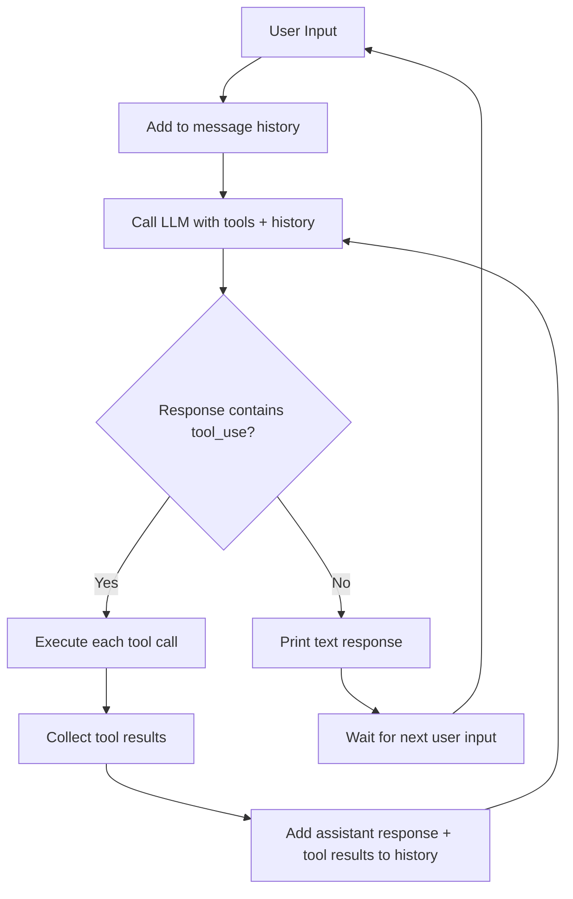
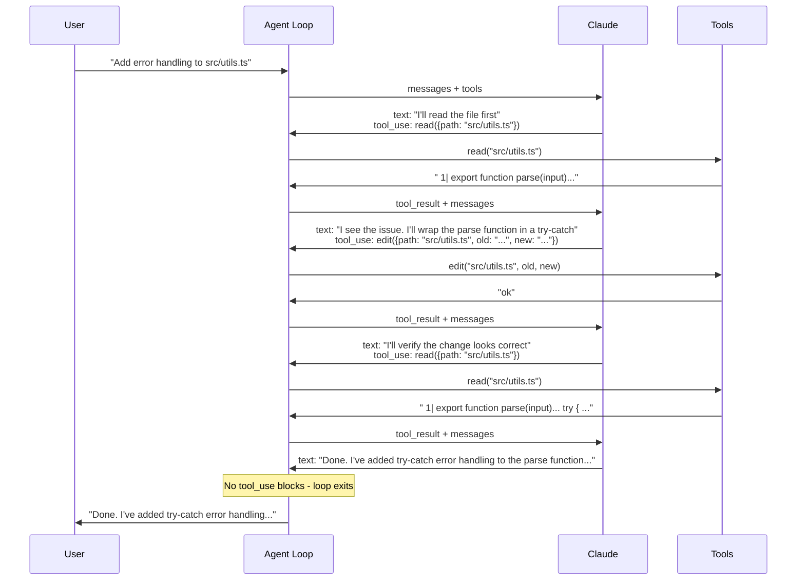

## Introduction

The difference between a chatbot and an agent is one `while` loop.

A chatbot takes a message, calls the model, and returns the response. An agent takes a message, calls the model, **executes whatever tools the model asks for**, feeds the results back, and lets the model keep going until it decides the task is done. That inner loop - call model, execute tools, repeat - is the entire mechanism that turns a text generator into something that can read files, run commands, search the web, and modify code autonomously.

I wanted to understand this loop at the code level, not behind layers of abstractions. [nanodeepagent](https://github.com/chrispangg/nanodeepagent) by Chris Pang is the clearest implementation I've found - a complete coding agent (read, write, edit, grep, glob, bash) in a single TypeScript file, about 200 lines. Every part of the agent pattern is visible in one place.

This post walks through how agent loops work using nanodeepagent's code as the reference.

## The Agent Loop in One Diagram



That's the entire pattern. Everything else - the tool definitions, the API format, the REPL, the terminal UI - is scaffolding around this loop.

## The Pieces

An agent has four components:

1. **Tools** - functions the model can call (read files, run bash, search code)
2. **Tool schema** - JSON descriptions of each tool so the model knows what's available
3. **API call** - sending messages + tool definitions to the model and getting back a response
4. **The loop** - executing tool calls, feeding results back, repeating until done

Let's look at each one in nanodeepagent's code.

## 1. Tools: What the Agent Can Do

nanodeepagent defines six tools in a single registry object. Each tool has a description, a list of parameter names, and a function that does the work:

```typescript
const TOOLS: Record<string, {
  desc: string;
  params: string[];
  fn: (args: any) => Promise<string> | string;
}> = {
  read: {
    desc: "Read file with line numbers",
    params: ["path"],
    fn: async (args) => {
      const lines = (await readFile(args.path, "utf-8")).split("\n");
      const start = args.offset ?? 0;
      const end = start + (args.limit ?? lines.length);
      return lines
        .slice(start, end)
        .map((line, i) => `${String(start + i + 1).padStart(4)}| ${line}`)
        .join("\n");
    },
  },
  write: {
    desc: "Write content to file",
    params: ["path", "content"],
    fn: async (args) => {
      await writeFile(args.path, args.content, "utf-8");
      return "ok";
    },
  },
  edit: {
    desc: "Replace old with new in file",
    params: ["path", "old", "new"],
    fn: async (args) => {
      const content = await readFile(args.path, "utf-8");
      if (!content.includes(args.old)) return "error: old_string not found";
      const result = args.all
        ? content.split(args.old).join(args.new)
        : content.replace(args.old, args.new);
      await writeFile(args.path, result, "utf-8");
      return "ok";
    },
  },
  bash: {
    desc: "Run shell command",
    params: ["cmd"],
    fn: (args) => {
      try {
        return execSync(args.cmd, { encoding: "utf-8", timeout: 30000 }).trim() || "(empty)";
      } catch (err: any) {
        return (err.stdout || err.stderr || String(err)).trim();
      }
    },
  },
  // ... plus glob and grep
};
```

A few things worth noting about this design:

**Every tool returns a string.** Success or failure, the result is always text that gets fed back to the model. Errors aren't exceptions - they're strings like `"error: old_string not found"` that the model reads, understands, and recovers from. This is what makes agents self-correcting.

**The registry is data, not code.** Adding a new tool is three lines: a name, a description, and a function. The agent loop doesn't need to change. The tool schema generator doesn't need to change. The model automatically sees the new tool on the next API call.

**Tools are deliberately simple.** `read` returns file contents with line numbers. `write` overwrites a file. `edit` does find-and-replace. `bash` runs a command. No abstraction layers, no framework, no middleware. This simplicity is why the entire agent fits in 200 lines.

## 2. Tool Schema: Telling the Model What's Available

The model needs to know what tools exist, what they do, and what parameters they accept. nanodeepagent generates this schema from the tool registry:

```typescript
function buildToolSchema() {
  return Object.entries(TOOLS).map(([name, { desc, params }]) => ({
    name,
    description: desc,
    input_schema: {
      type: "object",
      properties: Object.fromEntries(params.map((p) => [p, { type: "string" }])),
      required: params,
    },
  }));
}
```

This produces an array of tool definitions in Anthropic's format:

```json
[
  {
    "name": "read",
    "description": "Read file with line numbers",
    "input_schema": {
      "type": "object",
      "properties": { "path": { "type": "string" } },
      "required": ["path"]
    }
  },
  {
    "name": "bash",
    "description": "Run shell command",
    "input_schema": {
      "type": "object",
      "properties": { "cmd": { "type": "string" } },
      "required": ["cmd"]
    }
  }
]
```

The model reads these definitions and uses them to decide when and how to call tools. Good tool descriptions matter - a vague description means the model won't know when to use the tool. A precise description means the model calls it at the right time with the right arguments.

## 3. The API Call: Talking to the Model

Each iteration of the agent loop makes one API call to Anthropic's Messages API:

```typescript
async function callAPI(messages: any[], systemPrompt: string) {
  const response = await fetch(API_URL, {
    method: "POST",
    headers: {
      "Content-Type": "application/json",
      "x-api-key": process.env.ANTHROPIC_API_KEY ?? "",
      "anthropic-version": "2023-06-01",
    },
    body: JSON.stringify({
      model: MODEL,
      max_tokens: 8192,
      system: systemPrompt,
      messages,
      tools: buildToolSchema(),
    }),
  });
  if (!response.ok) throw new Error(`API error: ${response.status}`);
  return response.json();
}
```

The three critical fields in the request body:

- **`messages`** - the full conversation history, including previous tool calls and results
- **`tools`** - the schema array so the model knows what it can call
- **`system`** - a system prompt that sets the agent's behavior (nanodeepagent uses a minimal one: `"Concise coding assistant. cwd: /path/to/project"`)

The response contains an array of **content blocks** - either `text` (the model's words) or `tool_use` (a tool call the model wants to make):

```json
{
  "content": [
    { "type": "text", "text": "I'll read the file first to understand its structure." },
    {
      "type": "tool_use",
      "id": "toolu_01ABC",
      "name": "read",
      "input": { "path": "src/index.ts" }
    }
  ],
  "stop_reason": "tool_use"
}
```

When `stop_reason` is `"tool_use"`, the model is paused mid-thought, waiting for tool results before it can continue. This is the signal to execute the tools and call the API again.

## 4. The Loop: Where Agency Happens

Here's the complete agent loop from nanodeepagent. This is the core of the entire application:

```typescript
// User provides input
messages.push({ role: "user", content: input });

// Agentic loop - keep going until the model stops calling tools
while (true) {
  const response = await callAPI(messages, systemPrompt);
  const toolResults: any[] = [];

  // Process each block in the response
  for (const block of response.content) {
    if (block.type === "text") {
      console.log(`⏺ ${block.text}`);
    } else if (block.type === "tool_use") {
      console.log(`⏺ ${block.name}(${Object.values(block.input)[0]})`);
      const tool = TOOLS[block.name];
      const result = tool
        ? await tool.fn(block.input)
        : `error: unknown tool ${block.name}`;
      console.log(`  ⎿  ${result.split("\n")[0].slice(0, 60)}`);
      toolResults.push({
        type: "tool_result",
        tool_use_id: block.id,
        content: result,
      });
    }
  }

  // Add the assistant's response to history
  messages.push({ role: "assistant", content: response.content });

  // If no tools were called, the model is done - break
  if (toolResults.length === 0) break;

  // Feed tool results back and loop
  messages.push({ role: "user", content: toolResults });
}
```

Let me break down what each part does.

**Processing response blocks.** The model's response is an array of content blocks. Text blocks are the model talking. Tool use blocks are the model requesting an action. Both can appear in the same response - the model might say "Let me read the file" (text) and then call `read` (tool_use) in a single turn.

**Executing tool calls.** For each `tool_use` block, the code looks up the tool by name in the registry and calls its function with the input arguments. The result (always a string) is wrapped in a `tool_result` object with the matching `tool_use_id` so the model knows which call it corresponds to.

**The break condition.** If the response contained zero tool calls (`toolResults.length === 0`), the model has decided it's done. It responded with text only, meaning the task is complete. This is the only exit from the inner loop.

**Feeding results back.** Tool results are added to the message history as a `user` message (this is Anthropic's API format - tool results go in user messages). Then the loop calls the API again. The model now sees everything: the original request, its previous tool calls, and the results. It can decide to call more tools, or produce a final text response.

## What a Multi-Step Task Looks Like

When a user says "Add error handling to src/utils.ts", here's the actual message history as the loop executes:



Four API calls, three tool executions, zero human intervention between the first request and the final answer. The model autonomously decided to read first, then edit, then verify. That's agency.

## The Message History: Why It Matters

The message array is the agent's memory. After the task above, it looks like this:

```typescript
[
  // Turn 1: User request
  { role: "user", content: "Add error handling to src/utils.ts" },

  // Turn 2: Model reads the file
  { role: "assistant", content: [
    { type: "text", text: "I'll read the file first" },
    { type: "tool_use", id: "toolu_01", name: "read", input: { path: "src/utils.ts" } }
  ]},
  { role: "user", content: [
    { type: "tool_result", tool_use_id: "toolu_01", content: "  1| export function..." }
  ]},

  // Turn 3: Model edits the file
  { role: "assistant", content: [
    { type: "text", text: "I'll wrap the parse function..." },
    { type: "tool_use", id: "toolu_02", name: "edit", input: { path: "...", old: "...", new: "..." } }
  ]},
  { role: "user", content: [
    { type: "tool_result", tool_use_id: "toolu_02", content: "ok" }
  ]},

  // Turn 4: Model verifies
  { role: "assistant", content: [
    { type: "tool_use", id: "toolu_03", name: "read", input: { path: "src/utils.ts" } }
  ]},
  { role: "user", content: [
    { type: "tool_result", tool_use_id: "toolu_03", content: "  1| export function... try { ..." }
  ]},

  // Turn 5: Model is done (text only, no tool_use)
  { role: "assistant", content: [
    { type: "text", text: "Done. I've added try-catch error handling..." }
  ]},
]
```

Every API call sends the **full history**. The model sees every previous tool call and result, which is why it can chain operations coherently - it remembers what it read, what it changed, and what it's already tried. This is also why context window limits matter for agents: a long session with many tool calls can fill the context window, at which point you need to truncate or compact the history.

## Why This Pattern Works

The agent loop is powerful because of what it *doesn't* do:

**No decision tree.** The code doesn't have `if (task === "edit file") { readFile(); editFile(); }`. There's no hardcoded workflow. The model decides the plan at runtime based on the user's request and the tool results it receives. The same loop handles "fix this bug", "add a feature", "refactor this module", and "explain this codebase" without any task-specific logic.

**No error handling beyond tool functions.** When `edit` fails because the old string wasn't found, the tool returns `"error: old_string not found"`. The model reads that, adjusts its approach (maybe reads the file again to get the exact string), and tries a different edit. Recovery is emergent from the loop, not programmed explicitly.

**No fixed number of steps.** Simple tasks finish in one turn (model responds with text, no tool calls). Complex tasks might take 10+ turns. The loop runs until the model decides it's done by responding without tool calls. The agent adapts its effort to the task's complexity.

## From 200 Lines to Production

nanodeepagent is intentionally minimal. Production agents like Claude Code, Cursor, and [TinyClaw](/blog/building-an-ai-agent-platform-from-scratch/) add layers around the same core loop:

| Concern | nanodeepagent | Production Agent |
|---------|--------------|-----------------|
| Loop | `while (true)` until no tool calls | Same, plus max iteration limits |
| Errors | Tool returns error string | Retry logic, error classification, fallback models |
| Context | Full history every call | Compaction, truncation, summarization |
| Security | None | Tool policy engine, exec approval, SSRF guards |
| Streaming | None (waits for full response) | SSE token streaming |
| Persistence | In-memory only | Session files with crash recovery |
| Multi-tool | Sequential execution | Parallel execution of independent calls |

But the core pattern - call model, execute tools, feed results back, repeat - is identical in every one. If you understand nanodeepagent's 200-line loop, you understand the architecture of every AI coding agent.

## Key Takeaways

**The agent loop is embarrassingly simple.** Call the model. If it wants to use tools, execute them and call again. Repeat until it responds with text only. That's the entire algorithm. Everything else is error handling, security, and UX.

**Tools return strings, not exceptions.** This is a critical design decision. When a tool fails, it returns an error message that the model can read and react to. The model becomes its own error handler - it reads the failure, reasons about what went wrong, and tries a different approach. This is what makes agents self-correcting.

**The model controls the plan.** The code doesn't decide what order to call tools or when to stop. The model does. Give it a task and tools, and it figures out the steps. This is why the same 200-line loop can handle any coding task without task-specific logic.

**Message history is the agent's memory.** Every tool call and result stays in the conversation. The model can reference earlier results, avoid repeating failed approaches, and build on previous steps. Context window management becomes the primary scaling challenge for long-running agents.

**Start simple, add layers.** nanodeepagent proves that the core agent pattern works in 200 lines with zero dependencies beyond the API. Streaming, security, persistence, retry logic - these are all additions to the core loop, not replacements for it. Build the loop first, harden it later.

The full code is at [github.com/chrispangg/nanodeepagent](https://github.com/chrispangg/nanodeepagent). It's one file. Read it in 10 minutes and you'll understand how every AI coding agent works.

```bash
git clone https://github.com/chrispangg/nanodeepagent.git
cd nanodeepagent
echo "ANTHROPIC_API_KEY=your-key" > .env
bun nanodeepagent.ts
```
