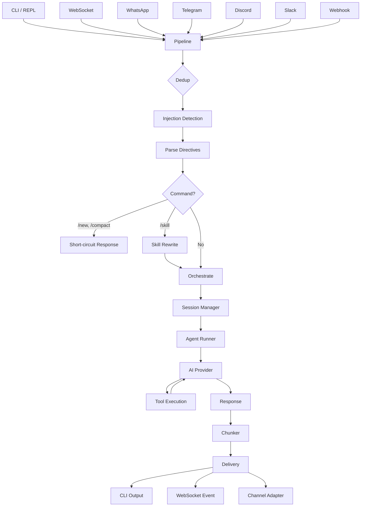
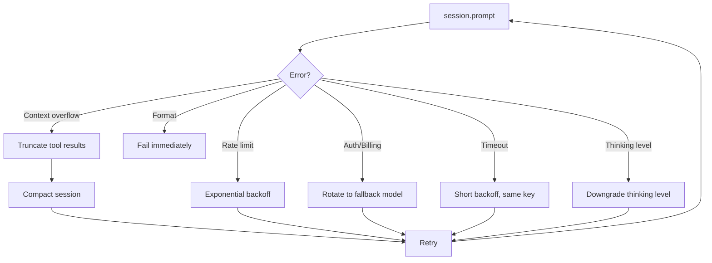

## Introduction

After spending months working with AI coding agents like Claude Code and Cursor, I wanted to understand what was actually happening behind the interfaces. Not the LLM part - I'd built [nanollama](/blog/how-llm-inference-engines-work/) for that. I wanted to understand the *platform* layer: how does a message from WhatsApp end up as an AI response with tool calls, session memory, and security checks?

So I built [TinyClaw](https://github.com/mrcloudchase/tinyclaw) - a full-featured AI agent platform in ~11K lines of TypeScript, extracted from [OpenClaw's](https://github.com/nicepkg/openclaw) core and rebuilt to be readable. It includes a CLI agent, a gateway server, messaging channels (WhatsApp, Telegram, Discord, Slack), a plugin system, Docker sandboxing, persistent memory, and a 10-layer security engine.

What surprised me most was how much of the engineering is *not* about the AI model. The model is one function call. The other 10,000 lines handle everything that can go wrong around it - retries, auth failures, session corruption, message dedup, injection attacks, rate limits, and delivery across platforms with different constraints. This post breaks down all of it.

## The Big Picture

Every AI agent platform solves the same fundamental problem: take user input from *somewhere*, route it through an AI model with tools, and deliver the response back. The complexity comes from all the things that can go wrong in between - and from supporting multiple "somewheres" at once.



TinyClaw implements every box in this diagram. Let's go layer by layer.

## The Message Pipeline

The pipeline is the central nervous system. Every message - whether from the CLI, a WebSocket client, or a WhatsApp user - enters through a single `dispatch()` function:

```typescript
export async function dispatch(params: {
  source: "cli" | "gateway" | "channel";
  body: string;
  config: TinyClawConfig;
  channelId?: string;
  peerId?: string;
  messageId?: string;
  channel?: ChannelInstance;
  onChunk?: (chunk: string) => void;
}): Promise<PipelineResult> {
  // Dedup → Collect → Inbound → Directives → Commands → Orchestrate → Deliver
}
```

This single entry point is a deliberate design choice. It means every message - regardless of origin - goes through the same deduplication, injection detection, directive parsing, and security checks. No channel gets special treatment, and no pathway bypasses security.

### Message Deduplication

Messaging platforms retry delivery. WhatsApp, Telegram, and Slack all send duplicate webhooks if they don't get a fast response. Without dedup, the agent processes the same message twice and sends duplicate replies.

```typescript
const recentMessages = new Map<string, number>();
const DEDUP_TTL_MS = 60_000;

function isDuplicate(channelId: string | undefined, messageId: string | undefined): boolean {
  if (!channelId || !messageId) return false;
  const key = `${channelId}:${messageId}`;
  const now = Date.now();
  for (const [k, ts] of recentMessages) {
    if (now - ts > DEDUP_TTL_MS) recentMessages.delete(k);
  }
  if (recentMessages.has(key)) return true;
  recentMessages.set(key, now);
  return false;
}
```

The approach: track `channelId:messageId` pairs in a Map with a 60-second TTL. Expired entries are swept on each check. Simple, no external dependencies, and effective for the throughput levels a single-instance agent handles.

### Collect Mode

Users on messaging apps send multiple short messages in quick succession. Without batching, each message triggers a separate agent turn:

> **User:** Hey can you help me  
> **User:** I need to fix the auth module  
> **User:** it's throwing 401 errors  

Collect mode batches these into a single dispatch:

```typescript
function collectBuffer(key: string, body: string, windowMs: number, callback: (combined: string) => void): void {
  const existing = collectBuffers.get(key);
  if (existing) {
    clearTimeout(existing.timer);
    existing.parts.push(body);
    existing.timer = setTimeout(() => {
      collectBuffers.delete(key);
      existing.callback(existing.parts.join("\n"));
    }, windowMs);
  } else {
    const entry = { parts: [body], callback, timer: setTimeout(/* ... */) };
    collectBuffers.set(key, entry);
  }
}
```

Each new message resets the timer. When the window expires (default 3 seconds), all accumulated messages are joined with newlines and dispatched as one. The agent sees the full context in a single turn.

### Prompt Injection Detection

When your agent is exposed to the internet via messaging channels, users will try to manipulate it. The pipeline runs a regex-based injection detector on every inbound message:

```typescript
const INJECTION_PATTERNS = [
  /ignore\s+(all\s+)?previous\s+instructions/i,
  /you\s+are\s+now\s+(a|an)\s+/i,
  /system\s*prompt\s*[:=]/i,
  /jailbreak/i,
  /bypass\s+(your\s+)?restrictions/i,
  /pretend\s+you\s+(are|have)/i,
  /forget\s+(your|all|previous)/i,
];
```

When injection is detected, the message is wrapped in `<<<EXTERNAL_UNTRUSTED_CONTENT>>>` tags before reaching the model. This isn't foolproof - no injection detection is - but it raises the bar significantly by signaling to the model that the content should be treated with suspicion.

## The Agent Runner: Retry and Recovery

This is where I learned that calling an AI model is the easy part. The hard part is handling the dozen ways that call can fail. The agent runner wraps the model call in a retry loop that classifies errors and applies the right recovery strategy for each:



```typescript
while (retries <= MAX_RETRIES) {
  try {
    await session.prompt(prompt);
    markKeySuccess(provider, modelId);
    return { text: responseText, compacted, tinyClawSession };
  } catch (error) {
    const reason: FailureReason = classifyFailoverReason(error);

    if (isContextOverflowError(error)) {
      // First: truncate oversized tool results (>30% of context)
      // Then: compact the full session
      // Both preserve conversation continuity
    }

    if (reason === "rate_limit") {
      // Exponential backoff: 1s → 2s → 4s (capped at 30s)
      markKeyFailed(provider, modelId, reason);
      await sleep(Math.min(1000 * Math.pow(2, retries), 30000));
    }

    if (reason === "auth" || reason === "billing") {
      // Mark key failed, try next model in fallback chain
      markKeyFailed(provider, modelId, reason);
      const next = resolveNextFallback(fallbackIdx, fallbackChain, config);
      if (next) { /* create new session with fallback model */ }
    }

    if (reason === "format") throw error; // Don't retry malformed requests
  }
}
```

### Error Classification

The key insight is that different errors require different responses. The classifier inspects both HTTP status codes and error message text:

```typescript
export function classifyFailoverReason(error: unknown): FailureReason {
  const status = (error as any)?.status;
  const msg = (error instanceof Error ? error.message : String(error)).toLowerCase();

  if (status === 402 || msg.includes("billing"))    return "billing";
  if (status === 429 || msg.includes("rate limit")) return "rate_limit";
  if (status === 401 || msg.includes("unauthorized")) return "auth";
  if (status === 408 || msg.includes("timeout"))    return "timeout";
  if (msg.includes("invalid_request"))              return "format";
  return "unknown";
}
```

Format errors (malformed requests) never retry - they'll fail forever. Timeouts retry the same key with a short backoff. Rate limits back off longer and rotate keys. Auth/billing failures rotate to a completely different model. This prevents the agent from burning through credits or hammering a rate-limited endpoint.

### Auth Resilience: Multi-Key Rotation with Persistent Cooldowns

If you're running an agent at scale, you'll have multiple API keys. TinyClaw manages a key pool per provider with round-robin selection, health tracking, and cooldown persistence:

```typescript
export function markKeyFailed(provider: string, key: string, reason: FailureReason): void {
  entry.failures++;
  entry.backoffUntil = Date.now() + computeBackoff(entry.failures, reason);
  // Persist to ~/.config/tinyclaw/auth-state.json
  saveCooldownState(state);
}

function computeBackoff(errorCount: number, reason: FailureReason): number {
  if (reason === "billing") {
    return Math.min(5 * 3600_000 * Math.pow(2, errorCount - 1), 24 * 3600_000);
    // 5hr → 10hr → 20hr → 24hr
  }
  return Math.min(60_000 * Math.pow(5, errorCount - 1), 3600_000);
  // 1min → 5min → 25min → 1hr
}
```

Cooldown state persists to disk. If the process restarts, it remembers which keys are in cooldown and doesn't re-try them immediately. Billing failures get much longer backoffs than rate limits because they indicate a structural problem (empty account) rather than a transient one.

## Session Management

Sessions seem simple until your agent runs for weeks and you discover all the ways file I/O can go wrong. Sessions maintain conversation history across turns, stored as JSONL files on disk.

### File Locking

When you have a gateway server and a CLI both running, they can both try to write to the same session file. TinyClaw uses advisory file locking via `O_CREAT | O_EXCL` - the atomic file creation flag that fails if the file already exists:

```typescript
export async function acquireSessionLock(sessionFile: string, timeoutMs = 10000): Promise<void> {
  const lockPath = sessionFile + ".lock";
  const deadline = Date.now() + timeoutMs;
  let delay = 50;

  while (Date.now() < deadline) {
    try {
      const fd = fs.openSync(lockPath, fs.constants.O_WRONLY | fs.constants.O_CREAT | fs.constants.O_EXCL);
      fs.writeSync(fd, JSON.stringify({ pid: process.pid, createdAt: Date.now() }));
      fs.closeSync(fd);
      return; // Lock acquired
    } catch (err: any) {
      if (err.code !== "EEXIST") throw err;
      // Check for stale locks (>30min or dead PID)
      const { pid, createdAt } = JSON.parse(fs.readFileSync(lockPath, "utf-8"));
      if (Date.now() - createdAt > 30 * 60 * 1000 || !isPidAlive(pid)) {
        fs.unlinkSync(lockPath); // Break stale lock
        continue;
      }
      await sleep(delay);
      delay = Math.min(delay * 2, 1000); // Exponential backoff
    }
  }
  throw new Error(`Failed to acquire session lock within ${timeoutMs}ms`);
}
```

The lock file stores the PID and timestamp. Stale lock detection handles both crashed processes (dead PID) and abandoned locks (>30 minutes old). Recursive locking is supported for the same process via a reference count map.

### Crash Repair

If the process dies mid-write to a JSONL session file, the file has a corrupted last line. On next load, the repair function drops unparseable lines and creates a backup:

```typescript
export function repairSessionFileIfNeeded(sessionFile: string): void {
  const lines = fs.readFileSync(sessionFile, "utf-8").split("\n");
  const valid: string[] = [];
  let repaired = false;

  for (const line of lines) {
    const trimmed = line.trim();
    if (!trimmed) { valid.push(line); continue; }
    try { JSON.parse(trimmed); valid.push(line); } catch {
      repaired = true; // Drop unparseable line
    }
  }

  if (repaired) {
    fs.copyFileSync(sessionFile, `${sessionFile}.bak-${process.pid}-${Date.now()}`);
    fs.writeFileSync(sessionFile + ".tmp", valid.join("\n"));
    fs.renameSync(sessionFile + ".tmp", sessionFile); // Atomic replace
  }
}
```

The write-to-temp-then-rename pattern ensures the repair itself is atomic - if the process crashes during repair, the original file is untouched.

## The Security Engine

When your agent can execute shell commands and is exposed to the internet, security is non-negotiable. TinyClaw implements a 10-layer policy engine that evaluates every tool call:

```typescript
export function evaluatePolicy(config: TinyClawConfig, ctx: PolicyContext): PolicyDecision {
  // Layer 1: Hardcoded deny (eval, exec_raw, system)
  if (ALWAYS_DENY.has(ctx.toolName)) return "deny";

  // Layer 2: Config deniedTools
  if (config.security?.deniedTools?.includes(ctx.toolName)) return "deny";

  // Layer 3: Config elevatedTools → require confirmation
  if (config.security?.elevatedTools?.includes(ctx.toolName)) return "confirm";

  // Layer 4: Per-agent tool allowlist
  if (ctx.agentId && agentDef?.tools && !agentDef.tools.includes(ctx.toolName)) return "deny";

  // Layer 6: Max tool calls per turn
  if (ctx.callCount >= config.security?.maxToolCallsPerTurn) return "deny";

  // Layer 7: Exec approval mode for bash/exec
  if (ctx.toolName === "bash" && mode === "interactive") return "confirm";

  // Layer 9: Global policy mode
  if (policyMode === "strict" && ELEVATED_BY_DEFAULT.has(ctx.toolName)) return "confirm";

  // Layer 10: Default allow
  return "allow";
}
```

Each layer is a short-circuit - the first match wins. This means hardcoded denies can never be overridden by config, and per-agent restrictions layer on top of global ones.

### SSRF Protection

The web fetch tool can access URLs - which means an attacker could try to access cloud metadata endpoints or internal services. The SSRF guard blocks private IPs, cloud metadata endpoints, and non-HTTP protocols:

```typescript
export function ssrfCheck(url: string, config: TinyClawConfig): { allowed: boolean; reason?: string } {
  const parsed = new URL(url);
  if (isPrivateIP(parsed.hostname))
    return { allowed: false, reason: `Blocked: private IP (${parsed.hostname})` };
  if (!["http:", "https:"].includes(parsed.protocol))
    return { allowed: false, reason: `Blocked: protocol ${parsed.protocol}` };
  if (["metadata.google", "169.254.169.254"].some(p => parsed.hostname.includes(p)))
    return { allowed: false, reason: `Blocked: cloud metadata endpoint` };
  return { allowed: true };
}
```

### Exec Approval with Auto-Allowlist

Shell command execution from channel sessions can require interactive approval. After 3 approvals of the same command prefix, it's auto-allowed:

```typescript
export function trackApproval(command: string): void {
  const prefix = commandPrefix(command); // First two words: "npm install", "git push"
  entry.approvalCount++;
  if (entry.approvalCount >= AUTO_ALLOW_THRESHOLD) {
    entry.autoAllowed = true;
  }
  saveAllowlist(); // Persists to exec-allowlist.json
}
```

This balances safety with usability - the first `npm install` requires approval, but the fourth one runs automatically.

## The Gateway: HTTP + WebSocket Server

The gateway is a Node.js HTTP server that hosts multiple protocols simultaneously:

- **WebSocket** with JSON-RPC 2.0 framing (23 RPC methods)
- **OpenAI-compatible REST API** (`/v1/chat/completions`, `/v1/models`)
- **Channel webhooks** (WhatsApp, Telegram)
- **Generic webhook** with Bearer token auth
- **WebChat UI** served at `/` (self-contained HTML page)

```typescript
export async function startGateway(config: TinyClawConfig): Promise<GatewayContext> {
  const server = http.createServer(async (req, res) => {
    // Route: WhatsApp webhook → channel handler
    // Route: Telegram webhook → channel handler
    // Route: Generic webhook → dispatch
    // Route: Plugin HTTP handlers → plugin handler
    // Route: Everything else → HTTP API (OpenAI-compatible + health + WebChat)
  });

  const wss = new WebSocketServer({ server });
  wss.on("connection", (ws) => {
    ws.on("message", async (data) => {
      const rpc = JSON.parse(data.toString());
      const result = await handleRpcMethod(rpc.method, rpc.params, config, ctx);
      ws.send(JSON.stringify({ jsonrpc: "2.0", id: rpc.id, result }));
    });
  });

  server.listen(port, host);
}
```

The WebSocket layer uses JSON-RPC 2.0 as the framing protocol - each message has a `method`, `params`, and `id`. Responses include `result` or `error`. This maps cleanly to the 23 supported operations: `chat.send`, `chat.stream`, `sessions.list`, `memory.search`, `cron.add`, `exec.approve`, etc.

### Broadcast Events

The gateway broadcasts 17 event types to all connected WebSocket clients. This enables real-time UIs - a WebChat client sees tool executions as they happen, session compactions, channel connects/disconnects, and config reloads:

```typescript
type BroadcastEvent =
  | "chat.message" | "chat.stream" | "chat.complete" | "chat.error"
  | "session.start" | "session.end" | "session.compact"
  | "tool.start" | "tool.end"
  | "channel.connect" | "channel.disconnect" | "channel.message"
  | "config.reload" | "health.heartbeat"
  | "approval.request" | "approval.resolve"
  | "system.shutdown";
```

### Config Hot-Reload

The gateway watches its config file and applies changes without restart:

```typescript
const watcher = startConfigWatcher(configPath, async () => {
  const newConfig = loadConfig();
  const changed = diffConfig(ctx.config, newConfig);
  if (requiresRestart(changed)) {
    log.warn("Config change requires restart: " + changed.join(", "));
  }
  ctx.config = newConfig;
  broadcast(ctx, "config.reload", { changed });
});
```

Changes to channels, hooks, and cron are applied immediately. Changes to `gateway.*` or `plugins.*` log a restart warning because they affect the server lifecycle.

## Channel Adapters

TinyClaw supports WhatsApp, Telegram, Discord, and Slack as first-class channels. Each is implemented as a channel adapter with a common interface:

```typescript
export interface ChannelAdapter {
  sendText(peerId: string, text: string, accountId?: string): Promise<void>;
  sendTyping?(peerId: string): Promise<void>;
  sendReadReceipt?(messageId: string): Promise<void>;
  sendReaction?(messageId: string, emoji: string): Promise<void>;
}
```

The pipeline doesn't know or care which channel it's talking to. It calls `adapter.sendText()`, and the adapter translates to the platform-specific API - WhatsApp Cloud API, grammY for Telegram, discord.js for Discord, Bolt for Slack.

### Block Streaming with Channel-Aware Limits

Each messaging platform has different message length limits. The coalescer chunks responses with awareness of these limits:

| Platform | Max chars |
|----------|-----------|
| WhatsApp | 1,600 |
| Discord | 2,000 |
| Telegram | 4,096 |

The chunker splits at paragraph boundaries first, then sentences, then newlines, and hard-splits as a last resort. Code blocks are tracked - a chunk never splits in the middle of a fenced code block.

### DM Pairing

When pairing is enabled, unknown senders on any channel receive a pairing code instead of an AI response:

```
🔒 Access requires pairing.

Your pairing code: ABCD1234

Ask the admin to run:
tinyclaw pair approve ABCD1234

Code expires in 1 hour.
```

The admin approves via the CLI, and the sender is added to the allowlist. This prevents strangers from using your agent's API credits.

## Memory: Hybrid Search

TinyClaw's memory system uses SQLite with FTS5 (full-text search) and optional vector search (sqlite-vec + OpenAI embeddings). Queries run both searches and merge results with weighted scoring:

```typescript
// Hybrid scoring: 0.7 cosine similarity + 0.3 BM25
const COSINE_WEIGHT = 0.7;
const BM25_WEIGHT = 0.3;
```

BM25 (the algorithm behind FTS5) excels at exact keyword matches. Cosine similarity on embeddings captures semantic relationships. The hybrid approach handles both "find the message where I mentioned the database password" (keyword) and "what did we discuss about authentication" (semantic).

The memory schema uses WAL mode for concurrent reads during writes, and maintains FTS5 indexes via triggers so they're always in sync:

```sql
CREATE TABLE memories (
  id INTEGER PRIMARY KEY AUTOINCREMENT,
  content TEXT NOT NULL,
  embedding BLOB,
  created_at INTEGER DEFAULT (unixepoch()),
  tags TEXT DEFAULT '[]'
);
CREATE VIRTUAL TABLE memories_fts USING fts5(content, content=memories, content_rowid=id);
```

## The Config System

Every behavior in TinyClaw is config-driven. The config schema is defined with Zod - which provides both runtime validation and TypeScript type inference from a single source:

```typescript
export const TinyClawConfigSchema = z.object({
  agent: AgentSchema.optional(),
  gateway: GatewaySchema.optional(),
  channels: ChannelsSchema.optional(),
  security: SecuritySchema.optional(),
  memory: MemorySchema.optional(),
  plugins: PluginsSchema.optional(),
  pipeline: PipelineSchema.optional(),
  // ... 18 top-level sections
});

export type TinyClawConfig = z.infer<typeof TinyClawConfigSchema>;
```

All config types throughout the codebase are inferred from the Zod schema. This means there's a single source of truth - if you add a field to the schema, TypeScript enforces its use everywhere. If a user provides invalid config, Zod produces a structured error with the exact path and expected type.

Config lives at `~/.config/tinyclaw/config.json5` (JSON5 allows comments and trailing commas). Environment variables override file config for deployment flexibility:

```bash
TINYCLAW_MODEL=openai/gpt-4o
TINYCLAW_PORT=3000
ANTHROPIC_API_KEY=sk-ant-...
```

## Model Resolution: Aliases, Fallbacks, and Local Providers

TinyClaw auto-detects local model providers by name:

```typescript
const LOCAL_PROVIDERS: Record<string, { baseUrl: string }> = {
  ollama:   { baseUrl: "http://127.0.0.1:11434/v1" },
  lmstudio: { baseUrl: "http://127.0.0.1:1234/v1" },
  vllm:     { baseUrl: "http://127.0.0.1:8000/v1" },
  litellm:  { baseUrl: "http://127.0.0.1:4000/v1" },
};
```

Set `"provider": "ollama"` in config and it just works - no base URL configuration needed. Model aliases let users type `sonnet` instead of `anthropic/claude-sonnet-4-5-20250929`. Fallback chains define what happens when the primary model fails:

```json
{
  "agent": {
    "provider": "anthropic",
    "model": "claude-sonnet-4-5-20250929",
    "fallbacks": ["openai/gpt-4o", "ollama/llama3.1"]
  }
}
```

If Claude fails with an auth error, TinyClaw automatically creates a new session with GPT-4o. If that fails too, it falls back to a local Ollama model.

## Plugins and Skills

### Plugin System

Plugins register via a typed API with 10 registration methods:

```typescript
export default function init(api: TinyClawPluginApi) {
  api.registerTool(/* AgentTool */);
  api.registerHook("message_inbound", handler);
  api.registerChannel(/* ChannelDef */);
  api.registerHttpRoute("/my-endpoint", "POST", handler);
  api.registerService("my-service", startFn, stopFn);
}
```

Plugins are discovered from 4 origins: bundled, config-specified, user directory (`~/.config/tinyclaw/plugins/`), and workspace-local (`.tinyclaw/plugins/`). Each plugin can add tools, hooks, channels, HTTP routes, and background services.

### Skills

Skills are Markdown files that become slash commands. Place a `.md` file in the skills directory, and it becomes `/skillname`:

```markdown
---
description: Summarize a pull request
tags: [git, review]
---

Review the pull request and provide:
1. A one-paragraph summary
2. Key changes
3. Potential issues
```

When a user types `/summarize-pr #123`, the skill content is injected as context for the agent. The agent sees the instructions and the user's arguments, then executes accordingly using its available tools.

## Hook System: Transform and Abort

The hook system runs at 14 pipeline events (boot, shutdown, pre_run, post_run, message_inbound, message_outbound, etc.). Hooks can do three things: observe, transform data, or abort the pipeline:

```typescript
export async function runHooks(event: string, data: Record<string, unknown>): Promise<HookResult | void> {
  const matching = hooks.filter(h => h.event === event || h.event === "*");
  for (const hook of matching) {
    const result = await Promise.race([
      hook.handler(event, data),
      new Promise((_, reject) => setTimeout(() => reject(new Error("timeout")), 5000)),
    ]);
    if (result?.abort) return result;       // Stop pipeline
    if (result?.transform) Object.assign(data, result.transform); // Modify data
  }
}
```

Hooks execute sequentially by priority. Each hook sees transforms from previous hooks. A 5-second timeout prevents hung hooks from blocking the pipeline.

## System Prompt Assembly

The system prompt is assembled from 18 sections based on what's enabled in config:

1. **Identity** - agent name, emoji, agent ID
2. **Available tools** - dynamically generated from registered tools
3. **Tool usage guidelines** - read-before-write, prefer edits over creates
4. **Safety constraints** - no self-preservation, no power-seeking
5. **Workspace** - working directory path
6. **Runtime** - OS, arch, Node version, model, thinking level
7. **Security policy** - tool policy mode, exec approval, SSRF status
8. **Memory instructions** - if memory is enabled
9. **Browser instructions** - if browser is enabled
10. **Cron instructions** - if cron is enabled
11. **TTS instructions** - if TTS is enabled
12. **Channel context** - connected messaging channels
13. **Multi-agent info** - if multiple agents configured
14. **Skills summary** - available slash commands
15. **Directives** - `++think`, `++model`, `++exec`
16. **Commands** - `/new`, `/compact`, `/model`
17. **Group chat context** - if responding in a group
18. **Bootstrap content** - SOUL.md, AGENTS.md, or other project files

Bootstrap files are loaded from the workspace root in priority order: `SOUL.md` → `IDENTITY.md` → `USER.md` → `TOOLS.md` → `TINYCLAW.md` → `CLAUDE.md` → `AGENTS.md` → `BOOTSTRAP.md`. SOUL.md gets special treatment - it's prepended with "Embody the persona and tone described below" to establish personality.

## Design Patterns

A few patterns that emerged across the codebase:

**Monolithic files.** Each subsystem is self-contained in one file - types, implementation, and exports together. The pipeline is one file. The security engine is one file. The hook system is one file. This makes it easy to understand a subsystem by reading one file top-to-bottom, at the cost of larger files.

**Lazy imports.** Heavy dependencies (gateway, channels, TUI, plugins) use `await import()` so the CLI stays fast. If you just run `tinyclaw "Hello"`, it doesn't load discord.js or grammY.

**Config-driven behavior.** Almost everything is a config toggle. Want injection detection? It's on by default. Want Docker sandboxing? Enable it in config. Want multi-agent routing? Define bindings. The Zod schema is the single source of truth for what's configurable.

**XDG paths.** All persistent state lives under `~/.config/tinyclaw/` via helpers in `config/paths.ts`. Sessions, memory, auth state, exec allowlists, and plugin data all follow XDG conventions.

## Key Takeaways

**The pipeline pattern is central.** A single dispatch function that every message passes through - regardless of source - ensures consistent security, dedup, and processing. If you build nothing else, build a unified pipeline.

**Error classification determines recovery strategy.** Not all errors are equal. Rate limits need backoff. Auth failures need key rotation. Context overflow needs compaction. Timeouts need a simple retry. Classifying errors precisely enables targeted recovery instead of blanket retries.

**Sessions need durability.** File locking, crash repair, and atomic writes aren't glamorous, but they prevent data corruption when your agent runs for weeks at a time with multiple access points.

**Security is layers, not a single check.** A 10-layer policy engine, SSRF guards, injection detection, pairing gates, and exec approval all work together. No single layer is sufficient. Defense in depth matters especially when your agent can execute shell commands.

**Config-driven architecture scales.** Zod schemas give you type safety, runtime validation, and self-documenting config in one package. When nearly everything is configurable, adding new features is often just adding a schema field and checking it in the pipeline.

If you want to explore the code, [TinyClaw is on GitHub](https://github.com/mrcloudchase/tinyclaw). Each subsystem is a single file you can read independently.

```bash
$ git clone https://github.com/mrcloudchase/tinyclaw.git
$ cd tinyclaw && npm install
$ export ANTHROPIC_API_KEY=sk-ant-...
$ npx tinyclaw "What is 2+2?"
```
