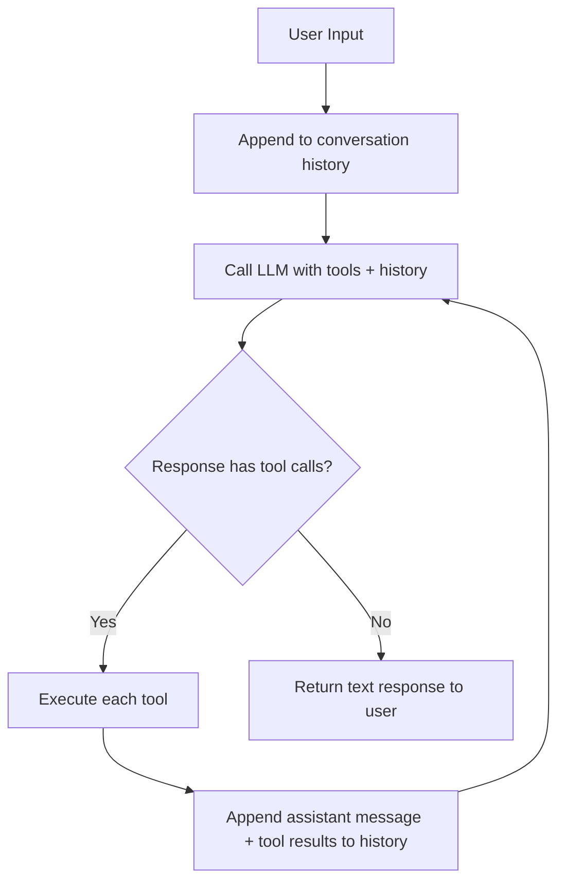
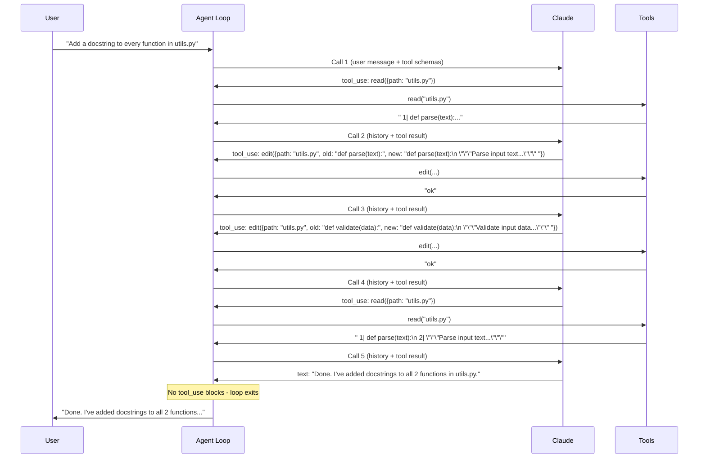

## Introduction

The difference between a chatbot and an agent is one `while` loop.

A chatbot takes a message, calls the model, and returns the response. An agent takes a message, calls the model, **executes whatever tools the model asks for**, feeds the results back, and lets the model keep going until it decides the task is done. That inner loop - call model, execute tools, repeat - is the mechanism that turns a text generator into something that can read files, run commands, and modify code autonomously.

After building [TinyClaw](/blog/building-an-ai-agent-platform-from-scratch/) and studying implementations like [nanodeepagent](https://github.com/chrispangg/nanodeepagent), I realized the core pattern is simple enough to fit in a single file. The complexity in production agents comes from hardening that pattern - retries, security, streaming, persistence - not from the pattern itself.

This post builds a working agent from scratch in Python. We'll start with the bare loop and progressively add the pieces that matter: a tool registry, state management, conversation history, error handling, and a token budget. By the end, you'll have a complete agent you can run and a clear mental model of how every AI coding agent works under the hood.

## The Core Loop

Here's the agent loop reduced to its essence:



In Python, that's about 15 lines:

```python
def agent_loop(user_message: str, history: list, tools: dict) -> str:
    history.append({"role": "user", "content": user_message})

    while True:
        response = call_model(history, tools)
        tool_calls = extract_tool_calls(response)

        history.append({"role": "assistant", "content": response.content})

        if not tool_calls:
            return extract_text(response)

        results = [execute_tool(tools, tc) for tc in tool_calls]
        history.append({"role": "user", "content": results})
```

That's the skeleton. Every AI coding agent - Claude Code, Cursor, Copilot - runs this loop. Let's fill in each piece.

## Building the Tool Registry

Tools are the agent's hands. Without them, it's just a chatbot. The tool registry maps tool names to their implementation and schema:

```python
import json
import subprocess
from pathlib import Path

def tool_read(path: str, offset: int = 0, limit: int | None = None) -> str:
    """Read a file and return contents with line numbers."""
    text = Path(path).read_text()
    lines = text.splitlines()
    end = offset + limit if limit else len(lines)
    numbered = [f"{i+1:4}| {line}" for i, line in enumerate(lines[offset:end], start=offset)]
    return "\n".join(numbered)

def tool_write(path: str, content: str) -> str:
    """Create or overwrite a file."""
    Path(path).parent.mkdir(parents=True, exist_ok=True)
    Path(path).write_text(content)
    return "ok"

def tool_edit(path: str, old: str, new: str) -> str:
    """Replace a string in a file. Fails if the string isn't found or is ambiguous."""
    text = Path(path).read_text()
    if old not in text:
        return "error: string not found in file"
    if text.count(old) > 1:
        return f"error: string appears {text.count(old)} times, must be unique"
    Path(path).write_text(text.replace(old, new, 1))
    return "ok"

def tool_bash(cmd: str) -> str:
    """Run a shell command and return stdout + stderr."""
    try:
        result = subprocess.run(
            cmd, shell=True, capture_output=True, text=True, timeout=30
        )
        output = (result.stdout + result.stderr).strip()
        return output if output else "(no output)"
    except subprocess.TimeoutExpired:
        return "error: command timed out after 30s"

def tool_grep(pattern: str, path: str = ".") -> str:
    """Search files for a regex pattern."""
    try:
        result = subprocess.run(
            ["grep", "-rn", pattern, path, "--include=*.py", "--include=*.ts",
             "--include=*.js", "--include=*.md"],
            capture_output=True, text=True, timeout=10
        )
        lines = result.stdout.strip().splitlines()[:50]
        return "\n".join(lines) if lines else "no matches"
    except subprocess.TimeoutExpired:
        return "error: search timed out"
```

Each tool follows the same contract: **take arguments, return a string**. Errors are returned as strings, not raised as exceptions. This is a deliberate design choice - the model reads the error message, understands what went wrong, and adapts. An exception would crash the loop; an error string lets the agent self-correct.

### The Schema

The model needs to know what tools are available and how to call them. We define the schema alongside the implementations:

```python
TOOLS = {
    "read": {
        "fn": tool_read,
        "schema": {
            "name": "read",
            "description": "Read a file and return its contents with line numbers.",
            "input_schema": {
                "type": "object",
                "properties": {
                    "path": {"type": "string", "description": "File path to read"},
                    "offset": {"type": "integer", "description": "Starting line (0-indexed)", "default": 0},
                    "limit": {"type": "integer", "description": "Max lines to return"},
                },
                "required": ["path"],
            },
        },
    },
    "write": {
        "fn": tool_write,
        "schema": {
            "name": "write",
            "description": "Create or overwrite a file with the given content.",
            "input_schema": {
                "type": "object",
                "properties": {
                    "path": {"type": "string", "description": "File path to write"},
                    "content": {"type": "string", "description": "File content"},
                },
                "required": ["path", "content"],
            },
        },
    },
    "edit": {
        "fn": tool_edit,
        "schema": {
            "name": "edit",
            "description": "Find and replace a unique string in a file. The old string must appear exactly once.",
            "input_schema": {
                "type": "object",
                "properties": {
                    "path": {"type": "string", "description": "File path to edit"},
                    "old": {"type": "string", "description": "Exact string to find"},
                    "new": {"type": "string", "description": "Replacement string"},
                },
                "required": ["path", "old", "new"],
            },
        },
    },
    "bash": {
        "fn": tool_bash,
        "schema": {
            "name": "bash",
            "description": "Run a shell command and return stdout and stderr. Times out after 30 seconds.",
            "input_schema": {
                "type": "object",
                "properties": {
                    "cmd": {"type": "string", "description": "Shell command to execute"},
                },
                "required": ["cmd"],
            },
        },
    },
    "grep": {
        "fn": tool_grep,
        "schema": {
            "name": "grep",
            "description": "Search files for a regex pattern. Returns matching lines with file paths and line numbers.",
            "input_schema": {
                "type": "object",
                "properties": {
                    "pattern": {"type": "string", "description": "Regex pattern to search for"},
                    "path": {"type": "string", "description": "Directory to search in", "default": "."},
                },
                "required": ["pattern"],
            },
        },
    },
}
```

The schema descriptions are what the model reads to decide which tool to use. Vague descriptions lead to wrong tool selection. Precise descriptions - like "The old string must appear exactly once" for edit - help the model call tools correctly on the first try.

## State Management

An agent needs to track more than just the conversation. Here's a state class that holds everything the loop needs:

```python
from dataclasses import dataclass, field
from time import time

@dataclass
class AgentState:
    history: list = field(default_factory=list)
    tool_calls_total: int = 0
    tokens_used: int = 0
    start_time: float = field(default_factory=time)
    max_iterations: int = 50
    max_tokens: int = 200_000

    def add_user(self, content):
        self.history.append({"role": "user", "content": content})

    def add_assistant(self, content):
        self.history.append({"role": "assistant", "content": content})

    def add_tool_results(self, results: list):
        self.history.append({"role": "user", "content": results})

    def should_stop(self) -> str | None:
        if self.tool_calls_total >= self.max_iterations:
            return f"Hit max iterations ({self.max_iterations})"
        if self.tokens_used >= self.max_tokens:
            return f"Hit token budget ({self.max_tokens:,})"
        return None
```

Two guardrails matter for production agents:

**Max iterations** prevents runaway loops. Without it, a model that keeps calling tools in a cycle (read -> edit -> read -> edit...) runs forever. Fifty iterations is generous for most tasks; if the model hasn't finished by then, something is wrong.

**Token budget** prevents cost explosions. Every API call sends the full conversation history. A long session with many tool calls accumulates tokens fast. Tracking cumulative usage and stopping at a budget keeps costs predictable.

## Calling the Model

The API call sends the conversation history and tool definitions, and returns the model's response:

```python
import httpx

API_URL = "https://api.anthropic.com/v1/messages"

def call_model(state: AgentState, tools: dict, api_key: str) -> dict:
    tool_schemas = [t["schema"] for t in tools.values()]

    response = httpx.post(
        API_URL,
        headers={
            "x-api-key": api_key,
            "anthropic-version": "2023-06-01",
            "content-type": "application/json",
        },
        json={
            "model": "claude-sonnet-4-5-20250929",
            "max_tokens": 8192,
            "system": f"You are a coding assistant. Working directory: {Path.cwd()}",
            "messages": state.history,
            "tools": tool_schemas,
        },
        timeout=120,
    )
    response.raise_for_status()
    data = response.json()

    # Track token usage
    usage = data.get("usage", {})
    state.tokens_used += usage.get("input_tokens", 0) + usage.get("output_tokens", 0)

    return data
```

The model returns a response with a `content` array containing `text` blocks and/or `tool_use` blocks, plus a `stop_reason` that tells us why the model stopped generating:

- `"end_turn"` - the model finished its response (no more tool calls)
- `"tool_use"` - the model wants to use tools and is waiting for results
- `"max_tokens"` - the model hit the token limit mid-response

## Executing Tool Calls

When the model returns `tool_use` blocks, we execute each one and package the results:

```python
def execute_tool_calls(response: dict, tools: dict, state: AgentState) -> list:
    results = []
    for block in response["content"]:
        if block["type"] != "tool_use":
            continue

        name = block["name"]
        args = block["input"]
        tool_id = block["id"]
        state.tool_calls_total += 1

        print(f"  > {name}({next(iter(args.values()), '')!s:.60})")

        if name not in tools:
            output = f"error: unknown tool '{name}'"
        else:
            try:
                output = tools[name]["fn"](**args)
            except Exception as e:
                output = f"error: {e}"

        # Truncate massive outputs to protect the context window
        if len(output) > 30_000:
            output = output[:30_000] + "\n\n[truncated]"

        results.append({
            "type": "tool_result",
            "tool_use_id": tool_id,
            "content": output,
        })

        preview = output.splitlines()[0][:80] if output else "(empty)"
        print(f"    {preview}")

    return results
```

Three important details here:

**Output truncation.** A single `grep` or `bash` call can return megabytes of text. Dumping all of that into the conversation history fills the context window in one turn. Truncating to 30K characters prevents a single tool result from crowding out the rest of the conversation.

**Exception catching.** Even though tools are designed to return error strings, unexpected exceptions (permissions errors, encoding issues, missing files) can still occur. The `try/except` ensures the loop never crashes - the error becomes a string the model can read.

**Tool ID matching.** Each `tool_use` block has a unique `id`. The `tool_result` must reference the same `id` so the model knows which call each result corresponds to. Getting this wrong causes API errors.

## The Complete Agent

Putting all the pieces together:

```python
import os, sys
from pathlib import Path

def run_agent(user_input: str, state: AgentState, tools: dict, api_key: str) -> str:
    state.add_user(user_input)

    while True:
        # Check guardrails
        stop_reason = state.should_stop()
        if stop_reason:
            return f"[Agent stopped: {stop_reason}]"

        # Call the model
        response = call_model(state, tools, api_key)

        # Extract text for display
        for block in response["content"]:
            if block["type"] == "text" and block["text"].strip():
                print(f"\n{block['text']}")

        # Execute tool calls
        tool_results = execute_tool_calls(response, tools, state)

        # Add assistant response to history
        state.add_assistant(response["content"])

        # If no tools were called, the model is done
        if not tool_results:
            text_parts = [b["text"] for b in response["content"] if b["type"] == "text"]
            return "\n".join(text_parts)

        # Feed results back and continue the loop
        state.add_tool_results(tool_results)


def main():
    api_key = os.environ.get("ANTHROPIC_API_KEY")
    if not api_key:
        print("Set ANTHROPIC_API_KEY environment variable")
        sys.exit(1)

    state = AgentState()
    print(f"Agent ready | {Path.cwd()} | type 'exit' to quit\n")

    while True:
        try:
            user_input = input("> ").strip()
        except (EOFError, KeyboardInterrupt):
            break
        if not user_input:
            continue
        if user_input in ("exit", "/q"):
            break
        if user_input == "/clear":
            state = AgentState()
            print("Session cleared.\n")
            continue

        try:
            run_agent(user_input, state, TOOLS, api_key)
        except Exception as e:
            print(f"Error: {e}")
        print()


if __name__ == "__main__":
    main()
```

## What Happens at Runtime

When you type "Add a docstring to every function in utils.py", the agent executes something like this:



Five API calls, four tool executions, zero human intervention. The model decided the plan (read first, edit each function, verify), executed it, and reported back. That's the agent loop in action.

## The Conversation History

After that task, the state's history array looks like this:

```python
[
    {"role": "user", "content": "Add a docstring to every function in utils.py"},

    {"role": "assistant", "content": [          # Call 1 response
        {"type": "tool_use", "id": "t1", "name": "read", "input": {"path": "utils.py"}}
    ]},
    {"role": "user", "content": [               # Tool result
        {"type": "tool_result", "tool_use_id": "t1", "content": "   1| def parse(text):..."}
    ]},

    {"role": "assistant", "content": [          # Call 2 response
        {"type": "text", "text": "I see two functions. I'll add docstrings to each."},
        {"type": "tool_use", "id": "t2", "name": "edit", "input": {"path": "...", "old": "...", "new": "..."}}
    ]},
    {"role": "user", "content": [
        {"type": "tool_result", "tool_use_id": "t2", "content": "ok"}
    ]},

    # ... more turns ...

    {"role": "assistant", "content": [          # Final response (text only)
        {"type": "text", "text": "Done. I've added docstrings to all 2 functions in utils.py."}
    ]},
]
```

Every API call sends the **full history**. The model sees every previous tool call and result, which is how it chains operations coherently - it remembers what it read, what it changed, and what it verified. This is also why token budgets matter: a long session fills the context window, and you eventually need to truncate or summarize older turns.

## Why This Pattern Works

The agent loop is powerful because of what it *doesn't* prescribe:

**No decision tree.** The code doesn't have `if task == "add docstrings": read(); edit(); verify()`. There's no hardcoded workflow. The model decides the plan at runtime based on the request and the tool results it sees. The same loop handles "fix this bug", "add a feature", "refactor this module", and "explain this code."

**No explicit error recovery.** When `edit` returns `"error: string not found in file"`, the model reads that, realizes it used the wrong string, reads the file again, and tries with the correct text. Recovery is emergent from the loop, not programmed.

**No fixed step count.** Simple tasks finish in one turn. Complex tasks take 10+. The loop runs until the model responds without tool calls, naturally adapting to task complexity.

## From Here to Production

This single-file agent works. But production agents add hardening around the same core loop:

| Concern | Our Agent | Production Agent |
|---------|-----------|-----------------|
| Loop termination | Max iterations + token budget | Same, plus time limits and cost caps |
| Error handling | Try/except returns error string | Error classification, retries, model fallbacks |
| Context management | Full history every call | Compaction, summarization, sliding window |
| Security | None | Tool policy engine, sandboxing, SSRF protection |
| Output | Print to terminal | SSE streaming, WebSocket events |
| Persistence | In-memory only | Session files, crash recovery, file locking |
| Tools | Sequential execution | Parallel execution of independent calls |

The core pattern - call model, execute tools, feed results back, repeat - is identical in every single one. If you understand this 200-line Python agent, you understand the architecture that powers Claude Code, Cursor, and every AI coding agent.

## Key Takeaways

**The agent loop is embarrassingly simple.** Call the model. If it wants to use tools, execute them and call again. Repeat until it responds with only text. That's the algorithm. Everything else is hardening.

**Tools return strings, not exceptions.** When a tool fails, the error becomes a message the model reads and reacts to. The model becomes its own error handler. This is what makes agents self-correcting without explicit recovery logic.

**The model controls the plan.** Your code doesn't decide what order to call tools or when to stop. The model does. This is why the same loop handles any task without task-specific logic.

**State is just the message history.** The conversation array *is* the agent's memory. Every tool call and result stays in it. The model references earlier results, avoids repeating mistakes, and builds on previous steps. Managing this history (truncation, compaction, token budgets) is the primary scaling challenge.

**Start simple, add layers.** The core agent pattern works in under 200 lines with one dependency (an HTTP client). Streaming, security, persistence, retry logic - these are all additions to the loop, not replacements for it. Build the loop first, harden it later.
