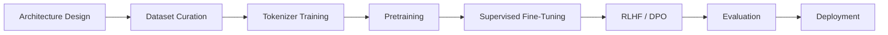
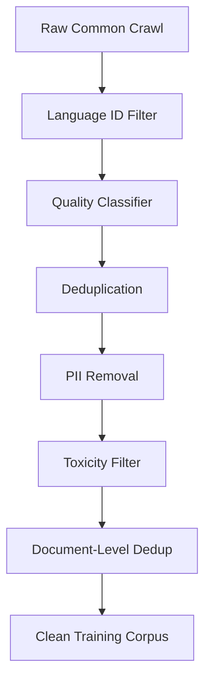
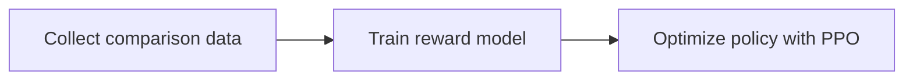

## Introduction

After building an [inference engine](/blog/how-llm-inference-engines-work/) and tracing [every operation inside a transformer](/blog/life-of-a-token-inside-an-llm/), the next question was obvious: how are these models actually *made*? Not the forward pass - I understood that. But the entire pipeline: how do you go from an empty `nn.Module` and a pile of internet text to a model that can reason about code, answer questions about history, and write poetry?

I spent weeks reading training papers (LLaMA, Chinchilla, InstructGPT), studying open-source training codebases, and putting together a complete picture of the process. This post is that picture - every stage from architecture selection to RLHF alignment, with the technical details that papers often gloss over.



## Stage 1: Architecture Decisions

### Why Decoder-Only Transformers Won

This was the first thing I wanted to understand - why did the entire industry converge on decoder-only? The original 2017 Transformer had an encoder and a decoder. Since then, three variants emerged:

| Architecture | Examples | Use Case |
|-------------|----------|----------|
| Encoder-only | BERT, RoBERTa | Classification, embeddings |
| Encoder-decoder | T5, BART | Translation, summarization |
| Decoder-only | GPT, LLaMA, Claude | General text generation |

Decoder-only won for foundation models because of a single property: **unified next-token prediction works for everything**. Classification, translation, summarization, code generation, reasoning - they all reduce to "predict the next token given context." One architecture, one training objective, infinite tasks.

The decoder-only transformer uses **causal (autoregressive) attention** - each token can only attend to tokens before it. This is what makes left-to-right generation possible.

### Choosing Model Dimensions

A modern foundation model is defined by a handful of hyperparameters:

```python
config = {
    "vocab_size": 128_000,        # tokenizer vocabulary size
    "hidden_size": 4096,          # embedding and residual stream dimension
    "num_hidden_layers": 32,      # number of transformer blocks
    "num_attention_heads": 32,    # query heads
    "num_key_value_heads": 8,     # KV heads (GQA)
    "intermediate_size": 14336,   # FFN hidden dimension
    "max_position_embeddings": 8192,
    "rope_theta": 500000.0,       # RoPE base frequency
    "rms_norm_eps": 1e-5,
}
```

These numbers aren't arbitrary. They follow scaling laws.

**Chinchilla scaling laws** (Hoffmann et al., 2022) showed that for a fixed compute budget, you should scale model size and training tokens roughly equally. The relationship is approximately:

```
Optimal tokens ~ 20 * model_parameters
```

So a 7B model wants ~140B tokens, a 70B model wants ~1.4T tokens. Training a large model on too little data wastes compute; training a small model on too much data also wastes compute. In practice, teams now overtrain beyond Chinchilla-optimal because inference cost (which scales with model size) matters more than training cost for widely deployed models. LLaMA 3 trained an 8B model on 15T tokens - roughly 100x the Chinchilla-optimal ratio.

### Normalization: RMSNorm Over LayerNorm

Modern models use **RMSNorm** (Root Mean Square Normalization) instead of the original transformer's LayerNorm:

```python
# LayerNorm: subtract mean, divide by std, scale + shift
def layer_norm(x, weight, bias, eps=1e-5):
    mean = x.mean(dim=-1, keepdim=True)
    var = (x - mean).pow(2).mean(dim=-1, keepdim=True)
    return (x - mean) / (var + eps).sqrt() * weight + bias

# RMSNorm: divide by RMS, scale only (no mean subtraction, no bias)
def rms_norm(x, weight, eps=1e-5):
    rms = x.pow(2).mean(dim=-1, keepdim=True).add(eps).rsqrt()
    return x * rms * weight
```

RMSNorm drops the mean-centering step and the bias term. It's faster (fewer operations) and works just as well empirically. The `weight` vector is learned per-dimension, allowing the model to rescale each feature.

Modern models also use **pre-norm** placement (normalize before each sublayer) rather than the original post-norm. Pre-norm produces more stable gradients in deep networks.

### Positional Encoding: RoPE

Modern models use **Rotary Positional Embeddings (RoPE)** instead of learned or sinusoidal position embeddings. RoPE encodes position by rotating query and key vectors, making the attention score depend on relative position:

```python
def precompute_rope(dim, max_seq, theta=500000.0):
    freqs = 1.0 / (theta ** (torch.arange(0, dim, 2).float() / dim))
    positions = torch.arange(max_seq).float()
    angles = torch.outer(positions, freqs)
    return angles.cos(), angles.sin()
```

RoPE has two key advantages: it generalizes to longer sequences than seen during training (with techniques like NTK-aware scaling), and it naturally captures relative position without adding parameters.

The `theta` parameter controls the frequency base. Higher values (500K vs. the original 10K) spread the frequencies further apart, which helps with long-context generalization. This is why LLaMA 3 uses `rope_theta=500000`.

### Attention: Grouped-Query Attention (GQA)

Standard multi-head attention gives each head its own Q, K, V projections. **GQA** shares K and V heads across multiple query heads:

```
Multi-Head Attention (MHA):  32 Q heads, 32 KV heads  (1:1)
Grouped-Query Attention (GQA): 32 Q heads, 8 KV heads   (4:1)
Multi-Query Attention (MQA):  32 Q heads, 1 KV head    (32:1)
```

GQA cuts KV cache memory by 4x (in the 4:1 case) with minimal quality loss. This directly translates to longer context windows and higher batch sizes during inference. LLaMA 2 70B and all LLaMA 3 models use GQA.

### Feed-Forward: SwiGLU

The feed-forward network uses **SwiGLU** gating:

```python
def swiglu_ffn(x, W_gate, W_up, W_down):
    gate = F.silu(x @ W_gate.T)    # SiLU activation on gate
    up = x @ W_up.T                 # linear projection
    return (gate * up) @ W_down.T   # element-wise gate, then project back
```

SwiGLU uses three weight matrices instead of two (gate, up, down vs. just up, down), but the gating mechanism makes it more expressive per parameter. The `intermediate_size` is typically ~3.5x the `hidden_size` to keep the total parameter count comparable to a standard 4x FFN.

## Stage 2: Dataset Curation

This stage surprised me. I expected the training loop to be the most complex part of building a foundation model. It's not. Data curation is. The preprocessing pipeline - filtering, deduplication, quality scoring - is often more engineering effort than the model training itself.

### Data Sources

Foundation model training data comes from multiple sources, mixed in carefully chosen proportions:

| Source | Size (typical) | Proportion | What It Teaches |
|--------|---------------|------------|-----------------|
| Web crawl (Common Crawl) | 5-10T tokens | 60-70% | Broad world knowledge, diverse language |
| Code (GitHub, StackOverflow) | 500B-1T tokens | 10-15% | Logical reasoning, structured thinking |
| Books (BookCorpus, Project Gutenberg) | 50-100B tokens | 3-5% | Long-range coherence, narrative structure |
| Academic papers (arXiv, Semantic Scholar) | 50-100B tokens | 3-5% | Technical reasoning, citations |
| Wikipedia | 10-20B tokens | 2-3% | Factual knowledge, encyclopedic style |
| Curated Q&A (StackExchange, forums) | 20-50B tokens | 2-3% | Question-answering patterns |
| Math (textbooks, competition problems) | 10-50B tokens | 1-3% | Mathematical reasoning |
| Multilingual text | varies | 5-15% | Non-English language support |

The **data mix** is one of the most consequential decisions in training. More code in the mix improves reasoning on non-code tasks. More books improve long-range coherence. The ratios are typically determined through ablation studies on smaller models.

### Data Preprocessing Pipeline

Raw web data is noisy. The preprocessing pipeline is typically the most engineering-heavy part of the entire project:



#### Language Identification

fastText classifiers detect the language of each document. English-only models filter to English; multilingual models keep documents in target languages:

```python
import fasttext
model = fasttext.load_model("lid.176.bin")

def detect_language(text):
    predictions = model.predict(text.replace("\n", " ")[:512])
    lang = predictions[0][0].replace("__label__", "")
    confidence = predictions[1][0]
    return lang, confidence

# Keep only high-confidence English
lang, conf = detect_language(document)
if lang != "en" or conf < 0.65:
    discard(document)
```

#### Quality Filtering

Most web text is low quality - SEO spam, boilerplate, auto-generated content. Quality classifiers score each document:

```python
# Heuristic filters (fast, applied first)
def passes_heuristics(doc):
    words = doc.split()
    if len(words) < 50:                        return False  # too short
    if len(words) > 100_000:                   return False  # too long
    if doc.count("...") / len(words) > 0.1:   return False  # ellipsis spam
    if len(set(words)) / len(words) < 0.1:    return False  # repetitive
    avg_word_len = sum(len(w) for w in words) / len(words)
    if avg_word_len > 20 or avg_word_len < 2:  return False  # gibberish

    # Check for excessive special characters
    alpha_ratio = sum(c.isalpha() for c in doc) / max(len(doc), 1)
    if alpha_ratio < 0.5:                       return False

    return True
```

More sophisticated quality classifiers use a small trained model (often a fastText or logistic regression classifier) trained on "high quality" text (Wikipedia, curated books) vs. random web text:

```python
# Perplexity-based quality filter (used by CCNet/LLaMA)
# Documents with very high perplexity under a language model
# are likely gibberish or very unusual text
def perplexity_filter(doc, lm, threshold=500):
    ppl = lm.perplexity(doc)
    return ppl < threshold
```

#### Deduplication

Duplicate and near-duplicate content inflates certain styles and memorization. There are three levels:

**Exact dedup** removes byte-identical documents using hashes:

```python
import hashlib

seen_hashes = set()

def exact_dedup(doc):
    h = hashlib.sha256(doc.encode()).hexdigest()
    if h in seen_hashes:
        return True  # duplicate
    seen_hashes.add(h)
    return False
```

**Fuzzy dedup** catches near-duplicates using MinHash + LSH (Locality-Sensitive Hashing). Two documents that share >80% of their n-gram shingles are considered duplicates:

```python
from datasketch import MinHash, MinHashLSH

lsh = MinHashLSH(threshold=0.8, num_perm=128)

def minhash_doc(doc, num_perm=128):
    m = MinHash(num_perm=num_perm)
    for shingle in ngrams(doc.lower().split(), 5):  # 5-gram shingles
        m.update(" ".join(shingle).encode())
    return m

def fuzzy_dedup(doc_id, doc):
    mh = minhash_doc(doc)
    if lsh.query(mh):       # check for similar documents
        return True          # near-duplicate
    lsh.insert(doc_id, mh)
    return False
```

**Substring dedup** removes documents that contain long repeated passages (e.g., shared boilerplate, copied paragraphs) using suffix arrays.

LLaMA's training pipeline used CCNet for deduplication, removing ~86% of raw Common Crawl. This is typical - the vast majority of raw web data is duplicate or near-duplicate.

#### PII Removal

Personal information (emails, phone numbers, SSNs, addresses) is removed or replaced:

```python
import re

PII_PATTERNS = [
    (r'\b[\w.+-]+@[\w-]+\.[\w.-]+\b', '[EMAIL]'),
    (r'\b\d{3}[-.]?\d{3}[-.]?\d{4}\b', '[PHONE]'),
    (r'\b\d{3}-\d{2}-\d{4}\b', '[SSN]'),
    (r'\b\d{1,5}\s\w+\s(?:St|Ave|Blvd|Dr|Rd|Ln)\b', '[ADDRESS]'),
]

def remove_pii(text):
    for pattern, replacement in PII_PATTERNS:
        text = re.sub(pattern, replacement, text)
    return text
```

## Stage 3: Tokenizer Training

Before training the model, you need a tokenizer - a mapping between text and integer token IDs. Modern tokenizers use **Byte-Pair Encoding (BPE)** or **SentencePiece** (Unigram model).

### BPE Training

BPE starts with a base vocabulary (individual bytes or characters) and iteratively merges the most frequent adjacent pairs:

```
Initial vocabulary: all individual bytes (256 entries)

Corpus: "the cat sat on the mat the cat"

Iteration 1: Most frequent pair is ('t', 'h') -> merge into 'th'
Iteration 2: Most frequent pair is ('th', 'e') -> merge into 'the'
Iteration 3: Most frequent pair is ('a', 't') -> merge into 'at'
Iteration 4: Most frequent pair is ('c', 'at') -> merge into 'cat'
Iteration 5: Most frequent pair is ('m', 'at') -> merge into 'mat'
Iteration 6: Most frequent pair is ('s', 'at') -> merge into 'sat'
...continue until vocabulary reaches target size (e.g., 128,000)
```

In practice, tokenizer training runs on a representative sample of the training data (not the full dataset) to determine the merge rules:

```python
from tokenizers import Tokenizer, models, trainers, pre_tokenizers

tokenizer = Tokenizer(models.BPE())
tokenizer.pre_tokenizer = pre_tokenizers.ByteLevel(add_prefix_space=False)

trainer = trainers.BpeTrainer(
    vocab_size=128_000,
    min_frequency=2,
    special_tokens=["<|begin_of_text|>", "<|end_of_text|>", "<|pad|>"],
)

# Train on a sample of the corpus
tokenizer.train(files=["sample_corpus.txt"], trainer=trainer)
```

### Tokenizer Design Choices

| Decision | Trade-off |
|----------|-----------|
| Vocabulary size (32K vs. 128K) | Larger vocab = shorter sequences (faster inference) but bigger embedding table |
| Byte-level BPE vs. character-level | Byte-level handles any Unicode; character-level is cleaner but can't represent unknown characters |
| Special tokens | BOS, EOS, PAD, chat role tokens (`<\|user\|>`, `<\|assistant\|>`) |
| Whitespace handling | Whether spaces are part of the preceding token or their own token affects tokenization quality |

LLaMA 3 expanded from 32K to 128K tokens, which improved compression ratio (fewer tokens per document), meaning faster training and inference on the same text. The trade-off is a larger embedding matrix (128K x 4096 vs. 32K x 4096).

## Stage 4: Pretraining (Self-Supervised Learning)

This is the core training stage - and by far the most expensive. Pretraining uses **next-token prediction** (also called causal language modeling) on the entire training corpus.

### The Training Objective

The model sees a sequence of tokens and predicts the next one at each position. The loss is cross-entropy between the predicted probability distribution and the actual next token:

```python
def compute_loss(model, input_ids):
    # input_ids: [batch_size, seq_len]
    # Shift: inputs are tokens 0..N-1, targets are tokens 1..N
    logits = model(input_ids[:, :-1])        # [B, S-1, vocab_size]
    targets = input_ids[:, 1:]                # [B, S-1]

    loss = F.cross_entropy(
        logits.reshape(-1, logits.size(-1)),  # [B*(S-1), vocab_size]
        targets.reshape(-1),                   # [B*(S-1)]
        ignore_index=PAD_TOKEN_ID,
    )
    return loss
```

This is **self-supervised** - the labels come from the data itself. No human annotation is needed. The model learns to predict the next token at every position simultaneously, so a single sequence of 4096 tokens provides 4095 training examples.

### The Optimizer: AdamW

Nearly all foundation models use **AdamW** (Adam with decoupled weight decay):

```python
optimizer = torch.optim.AdamW(
    model.parameters(),
    lr=3e-4,               # peak learning rate
    betas=(0.9, 0.95),     # momentum terms
    weight_decay=0.1,      # L2 regularization (decoupled)
    eps=1e-8,
)
```

AdamW maintains per-parameter running averages of the gradient (first moment) and squared gradient (second moment). This gives each parameter an adaptive learning rate - parameters with consistent gradients get larger updates, parameters with noisy gradients get smaller updates.

The `betas` control the exponential moving average:
- `beta1 = 0.9`: the gradient momentum (smooths out noise)
- `beta2 = 0.95`: the squared gradient (adapts per-parameter learning rates)

`weight_decay = 0.1` adds L2 regularization to prevent weights from growing too large, which helps generalization.

### Learning Rate Schedule

The learning rate follows a warmup + cosine decay schedule:

```python
def get_lr(step, warmup_steps=2000, max_steps=100_000, max_lr=3e-4, min_lr=3e-5):
    # Linear warmup
    if step < warmup_steps:
        return max_lr * step / warmup_steps

    # Cosine decay
    progress = (step - warmup_steps) / (max_steps - warmup_steps)
    return min_lr + 0.5 * (max_lr - min_lr) * (1 + math.cos(math.pi * progress))
```

```
Learning rate over training:

     max_lr |    /\
            |   /  \
            |  /    \_
            | /       \_
            |/          \____
     min_lr |________________\___
            0   warmup    max_steps
```

**Warmup** (first ~2000 steps) gradually increases the learning rate from 0 to the peak. Without warmup, the initial random gradients are large and would destabilize training. By the time the learning rate reaches its peak, the gradients have settled into a more stable regime.

**Cosine decay** smoothly decreases the learning rate to near zero. Large updates early in training make big progress; smaller updates later refine the weights without overshooting.

### Training Data Packing

Training sequences have a fixed context length (e.g., 4096 tokens). Documents shorter than this are **packed** together with separator tokens to avoid wasting compute on padding:

```
Document A (200 tokens) + <EOS> + Document B (1500 tokens) + <EOS> + 
Document C (2390 tokens) + <EOS> = 4096 tokens total
```

Documents longer than the context length are split into chunks. The attention mask ensures tokens from different documents don't attend to each other.

### Distributed Training

Training a 7B+ parameter model requires hundreds or thousands of GPUs. Three parallelism strategies are combined:

**Data Parallelism (DP):** Each GPU holds a full copy of the model and processes different batches. Gradients are averaged across GPUs after each step:

```python
# Simplified: each GPU processes its own batch, gradients are all-reduced
loss = model(batch_on_this_gpu)
loss.backward()
all_reduce(model.gradients)  # average across all GPUs
optimizer.step()
```

**Tensor Parallelism (TP):** Large weight matrices are split across GPUs. A single matrix multiplication is distributed, with each GPU computing a slice:

```
# W: [4096, 14336] split across 4 GPUs
GPU 0: W[:, 0:3584]       # computes partial result
GPU 1: W[:, 3584:7168]
GPU 2: W[:, 7168:10752]
GPU 3: W[:, 10752:14336]
# Results are concatenated or summed via all-reduce
```

**Pipeline Parallelism (PP):** Transformer layers are distributed across GPUs. GPU 0 runs layers 0-7, GPU 1 runs layers 8-15, etc. Micro-batching keeps all GPUs busy:

```
GPU 0: Layers 0-7    [batch 1 fwd] [batch 2 fwd] [batch 3 fwd] ...
GPU 1: Layers 8-15              [batch 1 fwd] [batch 2 fwd] [batch 3 fwd] ...
GPU 2: Layers 16-23                        [batch 1 fwd] [batch 2 fwd] ...
GPU 3: Layers 24-31                                   [batch 1 fwd] ...
```

**FSDP (Fully Sharded Data Parallelism):** A hybrid approach where each GPU holds only a shard of the model parameters and gathers them on demand during the forward/backward pass. This reduces per-GPU memory from O(model_size) to O(model_size / num_gpus).

A typical setup for a 7B model: 64 GPUs across 8 nodes, using FSDP + TP (2-way) with gradient checkpointing to fit within GPU memory. Training takes 1-2 weeks.

### Gradient Accumulation

When the desired batch size doesn't fit in GPU memory, gradients are accumulated across multiple forward/backward passes before taking an optimizer step:

```python
accumulation_steps = 8
optimizer.zero_grad()

for micro_step in range(accumulation_steps):
    batch = next(dataloader)
    loss = model(batch) / accumulation_steps  # scale loss
    loss.backward()                           # accumulate gradients

optimizer.step()  # one update from 8 micro-batches
```

This is mathematically equivalent to a larger batch size. A 7B model might use a global batch size of 4M tokens (1024 sequences x 4096 tokens), achieved through data parallelism across GPUs + gradient accumulation.

### Mixed Precision Training

Models train in **bfloat16** (bf16) to halve memory usage and double throughput:

```python
# Master weights in float32, forward/backward in bfloat16
with torch.autocast(device_type="cuda", dtype=torch.bfloat16):
    logits = model(input_ids)
    loss = F.cross_entropy(logits.view(-1, vocab_size), targets.view(-1))

# bf16 keeps fp32's exponent range, so no GradScaler / loss scaling is needed
loss.backward()
optimizer.step()
optimizer.zero_grad()
```

BFloat16 has the same exponent range as float32 (8 bits) but reduced mantissa precision (7 bits vs. 23). This means it rarely overflows/underflows (unlike float16), making it safe for training without loss scaling in most cases.

Critical operations - RMSNorm, softmax, loss computation - are still done in float32 for numerical stability.

### Checkpointing

Training runs for weeks. Regular checkpoints save the full training state:

```python
def save_checkpoint(model, optimizer, step, path):
    torch.save({
        "model_state_dict": model.state_dict(),
        "optimizer_state_dict": optimizer.state_dict(),
        "step": step,
        "loss": current_loss,
        "lr": current_lr,
        "rng_state": torch.random.get_rng_state(),
    }, path)
```

A checkpoint includes model weights, optimizer state, the current step, and the RNG state for deterministic resumption. AdamW dominates the size: it stores two fp32 moment buffers (first and second moment), each the size of the fp32 weights. For a 7B model that is ~56GB of optimizer state alone (2 buffers x 4 bytes x 7B), on top of fp32 master weights (~28GB) and the bf16 model (~14GB). A full training-state checkpoint runs well over 100GB, which is why large runs shard checkpoints across data-parallel ranks.

### What Pretraining Learns

This is the part I find most remarkable. The model's only objective is "predict the next token." There's no explicit knowledge injection, no reasoning curriculum, no labeled examples. But to predict the next token well, the model implicitly has to learn:

- **Syntax and grammar** - it must predict grammatically correct continuations
- **World knowledge** - "The capital of France is" requires knowing the answer
- **Reasoning patterns** - code and math in the training data teach logical structure
- **Style adaptation** - it can continue text in the style of the preceding context
- **Multilingual transfer** - patterns from one language transfer to others

But a pretrained model is not yet useful as an assistant. It's a text completer, not a question answerer. Ask it "What is 2+2?" and it might continue with "What is 3+3? What is 4+4?" because that pattern appears in its training data. Turning it into an assistant requires post-training.

## Stage 5: Supervised Fine-Tuning (SFT)

After pretraining, you have a powerful text completer that has no idea it's supposed to be an assistant. Ask it "What is 2+2?" and it might continue with "What is 3+3? What is 4+4?" because that pattern exists in its training data. SFT is what turns a text completer into a chatbot. It teaches the model the **format** of being an assistant - how to respond to questions, follow instructions, and use appropriate tone. The training data is human-written conversation examples:

```json
[
  {
    "messages": [
      {"role": "system", "content": "You are a helpful assistant."},
      {"role": "user", "content": "What is the capital of France?"},
      {"role": "assistant", "content": "The capital of France is Paris."}
    ]
  },
  {
    "messages": [
      {"role": "user", "content": "Write a Python function to reverse a string."},
      {"role": "assistant", "content": "```python\ndef reverse_string(s):\n    return s[::-1]\n```"}
    ]
  }
]
```

### SFT Training

The training loop is identical to pretraining (next-token prediction), but with two differences:

1. **Data format** - inputs are formatted with chat templates (role markers like `<|user|>` and `<|assistant|>`)
2. **Loss masking** - the loss is computed only on the assistant's tokens, not the user's. The model shouldn't learn to predict what the user says; it should learn to respond:

```python
def sft_loss(model, input_ids, labels):
    logits = model(input_ids)
    # labels has -100 for user/system tokens (ignored by cross_entropy)
    # and actual token IDs for assistant tokens
    loss = F.cross_entropy(
        logits.view(-1, vocab_size),
        labels.view(-1),
        ignore_index=-100,  # skip loss on non-assistant tokens
    )
    return loss
```

### SFT Dataset Scale

SFT datasets are much smaller than pretraining data - typically 10K to 1M examples. Quality matters far more than quantity. Key findings:

- **LIMA (Zhou et al., 2023)** showed that just 1,000 carefully curated examples can produce a strong instruction-following model
- **Diversity** of tasks matters more than volume - covering code, math, creative writing, analysis, and conversation is more important than having millions of similar Q&A pairs
- **Response quality** is critical - the model will mimic the style and depth of the training responses

### SFT Hyperparameters

SFT uses much lower learning rates than pretraining to avoid catastrophically forgetting pretrained knowledge:

```python
# SFT typically uses:
learning_rate = 2e-5        # 10-15x lower than pretraining
epochs = 2-3                # small number of passes
warmup_ratio = 0.03         # brief warmup
batch_size = 128            # smaller than pretraining
```

After SFT, the model can follow instructions and have conversations. But it might still produce harmful content, hallucinate confidently, or give verbose/unhelpful responses. That's what alignment addresses.

## Stage 6: Alignment (RLHF and DPO)

Alignment teaches the model **which** responses are better - not just how to format them, but how to make them helpful, harmless, and honest.

### RLHF: Reinforcement Learning from Human Feedback

RLHF has three sub-stages:



#### Step 1: Collect Human Preferences

Human annotators compare pairs of model responses and indicate which is better:

```
Prompt: "Explain quantum computing in simple terms."

Response A: "Quantum computing uses quantum bits (qubits) that can be 
0, 1, or both at once (superposition). This lets quantum computers 
try many solutions simultaneously for certain problems."

Response B: "Quantum computing is a type of computation that harnesses 
the collective properties of quantum states, such as superposition, 
interference, and entanglement, to perform calculations."

Human preference: A > B (simpler, more accessible)
```

Thousands of these comparisons are collected across diverse prompts.

#### Step 2: Train a Reward Model

A reward model learns to predict human preferences. It's initialized from the SFT model with the LM head replaced by a scalar output:

```python
class RewardModel(nn.Module):
    def __init__(self, base_model):
        super().__init__()
        self.backbone = base_model        # pretrained transformer
        self.reward_head = nn.Linear(hidden_size, 1)  # scalar output

    def forward(self, input_ids):
        hidden = self.backbone(input_ids)  # [B, S, hidden_size]
        last_hidden = hidden[:, -1, :]     # [B, hidden_size] (last token)
        reward = self.reward_head(last_hidden)  # [B, 1]
        return reward
```

The reward model is trained with a **pairwise ranking loss** - it should assign a higher score to the preferred response:

```python
def reward_loss(reward_model, prompt_chosen_ids, prompt_rejected_ids):
    r_chosen = reward_model(prompt_chosen_ids)    # scalar reward for preferred
    r_rejected = reward_model(prompt_rejected_ids)  # scalar reward for rejected

    # Bradley-Terry model: P(chosen > rejected) = sigmoid(r_chosen - r_rejected)
    loss = -F.logsigmoid(r_chosen - r_rejected).mean()
    return loss
```

#### Step 3: Optimize with PPO

Proximal Policy Optimization (PPO) fine-tunes the model to maximize the reward model's score while staying close to the SFT model (to prevent reward hacking):

```python
def ppo_objective(model, ref_model, reward_model, prompt_ids, response_ids):
    # Log probability of response under current model
    logprobs = model.log_prob(response_ids, given=prompt_ids)
    # Log probability under reference (SFT) model
    ref_logprobs = ref_model.log_prob(response_ids, given=prompt_ids)

    # Reward from the reward model
    reward = reward_model(torch.cat([prompt_ids, response_ids], dim=1))

    # KL penalty: don't diverge too far from the SFT model
    kl = logprobs - ref_logprobs

    # PPO objective: maximize reward - beta * KL
    objective = reward - beta * kl
    return -objective.mean()  # minimize negative objective
```

The KL penalty (`beta * kl`) is critical. Without it, the model finds degenerate ways to maximize the reward - like producing extremely verbose responses or repeating phrases the reward model likes. The KL constraint keeps the model close to its SFT distribution.

### DPO: Direct Preference Optimization

**DPO** (Rafailov et al., 2023) simplifies RLHF by eliminating the reward model and PPO entirely. It optimizes preferences directly:

```python
def dpo_loss(model, ref_model, chosen_ids, rejected_ids, beta=0.1):
    # Log probs under current policy
    pi_chosen = model.log_prob(chosen_ids)
    pi_rejected = model.log_prob(rejected_ids)

    # Log probs under reference model
    ref_chosen = ref_model.log_prob(chosen_ids)
    ref_rejected = ref_model.log_prob(rejected_ids)

    # DPO loss: directly optimize the implicit reward margin
    logits = beta * ((pi_chosen - ref_chosen) - (pi_rejected - ref_rejected))
    loss = -F.logsigmoid(logits).mean()
    return loss
```

DPO works by showing the model pairs of (chosen, rejected) responses and directly adjusting the model's probabilities to prefer the chosen response. Mathematically, it's equivalent to RLHF under certain assumptions, but it's much simpler to implement - no reward model training, no PPO, no reward hacking.

DPO has become the default alignment method for many teams because of its simplicity and stability. LLaMA 3 uses a variant of DPO for its alignment stage.

## Stage 7: Evaluation

### Benchmarks

Foundation models are evaluated across multiple dimensions:

| Benchmark | What It Tests | Format |
|-----------|--------------|--------|
| MMLU | Broad knowledge (57 subjects) | Multiple choice |
| HumanEval / MBPP | Code generation | Write function from docstring |
| GSM8K | Grade school math | Word problems |
| MATH | Competition math | Proof-style problems |
| HellaSwag | Common sense reasoning | Sentence completion |
| TruthfulQA | Factual accuracy / hallucination | Truthfulness of answers |
| MT-Bench | Multi-turn conversation quality | LLM-as-judge scoring |
| IFEval | Instruction following | Constraint satisfaction |

### Perplexity

The most fundamental metric during pretraining is **perplexity** - the exponential of the average cross-entropy loss:

```python
perplexity = torch.exp(loss)
```

Lower perplexity means the model is better at predicting the next token. A perplexity of 10 means the model is "as confused as if it had to choose uniformly among 10 options" on average. State-of-the-art models achieve perplexities of 5-8 on held-out web text.

Perplexity trends during training follow a smooth power law - rapid improvement early, gradually diminishing returns. Monitoring this curve is how teams detect training instabilities (loss spikes) and estimate when to stop.

## The Full Timeline

For a 7B parameter model:

| Stage | Duration | Compute | Data |
|-------|----------|---------|------|
| Architecture design | 2-4 weeks | Minimal (ablations on small models) | N/A |
| Dataset curation | 4-8 weeks | Moderate (CPU cluster for filtering) | 10T+ raw tokens in, 1-2T clean tokens out |
| Tokenizer training | 1-2 days | Minimal | Sample of training corpus |
| Pretraining | 2-4 weeks | 64-256 GPUs (H100) | 1-2T tokens, multiple epochs |
| SFT | 1-3 days | 8-16 GPUs | 50K-500K examples |
| RLHF/DPO | 3-7 days | 16-32 GPUs | 50K-200K preference pairs |
| Evaluation | 1-2 weeks | Moderate | Standard benchmarks |

Total cost for a 7B model: $500K-$2M in compute. For a 70B model: $5M-$20M. For frontier models (GPT-4 scale): $50M-$100M+.

## Key Takeaways

**Architecture is mostly settled.** Decoder-only transformer with RMSNorm, RoPE, GQA, and SwiGLU is the standard recipe. The major open decisions are model size, context length, and vocabulary size.

**Data quality dominates model quality.** A 7B model trained on carefully curated data outperforms a 70B model trained on noisy data. Deduplication alone can improve a model's benchmark scores by several percentage points. The preprocessing pipeline is typically more engineering effort than the training loop.

**Pretraining is self-supervised at scale.** Next-token prediction on trillions of tokens teaches language, knowledge, and reasoning without any human labels. The implicit curriculum is the internet itself.

**Post-training is where assistants are born.** SFT teaches format (how to be a chatbot). RLHF/DPO teaches preferences (which responses humans prefer). Both stages use orders of magnitude less data than pretraining but have an outsized impact on usability.

**Scaling laws guide resource allocation.** Chinchilla-optimal ratios tell you how to balance model size vs. training data for a given compute budget. In practice, teams overtrain smaller models because inference cost matters more than training cost at deployment scale.

**The training stack is as important as the model.** Distributed training (FSDP, tensor parallelism, pipeline parallelism), mixed precision, gradient accumulation, and checkpointing are not optional - they're required to make training tractable at scale. The engineering challenge of keeping hundreds of GPUs utilized efficiently is as hard as the ML research.
