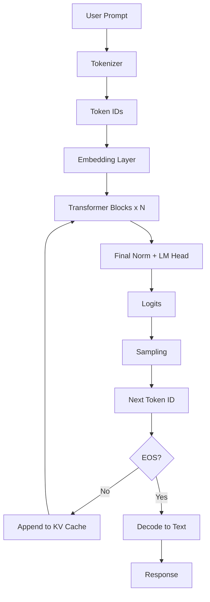
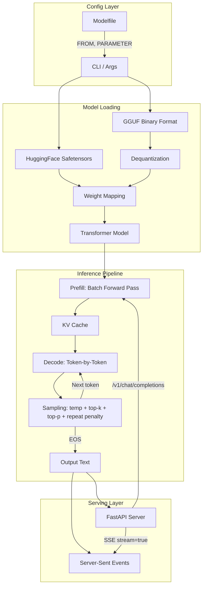

## Introduction

I spent a lot of time using tools like Ollama and vLLM before I realized I didn't actually understand what they were doing. I knew the transformer architecture in theory, but I couldn't explain how a model file on disk becomes a streaming chat response. The gap between "I've read the attention paper" and "I can build an inference engine" turned out to be enormous.

So I built one. [nanollama](https://github.com/mrcloudchase/nanollama) is a single-file LLM inference engine in ~1400 lines of PyTorch. It loads real models from HuggingFace, runs the full transformer forward pass, and serves an OpenAI-compatible API. Building it taught me more about how LLMs actually work than months of reading papers.

This post distills what I learned. I'll walk through every layer of an inference engine using nanollama's code, from raw model weights to streamed HTTP responses. If you've used LLMs but haven't looked under the hood, this is that look.

## Architecture Overview

Here's the full pipeline from prompt to response:



Every inference engine implements this loop. The differences between engines (Ollama, vLLM, llama.cpp, TGI) come down to how aggressively they optimize each step. Let's build it piece by piece.

## The Transformer: What the Model Actually Is

Here's the thing that clicked for me when building nanollama: an LLM is simpler than it looks. It's a stack of identical transformer blocks. Each block does two things - attention (look at previous tokens) and a feed-forward network (reason about what you saw). Everything else - normalization, positional encoding, KV caching - is infrastructure to make those two operations work well at scale.

### Configuration

Every model ships with a `config.json` that defines its shape:

```python
@dataclass
class Config:
    vocab_size: int = 32000
    hidden_size: int = 2048
    intermediate_size: int = 5632
    num_hidden_layers: int = 22
    num_attention_heads: int = 32
    num_key_value_heads: int = 4
    max_position_embeddings: int = 2048
    rms_norm_eps: float = 1e-5
    rope_theta: float = 10000.0
```

These numbers tell the engine how to build the model. `num_hidden_layers` is the depth (how many transformer blocks to stack). `hidden_size` is the width (the dimension of the vector representing each token). `num_attention_heads` vs `num_key_value_heads` defines the attention strategy - when they differ, it's **Grouped-Query Attention**, which we'll cover shortly.

### RMSNorm

Before each sublayer in the transformer, activations are normalized. Modern LLMs use **RMSNorm** instead of LayerNorm - it skips the mean-centering step and just scales by the root-mean-square:

```python
class RMSNorm(nn.Module):
    def __init__(self, dim: int, eps: float = 1e-5):
        super().__init__()
        self.eps = eps
        self.weight = nn.Parameter(torch.ones(dim))

    def forward(self, x):
        norm = x.float().pow(2).mean(-1, keepdim=True).add(self.eps).rsqrt()
        return (x.float() * norm).type_as(x) * self.weight
```

The `.float()` call matters - when running in float16, the squaring and mean operations can overflow without promoting to float32 first. This is one of the many numerical stability details that inference engines have to handle.

### Rotary Positional Embeddings (RoPE)

Transformers are position-agnostic by default - they don't know if a token is at position 0 or position 500. **RoPE** encodes position by rotating pairs of dimensions in the query and key vectors. The key insight: the dot product of two rotated vectors depends only on their *relative* position, giving the model translation-invariant position awareness.

```python
def precompute_rope(dim: int, max_seq: int, theta: float = 10000.0):
    freqs = 1.0 / (theta ** (torch.arange(0, dim, 2).float() / dim))
    angles = torch.outer(torch.arange(max_seq).float(), freqs)
    return angles.cos(), angles.sin()

def apply_rope(q, k, cos, sin, pos):
    seq = q.shape[1]
    cos = cos[pos:pos + seq].unsqueeze(0).unsqueeze(2)  # [1, seq, 1, dim//2]
    sin = sin[pos:pos + seq].unsqueeze(0).unsqueeze(2)

    def rotate(x):
        x = x.float()
        half = x.shape[-1] // 2
        x1, x2 = x[..., :half], x[..., half:]
        return torch.cat([x1 * cos - x2 * sin, x2 * cos + x1 * sin], dim=-1)

    return rotate(q), rotate(k)
```

Each dimension pair gets a different frequency (like the hands of a clock moving at different speeds). Lower-frequency pairs encode coarse position, higher-frequency pairs encode fine position. The `theta` parameter (typically 10,000) controls the frequency spread.

### Grouped-Query Attention (GQA) and KV Cache

Attention is where the model decides which previous tokens matter for predicting the next one. The standard formula is `softmax(QK^T / sqrt(d)) * V`, where Q (queries), K (keys), and V (values) are linear projections of the input.

**GQA** is a memory optimization: instead of giving every query head its own key/value head, multiple query heads *share* key/value heads. TinyLlama-1.1B uses 32 query heads but only 4 KV heads - an 8:1 ratio that cuts KV memory by 8x.

The **KV cache** is what makes autoregressive generation fast. During the prefill phase, we compute keys and values for all prompt tokens and store them. During decode, we only process *one new token at a time* - we compute its Q, K, V, write K and V into the cache, then attend over the full cached history:

```python
class Attention(nn.Module):
    def forward(self, x, cos, sin, pos, mask=None):
        B, S, _ = x.shape
        q = self.q_proj(x).view(B, S, self.n_heads, self.head_dim)
        k = self.k_proj(x).view(B, S, self.n_kv, self.head_dim)
        v = self.v_proj(x).view(B, S, self.n_kv, self.head_dim)
        q, k = apply_rope(q, k, cos, sin, pos)

        # Write new K, V into the cache
        self.cache_k[:B, pos:pos + S] = k
        self.cache_v[:B, pos:pos + S] = v
        kv_len = pos + S

        # Read full history from cache
        k = self.cache_k[:B, :kv_len]
        v = self.cache_v[:B, :kv_len]

        # Expand KV heads to match query heads (GQA)
        if self.n_rep > 1:
            k = k.unsqueeze(3).expand(-1, -1, -1, self.n_rep, -1)
            k = k.reshape(B, -1, self.n_heads, self.head_dim)
            # ... same for v

        # Scaled dot-product attention
        scores = (q.float() @ k.float().transpose(-2, -1)) / math.sqrt(self.head_dim)
        attn = F.softmax(scores, dim=-1).type_as(q)
        return self.o_proj((attn @ v).transpose(1, 2).reshape(B, S, -1))
```

Notice the `.float()` on the score computation. This one cost me hours. On Apple Silicon (MPS), float16 matmuls accumulate in half-precision, unlike CUDA which uses float32 accumulators. Without this upcast, attention scores silently overflow and the model produces complete garbage - coherent-looking tokens that are actually random. The output *looked* like language but made no sense, and the bug only appeared in float16 mode on MPS. You don't find this kind of thing in papers. You find it by running the code and staring at wrong outputs.

### SwiGLU Feed-Forward Network

After attention, each token passes through a gated feed-forward network. **SwiGLU** uses a gate mechanism - one linear projection controls *which features pass through*, making it more expressive than a plain ReLU FFN:

```python
class FFN(nn.Module):
    def __init__(self, cfg):
        super().__init__()
        self.gate_proj = nn.Linear(cfg.hidden_size, cfg.intermediate_size, bias=False)
        self.up_proj   = nn.Linear(cfg.hidden_size, cfg.intermediate_size, bias=False)
        self.down_proj = nn.Linear(cfg.intermediate_size, cfg.hidden_size, bias=False)

    def forward(self, x):
        return self.down_proj(F.silu(self.gate_proj(x)) * self.up_proj(x))
```

The `gate_proj` output passes through SiLU (a smooth approximation of ReLU), then element-wise multiplies with the `up_proj` output. This gating lets the model learn *which* dimensions to activate, rather than applying a blanket nonlinearity.

### Putting It Together

A transformer block is just pre-norm residual connections around attention and FFN:

```python
class Block(nn.Module):
    def forward(self, x, cos, sin, pos, mask=None):
        h = x + self.self_attn(self.input_layernorm(x), cos, sin, pos, mask)
        return h + self.mlp(self.post_attention_layernorm(h))
```

And the full model stacks N of these blocks between an embedding layer and a language model head:

```python
class Transformer(nn.Module):
    def forward(self, tokens, start_pos=0):
        h = self.embed_tokens(tokens)          # token IDs → vectors
        for layer in self.layers:              # N transformer blocks
            h = layer(h, cos, sin, pos, mask)
        return self.lm_head(self.norm(h))      # vectors → logits (vocab scores)
```

The output logits are a score for every token in the vocabulary. The sampling strategy decides which one to pick.

## Loading Pre-Trained Weights

The architecture is just an empty shell. The knowledge lives in the weights - billions of floating-point numbers learned during training. HuggingFace models store them in **safetensors** format.

```python
def load_model(model_id, device="cpu", dtype=torch.float32):
    path = Path(snapshot_download(model_id))
    cfg = Config.from_json(path / "config.json")

    weights = {}
    for f in sorted(path.glob("*.safetensors")):
        weights.update(load_file(f))

    # HuggingFace prefixes with "model." - strip it
    mapped = {(k[6:] if k.startswith("model.") else k): v for k, v in weights.items()}

    # Some models tie lm_head weights to the embedding layer
    if "lm_head.weight" not in mapped:
        mapped["lm_head.weight"] = mapped["embed_tokens.weight"]

    model = Transformer(cfg)
    model.load_state_dict(mapped, strict=False)
    model.to(dtype=dtype, device=device).eval()
    return model, AutoTokenizer.from_pretrained(str(path))
```

Weight name mapping was one of the most tedious parts of building nanollama. Every model family uses different naming conventions. HuggingFace prefixes everything with `model.`, GGUF files use names like `blk.0.attn_q.weight` instead of `layers.0.self_attn.q_proj.weight`. There's no standard, so every inference engine carries a translation layer. It's unglamorous work, but if you get a single name wrong, the model silently loads wrong weights into wrong layers and produces nonsense.

**Tied embeddings** caught me off guard. Models like Qwen share the same weight matrix between the input embedding layer and the output LM head. If you don't handle this, the LM head initializes to zeros and the model outputs uniform random logits. The fix is one line, but debugging it took much longer - the model *ran* fine, it just picked random tokens.

## Text Generation: The Prefill/Decode Loop

Generation happens in two phases:


**Prefill** processes the entire prompt in one batched forward pass. This is fast because all tokens run in parallel. The KV cache fills up with the prompt's keys and values.

**Decode** generates one token at a time. Each step only processes one new token, but it attends over the full cached history. This is the bottleneck - it's memory-bandwidth-bound, not compute-bound, because we're reading the entire KV cache for each new token.

```python
# Prefill: process entire prompt
with torch.no_grad():
    logits = model(tokens, start_pos=0)

# Decode: one token at a time, cache grows each step
for i in range(max_tokens):
    next_id = sample(logits[:, -1], ...)
    if next_id == tokenizer.eos_token_id:
        break
    inp = torch.tensor([[next_id]], device=device)
    with torch.no_grad():
        logits = model(inp, start_pos=len(prompt_ids) + i)
```

The `start_pos` parameter tells the model where to write in the KV cache. During prefill it's 0. During decode, it advances by 1 each step. This is what makes the cache work - we never recompute past positions.

## Sampling: Controlling the Output

The model outputs raw logits - unbounded scores for every token in the vocabulary. **Sampling** converts these into a token selection. The strategy dramatically affects output quality.

### Temperature

Temperature scales the logits before softmax. Lower values sharpen the distribution (more deterministic), higher values flatten it (more random):

```python
if temperature == 0:
    return logits.argmax(-1).item()  # greedy: always pick the best
logits = logits / temperature
```

At temperature 0, it's deterministic - always the highest-scoring token. At 0.7, it's balanced. At 1.5+, the model gets creative (and sometimes incoherent).

### Top-k Filtering

Keep only the k most likely tokens, discard the rest:

```python
if top_k > 0:
    top_values, _ = torch.topk(logits, min(top_k, logits.size(-1)))
    logits[logits < top_values[:, -1, None]] = float("-inf")
```

This removes the long tail of unlikely tokens. With top-k=50, the model can only choose from its 50 best guesses, preventing rare garbage tokens from being sampled.

### Top-p (Nucleus) Sampling

Keep the smallest set of tokens whose cumulative probability exceeds p:

```python
if top_p < 1.0:
    sorted_logits, sorted_idx = torch.sort(logits, descending=True)
    cumulative = torch.softmax(sorted_logits, dim=-1).cumsum(dim=-1)
    # Mask tokens once the cumulative probability passes p...
    remove = cumulative > top_p
    # ...but shift right so the first token over the threshold is always kept
    remove[..., 1:] = remove[..., :-1].clone()
    remove[..., 0] = False
    sorted_logits[remove] = float("-inf")
    logits = torch.full_like(logits, float("-inf")).scatter(-1, sorted_idx, sorted_logits)
```

Unlike top-k (which always keeps a fixed count), top-p **adapts** to the distribution. When the model is confident, only a few tokens pass the threshold. When it's uncertain, more tokens make the cut. This produces more natural-sounding text than top-k alone.

### Repetition Penalty

Reduce the probability of tokens that already appeared, preventing the model from getting stuck in loops:

```python
if repeat_penalty != 1.0:
    for tid in set(token_history):
        if logits[0, tid] > 0:
            logits[0, tid] /= repeat_penalty
        else:
            logits[0, tid] *= repeat_penalty
```

The sign-aware logic matters - positive logits are divided (reducing probability), negative logits are multiplied (making them more negative). Both operations reduce the chance of repetition, regardless of the logit's sign.

## Chat Templates

Raw LLMs are text completion models - they continue whatever text you give them. **Chat-tuned** models are fine-tuned on conversations with special role markers like `<|user|>` and `<|assistant|>`. Without the right template, the model doesn't know it should *respond* - it just continues your text like autocomplete.

Every model stores its chat template as a Jinja2 string in `tokenizer_config.json`. A proper inference engine loads and renders it automatically:

```python
def apply_chat_template(messages, tokenizer):
    if hasattr(tokenizer, "chat_template") and tokenizer.chat_template:
        from jinja2 import BaseLoader, Environment
        env = Environment(loader=BaseLoader(), keep_trailing_newline=True)
        template = env.from_string(tokenizer.chat_template)
        return template.render(
            messages=messages, add_generation_prompt=True,
            bos_token=tokenizer.bos_token or "",
            eos_token=tokenizer.eos_token or "",
        )
    # Fallback to a minimal chat template
    return f"<|user|>\n{messages[-1]['content']}</s>\n<|assistant|>\n"
```

This is how HuggingFace, Ollama, and nanollama support dozens of chat formats with one codebase - the template is data, not code. Switch the model, and the template switches automatically.

## Performance: Making It Fast

A naive implementation works but is painfully slow. Here's how inference engines speed things up.

### Precision: Float16 and BFloat16

Switching from float32 to float16 halves memory usage and can dramatically improve speed. But you have to be careful - normalization layers, attention scores, and softmax all need float32 intermediate values to avoid overflow:

```python
# Attention scores in float32 to prevent overflow
scores = (q.float() @ k.float().transpose(-2, -1)) / math.sqrt(self.head_dim)
attn = F.softmax(scores, dim=-1).type_as(q)
```

On CUDA GPUs, float16 matmuls internally accumulate in float32, so this is less of an issue. On Apple Silicon (MPS), they accumulate in float16, which causes silent numerical corruption without explicit upcasting. Platform-specific behavior like this is why inference engines need careful testing across hardware.

### Quantization

Quantization stores weights as low-bit integers with a scale factor, saving memory at the cost of some precision:

- **Q8 (int8):** 4x smaller than fp32 (2x vs. the fp16 these models usually run in), minimal quality loss
- **Q4 (4-bit):** 8x smaller than fp32 (4x vs. fp16), noticeable but acceptable quality loss

```python
class QuantizedLinear(nn.Module):
    def __init__(self, weight, bias, bits=8):
        max_int = (1 << (bits - 1)) - 1  # 127 for Q8, 7 for Q4
        scale = weight.float().abs().amax(dim=1) / max_int
        quantized = (weight.float() / scale.unsqueeze(1)).round().clamp(...)

        if bits == 4:
            # Pack two 4-bit values into one int8 byte
            even, odd = quantized[:, 0::2], quantized[:, 1::2]
            quantized = ((even & 0x0F) << 4) | (odd & 0x0F)
```

The 4-bit packing is particularly interesting - two signed values share one byte. Unpacking sign-extends each nibble: shift it into the top of a byte, then arithmetic-right-shift back down so the sign bit propagates. Real production engines (llama.cpp, GPTQ) use fused GPU kernels for this, but the math is the same.

### Batched Generation

Processing multiple prompts simultaneously increases throughput. The challenge is handling different-length prompts. The solution: **left-padding** shorter sequences so all prompts align on the right (the generation side), with `position_ids` telling RoPE the real position of each token:

```python
# Left-pad to same length
for ids in all_ids:
    pad_len = max_len - len(ids)
    padded.append([pad_id] * pad_len + ids)

# Position IDs: real tokens get 0, 1, 2, ...; padding gets 0
position_ids = torch.zeros(B, max_len, dtype=torch.long, device=device)
for i, pl in enumerate(pad_lengths):
    position_ids[i, pl:] = torch.arange(max_len - pl, device=device)

# Padding mask blocks attention to padding positions
pad_mask = torch.zeros(B, max_len + max_tokens, dtype=torch.bool, device=device)
for i, pl in enumerate(pad_lengths):
    pad_mask[i, :max_len - pl] = True
```

The padding mask is critical - without it, the model attends to padding tokens and produces incoherent output. I hit another subtle bug here: you need to use `torch.where` instead of multiplication when combining the padding mask with the causal mask. The reason is `0.0 * -inf = NaN` under IEEE 754 floating-point rules. The NaN propagates through softmax and silently corrupts all attention weights. Again, the model *runs* - it just produces subtly wrong output that's hard to distinguish from a model quality issue. These are the kinds of bugs that make you appreciate what production inference engines handle.

## Serving: The API Layer

A local inference engine isn't useful unless other tools can talk to it. The standard approach is an **OpenAI-compatible API** - the same endpoints and JSON format that the OpenAI SDK expects. This makes your engine a drop-in replacement for any tool that supports OpenAI (LangChain, Open WebUI, Continue, etc.).

nanollama implements this with FastAPI:

```python
def create_app(model, tokenizer):
    app = FastAPI()
    model_lock = asyncio.Lock()

    @app.post("/v1/chat/completions")
    async def chat_completions(request: ChatCompletionRequest):
        messages = [{"role": m.role, "content": m.content} for m in request.messages]
        prompt = apply_chat_template(messages, tokenizer)

        if request.stream:
            return StreamingResponse(
                stream_chat(prompt, sampling),
                media_type="text/event-stream",
            )

        async with model_lock:
            result = await asyncio.to_thread(generate, model, tokenizer, prompt, ...)

        return {"choices": [{"message": {"role": "assistant", "content": result}}], ...}
```

A few design decisions worth noting:

**Request queuing with `asyncio.Lock`.** The model's KV cache is mutable shared state - two concurrent generations would corrupt each other's cache. The lock serializes model access so requests queue safely. Production engines solve this with continuous batching (vLLM's PagedAttention), but a lock works for single-user scenarios.

**SSE streaming.** When `stream=true`, the engine yields tokens as Server-Sent Events - each chunk is `data: {json}\n\n`, ending with `data: [DONE]\n\n`. This matches OpenAI's format exactly:

```
data: {"choices":[{"delta":{"content":"The"}}]}

data: {"choices":[{"delta":{"content":" capital"}}]}

data: {"choices":[{"delta":{"content":" of"}}]}

data: [DONE]
```

**Offloading to a thread.** PyTorch inference is CPU/GPU-bound and blocking. `asyncio.to_thread()` runs the generation in a thread pool so the FastAPI event loop stays responsive for health checks and new requests.

## Loading GGUF Models

[GGUF](https://github.com/ggerganov/ggml/blob/master/docs/gguf.md) is the model format used by llama.cpp and Ollama. Supporting it means your engine can load the same model files the broader ecosystem uses.

GGUF is a binary format: a header with metadata, followed by tensor info, followed by raw tensor data. The tensor data can be in various quantization formats (F32, F16, Q4_0, Q4_1, Q8_0), and each needs its own dequantization logic:

```python
def _dequant_q4_0(data, shape):
    """Each 18-byte block encodes 32 elements:
    2-byte f16 scale + 16 packed uint8 (32 nibbles)."""
    blocks = np.frombuffer(data, dtype=np.uint8).reshape(n_blocks, 18)
    scales = blocks[:, :2].copy().view(np.float16).astype(np.float32)
    packed = blocks[:, 2:]  # 16 bytes = 32 nibbles
    low = (packed & 0x0F).astype(np.float32) - 8.0   # offset by -8
    high = (packed >> 4).astype(np.float32) - 8.0
    values = np.concatenate([low, high], axis=-1)
    return (values * scales).reshape(shape)
```

GGUF also uses different tensor naming conventions than HuggingFace, so a name mapping layer translates between formats (`blk.0.attn_q.weight` becomes `layers.0.self_attn.q_proj.weight`).

## Modelfile: Configuration as DSL

Ollama popularized the Modelfile concept - a simple DSL that bundles a model reference, system prompt, and sampling parameters into one config:

```
FROM Qwen/Qwen2-0.5B-Instruct-GGUF/qwen2-0_5b-instruct-q4_0.gguf
TOKENIZER Qwen/Qwen2-0.5B-Instruct
PARAMETER temperature 0.7
PARAMETER top_k 50
SYSTEM You are a helpful coding assistant.
```

This is simple to parse - line-by-line, split on whitespace, match directives - but it's a powerful UX pattern. Instead of remembering a dozen CLI flags, users create a config file per persona or use case. The parser is ~30 lines:

```python
def parse_modelfile(path):
    mf = Modelfile()
    with open(path) as f:
        for line in f:
            line = line.strip()
            if not line or line.startswith("#"):
                continue
            parts = line.split(None, 1)
            directive = parts[0].upper()
            value = parts[1] if len(parts) > 1 else ""
            if directive == "FROM":
                mf.model = value
            elif directive == "SYSTEM":
                mf.system = value
            elif directive == "PARAMETER":
                key, val = value.split(None, 1)
                mf.parameters[key] = auto_convert(val)
    return mf
```

## The Complete Picture

Here's how all the pieces fit together in a running inference engine:



## How nanollama Compares to Production Engines

| Feature | Ollama | vLLM | nanollama |
|---------|--------|------|-----------|
| Language | Go + C (llama.cpp) | Python + CUDA | Pure Python + PyTorch |
| Speed | Highly optimized | State-of-the-art | Educational |
| Quantization | GGUF Q2–Q8 | AWQ, GPTQ, FP8 | Q4/Q8 (naive) |
| Batching | Continuous | PagedAttention | Left-padded |
| API | OpenAI-compatible | OpenAI-compatible | OpenAI-compatible |
| Code size | ~100K lines | ~50K lines | ~1400 lines |
| Goal | Production local inference | Production serving | Learning |

The architectural patterns are identical - the difference is optimization depth. Production engines use fused CUDA kernels for quantized matmuls, PagedAttention for memory-efficient batching, and continuous batching to maximize GPU utilization. nanollama uses pure PyTorch, which makes the logic readable at the cost of speed.

## Key Takeaways

**An inference engine is a pipeline, not a monolith.** It's tokenization → embedding → attention → FFN → sampling → decoding, with a KV cache for speed and an API layer for access. Each piece is independently understandable.

**The KV cache is the central optimization.** Without it, generating N tokens requires O(N^2) compute because you'd reprocess the entire sequence each step. With it, each decode step is O(N) - read the cache, compute one new token.

**Sampling is where the "personality" lives.** The model outputs the same logits regardless - it's the combination of temperature, top-k, top-p, and repetition penalty that determines whether output is focused or creative, repetitive or varied.

**Platform-specific numerics will bite you.** Float16 on MPS vs CUDA behaves differently. IEEE 754 edge cases (0 * -inf = NaN) break padding masks. RMSNorm overflows without float32 promotion. Test on every target platform.

**OpenAI compatibility is the API standard.** If your engine speaks the OpenAI protocol, every tool in the ecosystem works with it out of the box. It's worth implementing correctly.

If you want to explore the code yourself, [nanollama is on GitHub](https://github.com/mrcloudchase/nanollama). It's designed to be read top to bottom in one sitting - every section builds on the one above it.

```bash
$ git clone https://github.com/mrcloudchase/nanollama.git
$ cd nanollama && uv venv && source .venv/bin/activate
$ uv pip install -r requirements.txt
$ python nanollama.py --prompt "What is the capital of France?" --chat
The capital of France is Paris.
```
