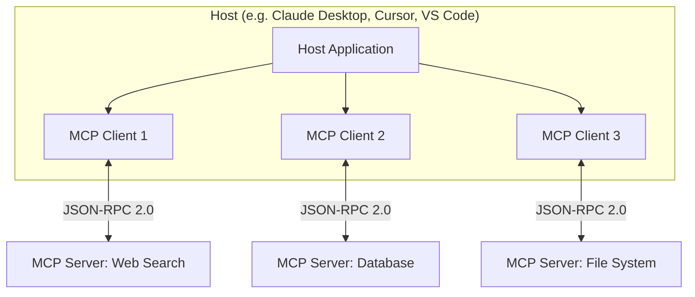
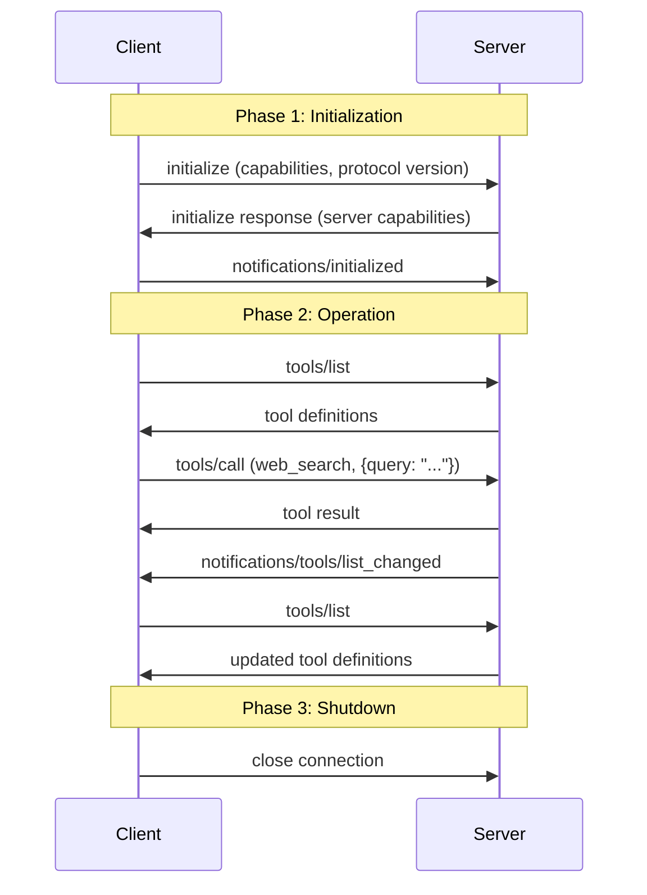
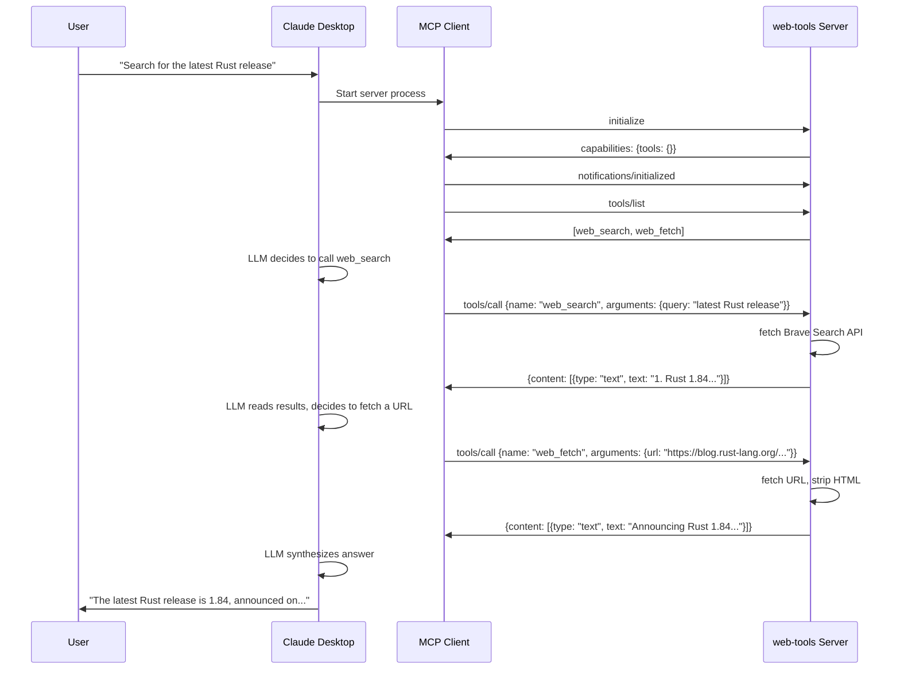
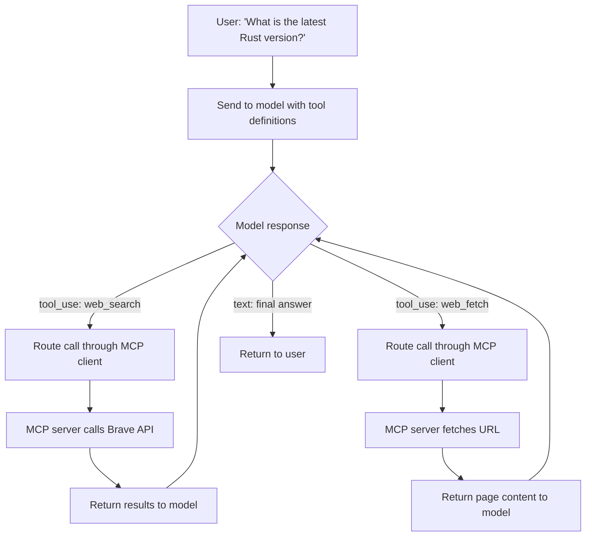
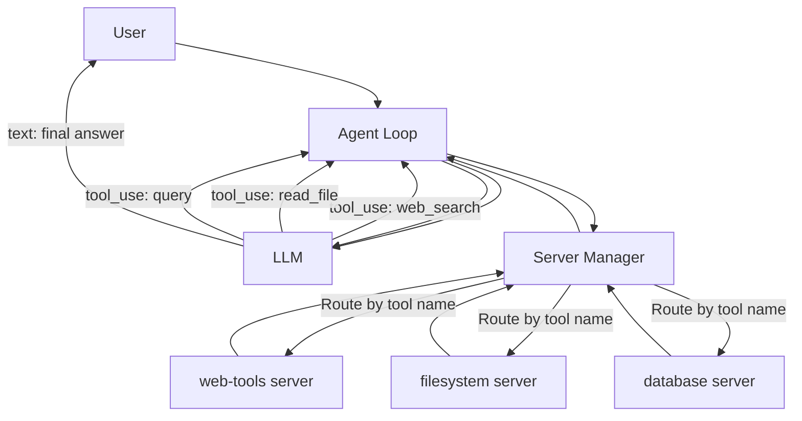

## Introduction

If you've used Claude Desktop with a file system tool, or Cursor with a database connection, you've used MCP without knowing it. **Model Context Protocol** is an open standard that lets AI applications connect to external tools and data sources through a common interface. It's the reason a single AI host can talk to a web search API, a database, a browser, and a code execution sandbox - all through the same protocol.

I think of MCP as the **USB-C of AI tooling**. Before USB-C, every device had its own connector. Before MCP, every AI tool integration was a custom implementation - different APIs, different auth flows, different data formats. MCP standardizes the connector so that any compliant host can use any compliant server, and any server can work with any host.

This post explains what MCP is, how the protocol works at the message level, and walks through building a working web search/fetch MCP server that an agent can use.

## The Architecture

MCP uses a **host-client-server** architecture with clear separation of concerns:



**Host** - The AI application the user interacts with. Claude Desktop, Cursor, VS Code with Copilot, or any custom agent. The host creates MCP client instances, manages permissions, and coordinates the AI model's access to tools.

**Client** - A connector within the host that maintains a dedicated 1:1 connection to a single MCP server. Each client handles protocol negotiation, capability exchange, and message routing for its server. A host runs multiple clients simultaneously - one per connected server.

**Server** - A lightweight process that exposes specific capabilities: tools, resources, or prompts. Each server is focused and independent - a web search server doesn't know about the database server. Servers can be local processes (communicating over stdio) or remote services (communicating over HTTP with Server-Sent Events).

The key design principle is **separation of concerns**. The host handles AI model integration and user consent. The client handles protocol mechanics. The server handles the actual tool logic. No layer needs to understand the others' internals.

## What Servers Expose

MCP servers can expose three types of capabilities:

### Tools

Functions that the AI model can invoke. A web search tool, a file reader, a database query executor. Tools have a name, description, and a JSON Schema defining their input parameters. The model decides *when* to call a tool based on the user's request.

```json
{
  "name": "web_search",
  "description": "Search the web for a query and return results",
  "inputSchema": {
    "type": "object",
    "properties": {
      "query": {
        "type": "string",
        "description": "The search query"
      },
      "count": {
        "type": "number",
        "description": "Number of results to return",
        "default": 5
      }
    },
    "required": ["query"]
  }
}
```

### Resources

Data that the server makes available for the model's context - file contents, database records, API responses. Unlike tools (which the model calls), resources are typically read by the client to populate the model's context window. They're identified by URIs (e.g., `file:///path/to/doc.md` or `db://users/123`).

### Prompts

Templated messages or workflows that servers provide. Think of them as reusable prompt snippets - a code review template, a SQL query builder, a debugging checklist. The user or host can select a prompt, fill in parameters, and inject it into the conversation.

## The Protocol: JSON-RPC 2.0

All MCP communication uses **JSON-RPC 2.0** - the same framing protocol used by the Language Server Protocol (LSP). Three message types:

**Requests** (expect a response):
```json
{
  "jsonrpc": "2.0",
  "id": 1,
  "method": "tools/call",
  "params": {
    "name": "web_search",
    "arguments": { "query": "rust programming language", "count": 3 }
  }
}
```

**Responses** (reply to a request):
```json
{
  "jsonrpc": "2.0",
  "id": 1,
  "result": {
    "content": [
      {
        "type": "text",
        "text": "1. The Rust Programming Language - rust-lang.org\n2. Rust (programming language) - Wikipedia\n3. Learn Rust - rust-lang.org/learn"
      }
    ]
  }
}
```

**Notifications** (fire-and-forget, no `id` field):
```json
{
  "jsonrpc": "2.0",
  "method": "notifications/initialized"
}
```

The `id` field is what distinguishes requests from notifications. Requests have an `id` and expect a response with the same `id`. Notifications have no `id` and expect nothing back.

## The Connection Lifecycle

Every MCP connection follows a strict three-phase lifecycle:



### Phase 1: Initialization

The client and server negotiate capabilities. This is mandatory before any tool calls:

```json
// Client -> Server: "Here's what I support"
{
  "jsonrpc": "2.0",
  "id": 1,
  "method": "initialize",
  "params": {
    "protocolVersion": "2025-06-18",
    "capabilities": {
      "roots": { "listChanged": true },
      "sampling": {}
    },
    "clientInfo": {
      "name": "my-ai-agent",
      "version": "1.0.0"
    }
  }
}

// Server -> Client: "Here's what I provide"
{
  "jsonrpc": "2.0",
  "id": 1,
  "result": {
    "protocolVersion": "2025-06-18",
    "capabilities": {
      "tools": { "listChanged": true }
    },
    "serverInfo": {
      "name": "web-tools-server",
      "version": "1.0.0"
    }
  }
}

// Client -> Server: "Ready to go"
{
  "jsonrpc": "2.0",
  "method": "notifications/initialized"
}
```

The capability exchange is important - it tells each side what the other supports. A server that declares `"tools": {}` can respond to `tools/list` and `tools/call`. A server that also declares `"resources": {}` can respond to `resources/list` and `resources/read`. The client only sends methods the server has declared support for.

### Phase 2: Operation

Normal message exchange. The client discovers tools, calls them, reads resources, and uses prompts. The server can send notifications (e.g., "my tool list changed") and log messages.

### Phase 3: Shutdown

Either side can close the connection. Well-behaved implementations send a close signal and wait for acknowledgment before terminating.

## Transport: How Messages Move

MCP supports two transport mechanisms:

**stdio** - The server runs as a child process. The client writes JSON-RPC messages to the server's stdin and reads responses from stdout. This is the simplest transport and what most local MCP servers use. Claude Desktop, Cursor, and VS Code all launch MCP servers this way.

**Streamable HTTP** - The server runs as an HTTP service. The client sends requests via POST and receives responses (and server-initiated messages) via Server-Sent Events. This supports remote servers, multiple concurrent clients, and session resumption.

For local tools, stdio is the standard. The host launches the server process, pipes messages through stdin/stdout, and kills the process on shutdown. No networking, no ports, no authentication.

## Building a Web Tools MCP Server

Let's build a working MCP server that exposes two tools: `web_search` (search the web via Brave Search API) and `web_fetch` (fetch a URL and extract text). An AI agent can use these tools to research topics, verify facts, or summarize web pages.

### Project Setup

```bash
mkdir mcp-web-tools && cd mcp-web-tools
npm init -y
npm install @modelcontextprotocol/sdk zod
```

### The Server

```typescript
import { McpServer } from "@modelcontextprotocol/sdk/server/mcp.js";
import { StdioServerTransport } from "@modelcontextprotocol/sdk/server/stdio.js";
import { z } from "zod";

const server = new McpServer({
  name: "web-tools",
  version: "1.0.0",
});

// Tool 1: Web Search via Brave Search API
server.tool(
  "web_search",
  "Search the web and return results with titles, URLs, and snippets",
  { query: z.string().describe("The search query"), count: z.number().default(5).describe("Number of results") },
  async ({ query, count }) => {
    const apiKey = process.env.BRAVE_API_KEY;
    if (!apiKey) {
      return { content: [{ type: "text", text: "Error: BRAVE_API_KEY not set" }] };
    }

    const url = `https://api.search.brave.com/res/v1/web/search?q=${encodeURIComponent(query)}&count=${count}`;
    const res = await fetch(url, {
      headers: { "X-Subscription-Token": apiKey, Accept: "application/json" },
    });

    if (!res.ok) {
      return { content: [{ type: "text", text: `Search failed: ${res.status} ${res.statusText}` }] };
    }

    const data = await res.json();
    const results = (data.web?.results ?? [])
      .map((r: any, i: number) => `${i + 1}. ${r.title}\n   ${r.url}\n   ${r.description}`)
      .join("\n\n");

    return {
      content: [{ type: "text", text: results || "No results found" }],
    };
  }
);

// Tool 2: Fetch a URL and extract text content
server.tool(
  "web_fetch",
  "Fetch a URL and return its text content (HTML stripped)",
  { url: z.string().url().describe("The URL to fetch") },
  async ({ url }) => {
    try {
      const res = await fetch(url, {
        headers: { "User-Agent": "MCP-WebTools/1.0" },
        signal: AbortSignal.timeout(10_000),
      });

      if (!res.ok) {
        return { content: [{ type: "text", text: `Fetch failed: ${res.status} ${res.statusText}` }] };
      }

      const contentType = res.headers.get("content-type") ?? "";
      const raw = await res.text();

      let text: string;
      if (contentType.includes("text/html")) {
        // Strip HTML tags, scripts, styles; decode entities
        text = raw
          .replace(/<script[\s\S]*?<\/script>/gi, "")
          .replace(/<style[\s\S]*?<\/style>/gi, "")
          .replace(/<[^>]+>/g, " ")
          .replace(/&nbsp;/g, " ")
          .replace(/&amp;/g, "&")
          .replace(/&lt;/g, "<")
          .replace(/&gt;/g, ">")
          .replace(/&quot;/g, '"')
          .replace(/\s+/g, " ")
          .trim();
      } else {
        text = raw;
      }

      // Truncate to avoid overwhelming the context window
      const maxLen = 50_000;
      if (text.length > maxLen) {
        text = text.slice(0, maxLen) + "\n\n[Truncated]";
      }

      return { content: [{ type: "text", text }] };
    } catch (err) {
      return {
        content: [{ type: "text", text: `Fetch error: ${err instanceof Error ? err.message : String(err)}` }],
      };
    }
  }
);

// Start the server on stdio
const transport = new StdioServerTransport();
await server.connect(transport);
```

### How It Works Under the Hood

When a host like Claude Desktop launches this server, here's the actual message exchange:



The key insight: **the model decides which tools to call and when**. The host sends the tool definitions (names, descriptions, schemas) to the model as part of its context. The model generates a tool call as structured output. The host routes that call through the MCP client to the server, gets the result, feeds it back to the model, and the model continues generating.

### Connecting to Claude Desktop

Add the server to Claude Desktop's configuration at `~/Library/Application Support/Claude/claude_desktop_config.json`:

```json
{
  "mcpServers": {
    "web-tools": {
      "command": "node",
      "args": ["path/to/mcp-web-tools/server.js"],
      "env": {
        "BRAVE_API_KEY": "your-brave-api-key"
      }
    }
  }
}
```

Claude Desktop launches the server as a child process, connects via stdio, runs the initialization handshake, and discovers the `web_search` and `web_fetch` tools. From that point on, the model can use them in any conversation.

### Connecting an Agent to MCP

The examples above show the server and the config, but the interesting part is the **agent loop** - where the model decides which tools to call, your code routes those calls through MCP, and the results feed back into the model. Here's a complete minimal agent that does this:

```typescript
import Anthropic from "@anthropic-ai/sdk";
import { Client } from "@modelcontextprotocol/sdk/client/index.js";
import { StdioClientTransport } from "@modelcontextprotocol/sdk/client/stdio.js";

// Step 1: Connect to the MCP server
const transport = new StdioClientTransport({
  command: "node",
  args: ["path/to/server.js"],
  env: { BRAVE_API_KEY: "your-key" },
});
const mcpClient = new Client({ name: "my-agent", version: "1.0.0" }, { capabilities: {} });
await mcpClient.connect(transport);

// Step 2: Discover tools and convert to Anthropic's tool format
const { tools: mcpTools } = await mcpClient.listTools();
const anthropicTools = mcpTools.map((tool) => ({
  name: tool.name,
  description: tool.description ?? "",
  input_schema: tool.inputSchema,
}));

// Step 3: The agent loop
const anthropic = new Anthropic();

async function runAgent(userMessage: string): Promise<string> {
  const messages: Anthropic.MessageParam[] = [
    { role: "user", content: userMessage },
  ];

  // Loop until the model stops calling tools
  while (true) {
    const response = await anthropic.messages.create({
      model: "claude-sonnet-4-5-20250929",
      max_tokens: 4096,
      tools: anthropicTools,
      messages,
    });

    // Collect text and tool use blocks from the response
    const toolUseBlocks = response.content.filter((b) => b.type === "tool_use");

    // If no tool calls, extract the final text and return
    if (toolUseBlocks.length === 0) {
      const textBlock = response.content.find((b) => b.type === "text");
      return textBlock?.type === "text" ? textBlock.text : "";
    }

    // Add the assistant's response (with tool_use blocks) to history
    messages.push({ role: "assistant", content: response.content });

    // Execute each tool call through MCP and collect results
    const toolResults: Anthropic.ToolResultBlockParam[] = [];
    for (const toolUse of toolUseBlocks) {
      if (toolUse.type !== "tool_use") continue;

      console.log(`Calling tool: ${toolUse.name}(${JSON.stringify(toolUse.input)})`);

      // Route the tool call through MCP
      const result = await mcpClient.callTool({
        name: toolUse.name,
        arguments: toolUse.input as Record<string, unknown>,
      });

      const text = result.content
        .filter((c): c is { type: "text"; text: string } => c.type === "text")
        .map((c) => c.text)
        .join("\n");

      toolResults.push({
        type: "tool_result",
        tool_use_id: toolUse.id,
        content: text,
      });
    }

    // Feed tool results back to the model
    messages.push({ role: "user", content: toolResults });
    // Loop continues - model sees the results and either calls more tools or responds
  }
}

// Run it
const answer = await runAgent("What is the latest version of Rust? Give me details from the official blog.");
console.log(answer);

await mcpClient.close();
```

Here's what's happening in that loop:



The three pieces fit together like this:

1. **MCP server** exposes tools with names, descriptions, and schemas
2. **MCP client** discovers those tools and converts them to the model's tool format
3. **Agent loop** sends tools to the model, routes the model's tool calls through MCP, feeds results back, and repeats until the model produces a final text response

The model never talks to MCP directly. Your agent code is the bridge - it translates between the model's tool-calling format and MCP's `tools/call` protocol. This is the same pattern that Claude Desktop, Cursor, and every other MCP host uses internally.

## Building an MCP Plugin System

The examples above connect to a single server. But real hosts like Claude Desktop, Cursor, and VS Code manage **multiple MCP servers** from a config file - users add servers, the host launches and connects to all of them, and the model sees a unified set of tools across every server. This is the plugin system pattern.

Here's how to build one.

### The Config File

The standard approach is a JSON config that maps server names to launch commands, similar to what Claude Desktop and VS Code use:

```json
{
  "mcpServers": {
    "web-tools": {
      "command": "node",
      "args": ["./servers/web-tools/server.js"],
      "env": { "BRAVE_API_KEY": "your-key" }
    },
    "filesystem": {
      "command": "node",
      "args": ["./servers/filesystem/server.js"],
      "env": { "ALLOWED_DIRS": "/home/user/projects" }
    },
    "database": {
      "command": "python",
      "args": ["./servers/database/server.py"],
      "env": { "DATABASE_URL": "postgresql://localhost/mydb" }
    }
  }
}
```

Each entry defines how to launch one server process. The host doesn't need to know what tools each server provides - it discovers them at runtime via `tools/list`.

### The Server Manager

The manager reads the config, launches each server as a child process, connects an MCP client to each one, discovers their tools, and provides a unified interface for the agent loop:

```typescript
import { Client } from "@modelcontextprotocol/sdk/client/index.js";
import { StdioClientTransport } from "@modelcontextprotocol/sdk/client/stdio.js";
import fs from "node:fs";

interface ServerConfig {
  command: string;
  args?: string[];
  env?: Record<string, string>;
}

interface ConnectedServer {
  name: string;
  client: Client;
  tools: Array<{ name: string; description: string; inputSchema: any }>;
}

class McpServerManager {
  private servers = new Map<string, ConnectedServer>();
  private toolIndex = new Map<string, string>(); // tool name -> server name

  async loadFromConfig(configPath: string): Promise<void> {
    const raw = fs.readFileSync(configPath, "utf-8");
    const config = JSON.parse(raw);
    const entries = Object.entries(config.mcpServers ?? {}) as [string, ServerConfig][];

    // Connect to all servers in parallel
    await Promise.all(entries.map(([name, cfg]) => this.connectServer(name, cfg)));
  }

  private async connectServer(name: string, cfg: ServerConfig): Promise<void> {
    try {
      const transport = new StdioClientTransport({
        command: cfg.command,
        args: cfg.args,
        env: { ...process.env, ...cfg.env } as Record<string, string>,
      });

      const client = new Client(
        { name: `host-client-${name}`, version: "1.0.0" },
        { capabilities: {} },
      );
      await client.connect(transport);

      // Discover tools from this server
      const { tools } = await client.listTools();

      // Index each tool back to its server
      for (const tool of tools) {
        this.toolIndex.set(tool.name, name);
      }

      this.servers.set(name, { name, client, tools });
      console.log(`Connected: ${name} (${tools.length} tools: ${tools.map(t => t.name).join(", ")})`);
    } catch (err) {
      console.error(`Failed to connect ${name}: ${err}`);
    }
  }

  // Get all tools across all servers, formatted for the model
  getAllTools(): Array<{ name: string; description: string; input_schema: any }> {
    const tools: Array<{ name: string; description: string; input_schema: any }> = [];
    for (const server of this.servers.values()) {
      for (const tool of server.tools) {
        tools.push({
          name: tool.name,
          description: tool.description ?? "",
          input_schema: tool.inputSchema,
        });
      }
    }
    return tools;
  }

  // Route a tool call to the correct server
  async callTool(name: string, args: Record<string, unknown>): Promise<string> {
    const serverName = this.toolIndex.get(name);
    if (!serverName) throw new Error(`Unknown tool: ${name}`);

    const server = this.servers.get(serverName);
    if (!server) throw new Error(`Server not connected: ${serverName}`);

    const result = await server.client.callTool({ name, arguments: args });
    return result.content
      .filter((c): c is { type: "text"; text: string } => c.type === "text")
      .map((c) => c.text)
      .join("\n");
  }

  async shutdown(): Promise<void> {
    for (const server of this.servers.values()) {
      await server.client.close();
    }
    this.servers.clear();
    this.toolIndex.clear();
  }
}
```

### Wiring It Into the Agent

With the manager, the agent loop barely changes - it just uses `manager.getAllTools()` and `manager.callTool()` instead of talking to a single client:

```typescript
import Anthropic from "@anthropic-ai/sdk";

const manager = new McpServerManager();
await manager.loadFromConfig("./mcp-config.json");
// Connected: web-tools (2 tools: web_search, web_fetch)
// Connected: filesystem (3 tools: read_file, write_file, list_dir)
// Connected: database (2 tools: query, execute)

const anthropic = new Anthropic();

async function runAgent(userMessage: string): Promise<string> {
  const messages: Anthropic.MessageParam[] = [
    { role: "user", content: userMessage },
  ];

  while (true) {
    const response = await anthropic.messages.create({
      model: "claude-sonnet-4-5-20250929",
      max_tokens: 4096,
      tools: manager.getAllTools(),  // 7 tools from 3 servers
      messages,
    });

    const toolUseBlocks = response.content.filter((b) => b.type === "tool_use");

    if (toolUseBlocks.length === 0) {
      const textBlock = response.content.find((b) => b.type === "text");
      return textBlock?.type === "text" ? textBlock.text : "";
    }

    messages.push({ role: "assistant", content: response.content });

    const toolResults: Anthropic.ToolResultBlockParam[] = [];
    for (const toolUse of toolUseBlocks) {
      if (toolUse.type !== "tool_use") continue;

      // Manager routes to the correct server automatically
      const text = await manager.callTool(
        toolUse.name,
        toolUse.input as Record<string, unknown>,
      );

      toolResults.push({
        type: "tool_result",
        tool_use_id: toolUse.id,
        content: text,
      });
    }

    messages.push({ role: "user", content: toolResults });
  }
}

const answer = await runAgent("Read my project's README and search the web for similar projects");
console.log(answer);
// Model calls read_file (routed to filesystem server)
// Then calls web_search (routed to web-tools server)
// Then synthesizes an answer using both results

await manager.shutdown();
```

The model sees 7 tools from 3 servers as a flat list. When it calls `read_file`, the manager routes it to the filesystem server. When it calls `web_search`, the manager routes it to the web-tools server. The model doesn't know or care that the tools come from different processes.



This is the same architecture that Claude Desktop, Cursor, and VS Code use internally. The config file is the plugin registry. The server manager is the plugin host. Each MCP server is a plugin. Users add capabilities by adding entries to the config - no code changes, no recompilation, no plugin API to learn.

## Why MCP Matters

### Before MCP

Every AI tool integration was bespoke:

```
Claude Desktop ─── custom plugin API ──── File System
Cursor ─────────── custom extension API ── Database
ChatGPT ────────── custom actions API ──── Web Search
Your Agent ─────── custom code ─────────── Everything
```

Every host had its own plugin format. Every tool had to be reimplemented for each host. If you built a web search tool for Claude Desktop, you'd rebuild it from scratch for Cursor.

### After MCP

One protocol, universal interoperability:

```
Claude Desktop ─┐
Cursor ─────────┤
VS Code ────────┼── MCP ──┬── Web Search Server
Your Agent ─────┤         ├── Database Server
Any Host ───────┘         ├── File System Server
                          └── Any Server
```

Build a server once, and it works with every MCP-compatible host. Build a host once, and it can use every MCP server. The ecosystem compounds - every new server benefits every existing host, and every new host benefits from every existing server.

### The LSP Analogy

MCP is explicitly modeled after the **Language Server Protocol**. Before LSP, every code editor reimplemented language support for every language - VS Code had its own TypeScript support, Sublime had its own, Vim had its own. LSP standardized the interface: one TypeScript language server works in every LSP-compatible editor.

MCP does the same for AI tools. One web search server works in every MCP-compatible AI host. The economics are the same: an N editors x M languages problem becomes N + M.

## Key Takeaways

**MCP is a protocol, not a framework.** It defines the message format (JSON-RPC 2.0), the lifecycle (initialize, operate, shutdown), and the capability types (tools, resources, prompts). How you implement the server logic is entirely up to you.

**Tools are the primary capability.** Resources and prompts matter, but tools are what give AI agents the ability to act in the world - search the web, read files, query databases, execute code. The tool definition (name + description + JSON Schema) is what the model sees; the implementation is what the server executes.

**stdio is the default transport.** For local tools, the host launches the server as a child process and communicates through stdin/stdout. No networking, no ports, no authentication overhead. This makes MCP servers trivial to develop and test.

**The model decides, the protocol routes.** The host sends tool definitions to the model. The model generates tool calls as structured output. The host routes those calls through MCP clients to servers. The results flow back to the model. MCP is the plumbing between "the model wants to search the web" and "here are the search results."

**The ecosystem is the value.** A single MCP server is useful. A thousand MCP servers that all work with every AI host is transformative. MCP's value grows with adoption, just as LSP's value grew as more editors and language servers adopted it.
