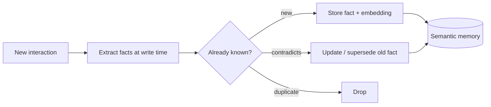
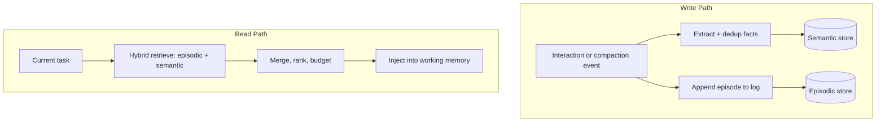

## Introduction

In [Anatomy of an Agent Loop](/blog/anatomy-of-an-agent-loop/) I made the point that an agent's state is just its message history. The conversation array is the memory. That is true, and it is also the problem. The context window is finite, every API call resends the whole thing, and the moment you compact or truncate to fit, the agent forgets. An agent whose only memory is the context window is an agent with anterograde amnesia. It is sharp within a session and blank across them.

Most of my work on agent runtimes ends up being memory work, because memory is what separates a demo from a system you can actually live with. This post is about giving an agent memory that survives compaction, restarts, and the passage of time, without poisoning its context or drowning it in stale facts.

## Three Kinds of Memory

Borrowing loosely from cognitive science, it helps to split agent memory into three distinct systems with different lifetimes and access patterns:

| Type | Holds | Lifetime | Analogy |
|------|-------|----------|---------|
| Working memory | The current task's active context | This turn | What you are thinking about right now |
| Episodic memory | A log of events and interactions | Long term, time-stamped | Remembering what happened last Tuesday |
| Semantic memory | Distilled, durable facts | Long term, deduplicated | Knowing your colleague prefers Python |

Naive implementations collapse all three into "stuff everything into a vector database and retrieve the top-k." That conflates a log of events with a set of facts, and it shows. The architecture works better when each system has its own write path, its own retrieval, and its own eviction policy.

## Working Memory: the Context Window Is a Budget

Working memory is the context window, and the only honest way to manage it is as a budget. Every token spent on history is a token not available for reasoning, and most models degrade when the relevant fact is buried in the middle of a long context. So the goal is not "fit as much as possible," it is "keep the most relevant tokens and evict the rest."

Three strategies, usually combined:

- **Sliding window.** Keep the last N turns verbatim. Simple, but it forgets the start of a long task.
- **Compaction.** When the history approaches the limit, summarize older turns into a compact synopsis and replace them. This preserves continuity at the cost of detail.
- **Externalization.** Move detail out of the window into episodic or semantic memory, and pull it back in on demand via retrieval. The window holds pointers and summaries; the stores hold the full record.

The key design move is that compaction should not be lossy in a vacuum. Before you summarize older turns away, extract anything durable from them into long-term memory. Compaction and the write path to memory are the same event.

## Episodic Memory: Remembering What Happened

Episodic memory is an append-only log of events: messages, tool calls, decisions, outcomes. Each episode is stored with metadata that makes it retrievable later: a timestamp, the session, the actors, and an embedding of the content for semantic search.

The retrieval question for episodic memory is "what past events are relevant to what I am doing now." That is rarely pure semantic similarity. Recency matters, and so does frequency. A useful episodic scorer blends them:

```python
def episodic_score(query_emb, episode):
    similarity = cosine(query_emb, episode.embedding)   # relevance
    recency = decay(now() - episode.timestamp)          # newer ranks higher
    return 0.7 * similarity + 0.3 * recency
```

Pure similarity will happily surface a perfectly relevant event from a year ago while ignoring what happened five minutes back. A recency term fixes that. The weights are not sacred; the point is that "relevant" for an event log is a function of content and time, not content alone.

## Semantic Memory: Distilling Facts

Episodic memory remembers that a conversation happened. Semantic memory remembers what was true. "The user's production database is Postgres 15" is a fact. It should not require re-reading the conversation where it was mentioned, and it should not be one of fifty near-duplicate chunks competing in a retrieval.

The important architectural decision here is write-time versus read-time extraction.

**Read-time extraction** stores raw text and figures out the facts at retrieval, usually by dumping retrieved chunks into the model and hoping it synthesizes. It is cheap to write and expensive and imprecise to read.

**Write-time extraction** runs a small extraction step when information arrives, pulling structured facts out of the raw text and storing those facts directly. It costs a model call on the write path and pays off on every read.



I favor write-time extraction in the systems I build, because precision at read time is what makes memory feel reliable instead of noisy. The extraction step is also where you handle the hard part: deduplication and contradiction. When a new fact arrives, you check it against what you already know. If it is new, store it. If it duplicates an existing fact, drop it. If it contradicts one, supersede the old version and keep provenance. Without this, "memory" becomes an ever-growing pile of overlapping, occasionally contradictory chunks, which is worse than no memory at all.

## Retrieval: Hybrid Search

Both episodic and semantic stores need retrieval, and neither vector search nor keyword search is sufficient alone. Vector search captures meaning but misses exact tokens. A query for a specific error code, a file path, or a function name often does better with keyword search, because the embedding blurs the very specificity you need.

The answer is hybrid: run both and merge with weighted scoring.

```python
# Hybrid: semantic similarity plus lexical BM25
COSINE_WEIGHT = 0.7
BM25_WEIGHT = 0.3
score = COSINE_WEIGHT * cosine_sim + BM25_WEIGHT * bm25_score
```

BM25 handles "find where I mentioned the database password." Cosine similarity handles "what did we discuss about authentication." Real queries are a mix, and the blend covers both. For high-stakes retrieval you can add a reranking pass over the merged candidates, at the cost of latency. That is a deliberate tradeoff: rerank when precision matters more than speed, skip it when it does not.

## The Write Path and the Read Path

The cleanest way to think about agent memory is as two distinct pipelines.



The write path runs when information arrives or when the window compacts. The read path runs when the agent needs context. Keeping them separate is what lets you tune precision on the read side without bloating the write side, and bound growth on the write side without starving retrieval.

## Failure Modes

Memory systems fail in specific, recognizable ways. Knowing them is half of designing against them.

- **Stale facts.** A fact was true and no longer is. Without contradiction handling and supersession, the agent confidently acts on outdated information.
- **Context pollution.** Retrieval pulls in loosely related memories that crowd out the actual task. More retrieved context is not better; irrelevant context actively hurts.
- **Unbounded growth.** Every interaction adds episodes and facts forever. Without eviction and deduplication, retrieval slows and quality drops as the signal-to-noise ratio falls.
- **Retrieval misses.** The right memory exists but the query does not surface it. This is usually a hybrid-search problem, a keyword the embedding blurred away.
- **Contradiction.** Two stored facts disagree and retrieval returns both, leaving the model to guess. Resolve at write time, not read time.

## Design Principles

A few rules I keep coming back to:

**Separate the three memory systems.** Working, episodic, and semantic have different lifetimes and access patterns. Collapsing them into one vector store is the root cause of most "my agent's memory is noisy" complaints.

**Extract at write time.** Pay the cost once on write to get precision on every read. Do deduplication and contradiction resolution there too.

**Make retrieval hybrid.** Combine lexical and semantic search. Exact tokens and fuzzy meaning are both real query types.

**Treat the context window as a budget.** Inject the smallest set of high-relevance memories, not the largest. Relevance beats volume.

**Bound growth deliberately.** Eviction, deduplication, and supersession are features, not afterthoughts. Memory that only grows eventually only hurts.

## Key Takeaways

**The context window is short-term memory, and it overflows.** Real memory is what survives compaction. If your agent forgets across sessions, it has no memory architecture, just a buffer.

**Three systems, not one.** Working memory is the active budget, episodic memory is a time-stamped event log, semantic memory is a deduplicated fact store. Each needs its own write path, retrieval, and eviction.

**Write-time extraction is the high-leverage choice.** It moves the hard work, distilling and deduplicating facts, to the write path, where it pays off on every subsequent read.

**Hybrid retrieval beats either half alone.** BM25 for exact tokens, embeddings for meaning, merged with weights. Real queries need both.

**Most memory failures are growth and pollution.** Stale facts, contradictions, and irrelevant retrieved context degrade an agent faster than having no memory at all. Design eviction and contradiction handling in from the start.

Memory is the difference between an agent that is brilliant for one session and an agent that gets better the longer you work with it. The architecture, not the model, is what decides which one you have.
