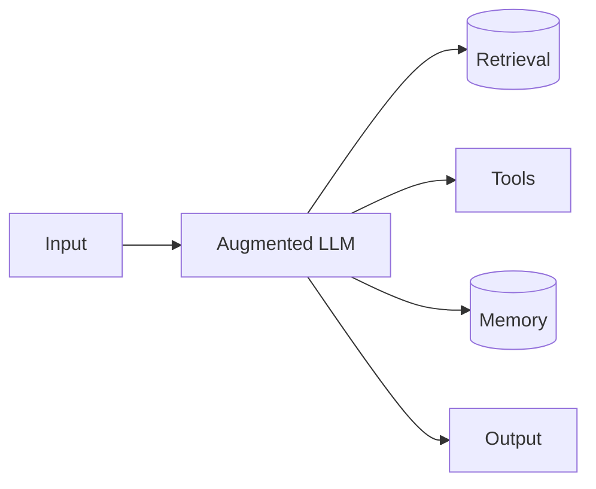
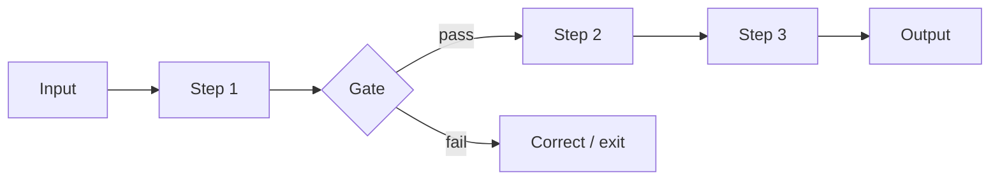
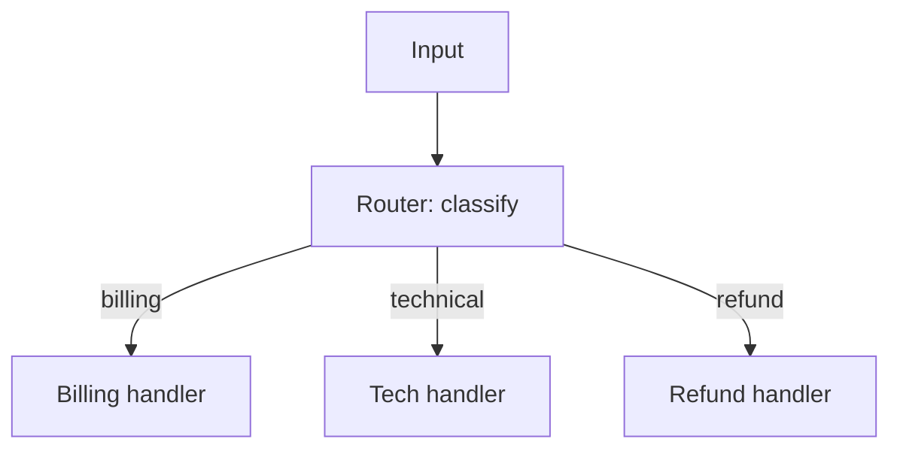
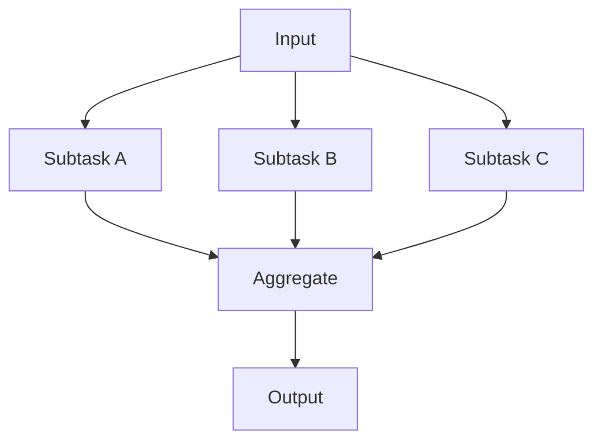
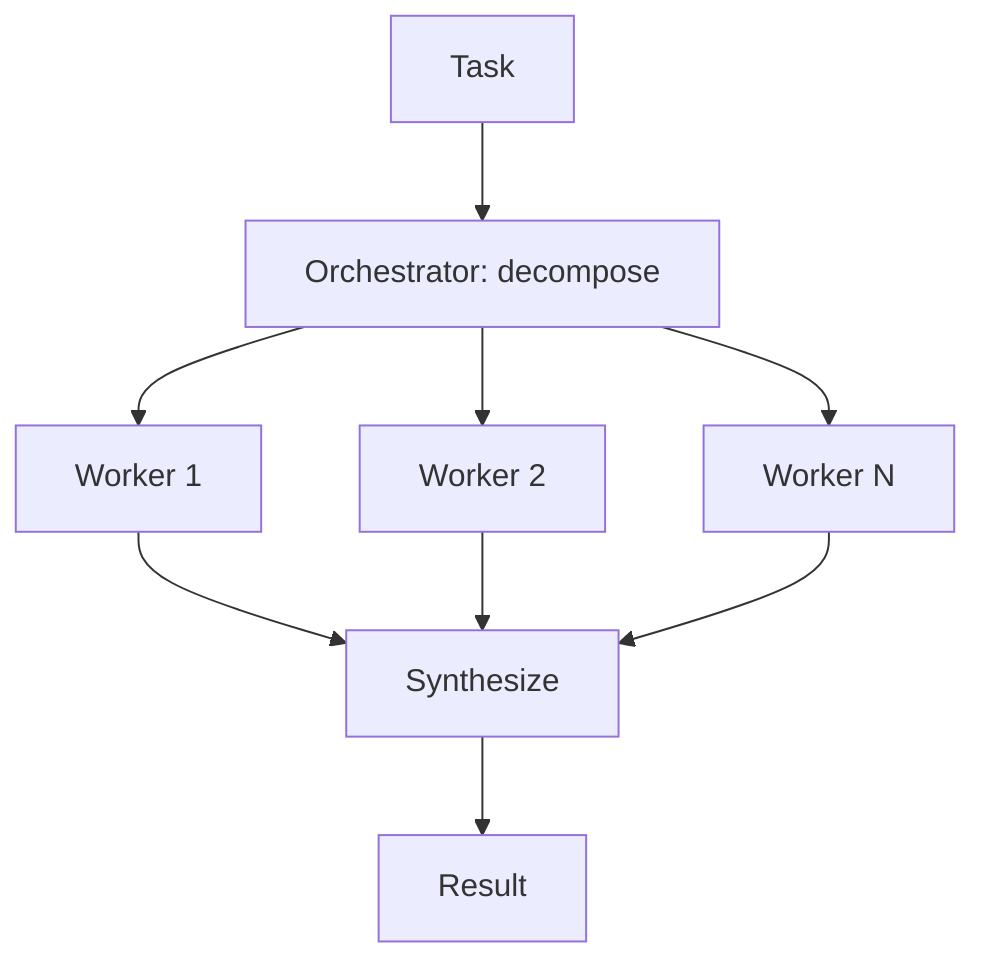
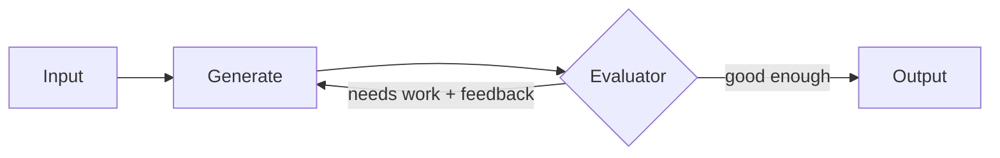

## Introduction

In [Anatomy of an Agent Loop](/blog/anatomy-of-an-agent-loop/) I built the bare mechanism: call the model, run the tools it asks for, feed the results back, repeat. That loop is the most autonomous end of a spectrum. Most systems that ship and stay reliable live closer to the other end, where the control flow is mostly fixed and the model fills in the hard parts.

Anthropic's [Building Effective Agents](https://www.anthropic.com/research/building-effective-agents) draws the line cleanly: workflows are systems where models and tools are orchestrated through predefined code paths, while agents are systems where the model dynamically directs its own process and tool use. Both are "agentic." They are not the same thing, and confusing them is how you end up with a fragile, unpredictable system doing a job a simple chain would have done reliably. This post walks the patterns I actually reach for, from simplest to most autonomous, and when each one earns its complexity.

## Workflows Versus Agents

The single most useful design principle in this space: find the simplest thing that works, and only add autonomy when it measurably improves outcomes. Autonomy buys flexibility and costs predictability, latency, and money. A workflow with fixed steps is easier to test, cheaper to run, and far easier to debug than a model improvising its own path.

So the question for any task is not "how do I build an agent," it is "how much of this can be fixed code, and how little can be left to the model." The patterns below are points on that gradient.

## The Building Block: The Augmented LLM

Every pattern is composed of the same unit: a model augmented with retrieval, tools, and memory. The model can pull in context, take actions, and remember. Get this unit clean, a clear tool interface, well-described tools, scoped memory, and the patterns are just ways of wiring units together.

## Pattern 1: Prompt Chaining

Decompose a task into a fixed sequence of steps, each a model call, with optional programmatic gates between them.

Reach for this when the task splits cleanly into subtasks you know in advance: outline then draft then polish, or extract then validate then format. The gate is where you check the intermediate result programmatically and bail early if it is wrong. It trades a little latency for a lot of accuracy, because each step is a simpler problem than the whole.

## Pattern 2: Routing

Classify the input, then dispatch to a specialized handler.

Use routing when inputs fall into distinct categories that are better served by different prompts, tools, or even different models. A cheap, fast model can route while expensive models handle only the cases that need them. The win is separation of concerns: each handler stays simple because it only handles one kind of input, and you can tune them independently.

## Pattern 3: Parallelization

Run multiple model calls at once and aggregate. Two flavors. Sectioning splits a task into independent subtasks that run concurrently. Voting runs the same task several times and aggregates for confidence.

Sectioning is for genuinely independent work, evaluate a document against five criteria in parallel rather than asking for all five in one overloaded prompt. Voting is for when you want multiple looks at the same hard question, like several independent passes flagging whether code is safe, and you trust the consensus more than any single pass. The cost is more calls; the benefit is speed (for sectioning) or reliability (for voting).

## Pattern 4: Orchestrator-Workers

When you cannot predict the subtasks in advance, let a model decide them. An orchestrator breaks the task into pieces at runtime, delegates each to a worker, and synthesizes the results.

This is the right pattern for tasks like "make this change across the codebase," where the number and nature of the subtasks depend on the input and cannot be hardcoded. The difference from parallelization is that the subtasks are determined dynamically by the model, not fixed by you. It is more autonomous, and correspondingly harder to predict and test, so use it when the dynamism is actually required.

## Pattern 5: Evaluator-Optimizer

Generate a result, have a second call critique it against criteria, and loop until it passes.

This works when you have clear evaluation criteria and iteration genuinely helps, literary translation, complex search, code that must pass tests. The evaluator's feedback feeds the next generation, the same way a human editor's notes improve a draft. The trap is looping forever or chasing a moving target, so cap the iterations and make the pass condition concrete.

## When to Go Fully Agentic

The open-loop agent from the [agent loop post](/blog/anatomy-of-an-agent-loop/) is the right tool when the path genuinely cannot be predicted: open-ended tasks, an unknown number of steps, and a need for the model to adapt to what it discovers along the way. Coding agents are the canonical example, the plan emerges from the code the agent reads.

Autonomy is powerful and expensive. The model controls the plan, which means you cannot enumerate the paths in advance, which means your safety story has to come from containment rather than control flow. That is exactly why the [sandboxing](/blog/sandboxing-agent-tool-execution/) and human-in-the-loop work matters: when you give up control over what the agent will do, you compensate with hard limits on what it can do.

## Choosing a Pattern

| Task shape | Pattern |
|------------|---------|
| Fixed, decomposable steps | Prompt chaining |
| Distinct input categories | Routing |
| Independent subtasks, or need consensus | Parallelization |
| Subtasks unknown until runtime | Orchestrator-workers |
| Clear criteria, iteration helps | Evaluator-optimizer |
| Open-ended, unpredictable path | Autonomous agent loop |

Notice most of these are workflows. In practice, the majority of production "AI agents" are, and should be, workflows with a model in the loop, not autonomous agents. The autonomy is the exception you reach for when the task demands it, not the default.

## Key Takeaways

**Workflows and agents are different tools.** Workflows orchestrate models through fixed code paths. Agents let the model direct its own path. Most reliable production systems are workflows.

**Start with the simplest pattern that works.** Autonomy costs predictability, latency, and money. Add it only when it measurably improves outcomes, and measure to confirm it did.

**The patterns compose from one unit.** A model augmented with retrieval, tools, and memory. Chaining, routing, parallelization, orchestration, and evaluation are all ways of wiring that unit together.

**Match the pattern to the task shape.** Fixed steps want chaining, distinct categories want routing, unknown decomposition wants an orchestrator, clear criteria want an evaluator.

**Full autonomy demands containment.** When you let the model decide the plan, you give up control flow as a safety mechanism. Sandboxing, privilege separation, and approval are how you stay safe without it.

The skill is not building the most autonomous agent you can. It is building the least autonomous system that still solves the problem, then proving it does.
