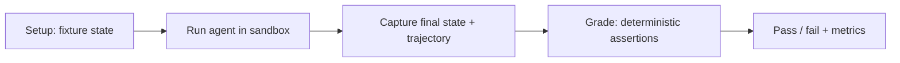
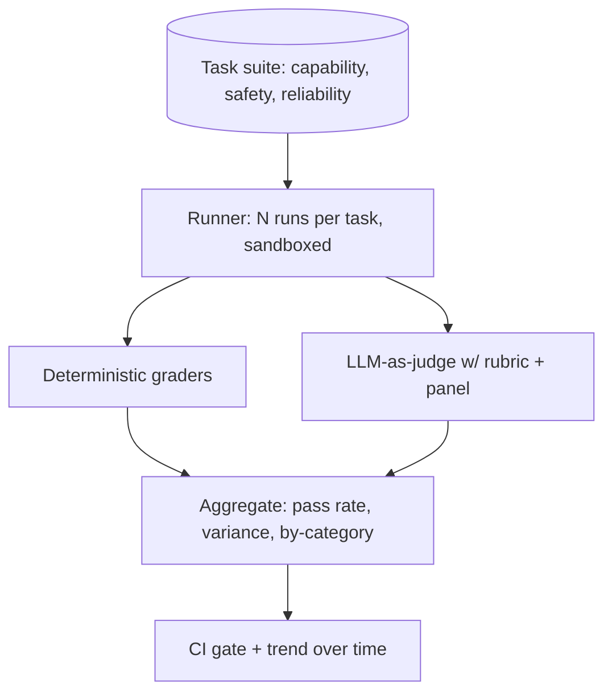

## Introduction

In [Building a Red-Team Agent](/blog/building-a-red-team-agent/) I said the only honest way to know whether a red-team agent helps is to measure its operational uplift, and pointed here for how. This is that post. Evaluation is the unglamorous discipline that decides whether you can change a prompt or swap a model with confidence, or whether every deploy is a coin flip. For agents specifically, it is also genuinely hard, because everything that makes an agent useful also makes it difficult to measure.

I treat eval harnesses as core infrastructure, on the same tier as the agent loop itself. An agent you cannot evaluate is an agent you cannot improve, secure, or trust. Here is how I build the harness.

## Why Agent Evaluation Is Hard

A traditional model eval is input, output, compare to a label. Agents break all three assumptions:

- **Non-determinism.** The same input can produce different trajectories on different runs. A single pass tells you almost nothing.
- **Multi-step trajectories.** The agent takes many actions to reach a result. Two runs can reach the same answer by very different paths, one safe and one reckless.
- **Open-ended tasks.** "Fix the bug" has many valid solutions and no single ground-truth string to diff against.
- **Tool side effects.** The output is not text, it is a changed world: files written, calls made. You have to inspect state, not read a reply.

So you cannot evaluate an agent the way you evaluate a classifier. You have to evaluate what it accomplished and how.

## Outcome Versus Trajectory

There are two things worth measuring, and you usually want both.

**Outcome evaluation** checks the end state. Did the task get done. After "make the failing test pass," you run the test suite and assert green. This is robust precisely because it ignores the path: any trajectory that ends in a passing suite counts. Outcome checks are the backbone of a good harness because they are objective and hard to game.

**Trajectory evaluation** checks the path. Did the agent use the right tools, stay within policy, avoid dangerous actions, finish in a reasonable number of steps. You need this for anything where the journey matters, especially safety, because an agent that reaches the right answer by trying to exfiltrate data along the way has not actually passed.

Lead with outcome checks where you can express them, and add trajectory checks where the path carries risk.

## Building Task-Based Evals

The unit of an agent eval is a task: a defined starting state, the agent run, and an assertion on the final state.

Concretely, for a coding agent: a task sets up a repo with a failing test, runs the agent against it in a [sandbox](/blog/sandboxing-agent-tool-execution/), then asserts the test passes and nothing outside the allowed scope changed. The grader is plain code, deterministic, fast, unambiguous. Prefer deterministic graders wherever the task allows it, a test runner, a schema validator, a string match, an API assertion. They never disagree with themselves, and they cannot be talked out of a verdict.

Running in a sandbox is not just safety here, it is reproducibility. A clean, isolated fixture per task means runs do not contaminate each other and a failure is attributable to the agent, not to leftover state.

## LLM-as-Judge

Some criteria resist deterministic grading: is this summary faithful, is this explanation clear, is this response helpful. For those, you use a model as the grader, with a rubric.

It works, but it has known biases you must design around. Judges favor longer answers, favor the first option in a comparison, and favor outputs that resemble their own style. Mitigate by giving the judge a concrete rubric rather than "rate this 1 to 10," anchoring with reference answers, randomizing position in pairwise comparisons, and using a panel of independent judgments rather than one. And validate the judge itself against human labels on a sample, a judge you have not checked is a ruler you have not measured. Treat LLM-as-judge as a useful estimator with error bars, not as ground truth.

## Capability, Safety, and Reliability

A complete harness measures three different things, and they trade off against each other:

| Axis | Question | How |
|------|----------|-----|
| Capability | Can it do the task | Outcome evals on real tasks |
| Safety | Does it refuse and contain misuse | Adversarial suite from red-teaming, measure misuse resistance and false-refusal rate |
| Reliability | Does it succeed consistently | Run each task N times, measure pass rate and variance |

Reliability is the axis non-determinism forces on you and the one teams skip. Because the same input can take different paths, a task that passes once might pass only sixty percent of the time. Run each eval multiple times and report the pass rate and its variance, not a single binary. A capable-but-flaky agent and a slightly-less-capable-but-consistent agent are very different products, and only repeated runs reveal which one you have.

The capability and safety axes pull against each other: the easiest way to raise misuse resistance is to refuse more, which lowers capability via false refusals. Measuring both is the only way to see the tradeoff instead of optimizing one into the ground.

## Regression and Drift

Once you have a harness, wire it into CI. Every prompt change, model swap, or dependency bump runs the suite, and a drop in the pass rate blocks the change. This is what makes iteration safe: you can refactor a system prompt or move to a new model and know within minutes whether you broke something.

It also catches drift. Providers update models behind stable names, and behavior shifts under you. A scheduled run of the harness against production models surfaces silent regressions you would otherwise discover from user complaints. Lock your evals, version them, and treat a falling score the way you treat a failing test, because that is what it is.

## Avoiding the Traps

Eval numbers lie in predictable ways. Watch for these:

- **Benchmark overfitting.** Tuning prompts until they ace your eval set produces a system good at your evals and not at the real task. Keep a held-out set you do not tune against.
- **Contamination.** If your eval tasks have leaked into training data, scores are inflated and meaningless. Prefer fresh, private tasks for anything load-bearing.
- **Gaming the judge.** When the grader is a model, optimization pressure finds its biases, verbose, confident, well-formatted answers that are not actually better. Anchor judges with deterministic checks wherever possible.
- **Vanity metrics.** A high average on easy tasks hides failure on the hard ones. Segment by difficulty and report the distribution, not just the mean.

The honest move when a harness has a known blind spot is to say so. A silent gap in coverage reads as "we tested everything" when you did not.

## The Harness

## Key Takeaways

**Agents resist measurement, so measure outcomes and behavior, not outputs.** Non-determinism, multi-step paths, and open-ended tasks mean you inspect the final state and the trajectory, not a single reply.

**Lead with deterministic, outcome-based graders.** A test runner or schema check is objective, fast, and ungameable. Use them as the backbone and reserve LLM-as-judge for genuinely fuzzy criteria.

**Treat LLM-as-judge as an estimator with biases.** Rubrics, reference anchors, randomized positions, panels, and validation against human labels. A judge you have not checked is not ground truth.

**Measure capability, safety, and reliability separately.** They trade off. Run each task many times to get reliability; without repeated runs you are reporting a coin flip as a fact.

**Wire the harness into CI and watch for drift.** Locked, versioned evals turn prompt and model changes from gambles into checked diffs, and catch silent provider-side regressions before users do.

**Name your blind spots.** Overfitting, contamination, judge-gaming, and vanity averages all make numbers lie. The harness is only as honest as what you admit it does not cover.

The harness is what lets you ship an agent and sleep. Build it alongside the agent, not after, because the first time you need to know whether a change helped or hurt, you will wish you already had it.
