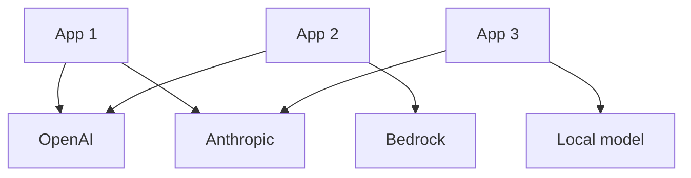
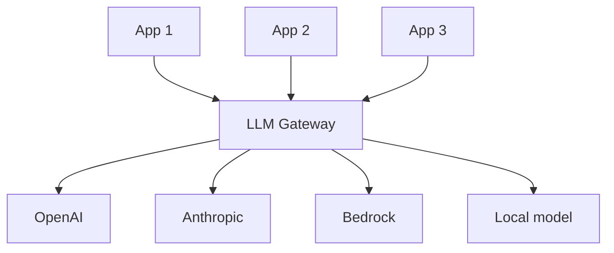
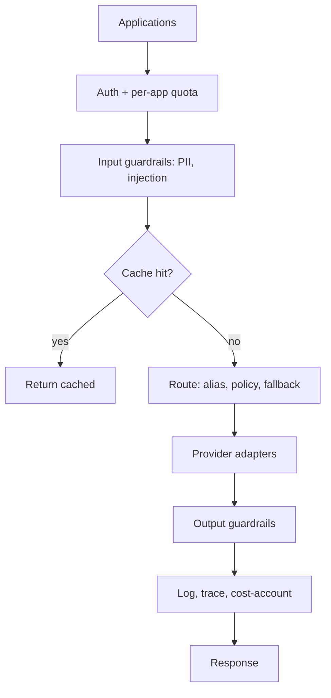

## Introduction

In [How LLM Inference Engines Work](/blog/how-llm-inference-engines-work/) I covered what happens inside a single model serving a single request. This post is about the layer above that: what you put in front of many models serving many applications. Once you have more than one app calling more than one provider, every app starts reinventing the same plumbing, auth, retries, fallbacks, cost tracking, redaction, and you get an inconsistent, unobservable mess. The fix is a gateway: a single chokepoint that every LLM call flows through.

A gateway sounds like a thin proxy. It is not. Done right, it becomes the place where routing, safety, governance, and observability for all of your AI traffic live. It is the control plane for everything your organization sends to a model.

## The Problem a Gateway Solves

Without a gateway, the topology is N applications times M providers, and every cell of that matrix duplicates work:

Every app handles its own keys, its own retry logic, its own provider-specific request format, its own cost accounting. There is no central place to enforce a policy, see total spend, or swap a provider. A gateway collapses N times M into N plus M: apps talk to one endpoint, the gateway talks to every provider.

## One Endpoint, Many Providers

The foundation is a provider abstraction. The gateway exposes one stable request and response shape, usually an OpenAI-compatible API since that is the de facto standard, and translates internally to each provider's native format: Anthropic's messages API, Bedrock, Vertex, or a local server like Ollama or vLLM. Applications write to one interface and never learn the quirks of seven SDKs.

This abstraction is what makes everything downstream possible. Because every call goes through one shape at one point, you have exactly one place to add routing, safety, and metering.

## Routing and Fallbacks

With all traffic centralized, the gateway can decide where each request actually goes:

- **Model aliases.** Apps request `fast` or `smart`, and the gateway maps those to concrete models. You can re-point an alias to a new model for every app at once, without touching app code.
- **Policy routing.** Route by cost, latency, capability, or context-length requirements. Cheap models for cheap tasks, frontier models only where needed.
- **Fallback chains.** When the primary provider fails, fail over automatically. As I described in [Building an AI Agent Platform](/blog/building-an-ai-agent-platform-from-scratch/), the key is classifying the error: rate limits back off and rotate keys, auth and billing failures jump to a different provider, timeouts retry, malformed requests fail fast. The gateway is the natural home for that logic because it sees every error from every provider.
- **Key rotation.** A pool of keys per provider with health tracking and cooldowns, so one rate-limited key does not take down an app.

## Guardrails at the Gateway

The gateway is the right place to enforce safety, because it is the one point every request and response must pass through. Put the guardrails here and no application can bypass them:

- **Input screening.** PII detection and redaction before prompts leave your boundary, and injection screening on untrusted content (see [Detecting Prompt Injection](/blog/detecting-prompt-injection/)).
- **Output filtering.** Scan responses for leaked secrets, PII, or policy violations before they reach the user.
- **Content policy.** Centralized rules applied uniformly, rather than each app implementing its own and getting it subtly wrong.

I have built exactly this, a gateway deployment with PII guardrails inline, and the lesson is that centralizing redaction is what makes it trustworthy. A guardrail that lives in one app is a guardrail that the next app forgets. A guardrail at the gateway covers everything by construction.

## Quotas and Access Control

Centralization also gives you governance. The gateway issues per-application credentials and enforces what each one can do:

- **Per-app keys and budgets.** Each consumer gets its own credential, its own rate limit, and its own spend cap. One runaway batch job cannot drain the account.
- **Access policies.** IAM-style rules for which apps can use which models, which is how you keep a low-trust internal tool off a frontier model, or keep regulated data away from a particular provider.
- **Quotas.** Hard ceilings that protect both cost and upstream rate limits.

This is the difference between "we have an OpenAI key in an env var" and "we have governed, attributable, capped access to AI across the organization."

## Observability

You cannot operate what you cannot see. Because every call flows through the gateway, it is the one place to capture complete telemetry: request and response logging (with redaction), token and cost accounting per app and per model, latency and error rates, and traces that tie a model call back to the user request that caused it. When spend spikes or quality drops, the gateway logs are where you find out which app, which model, and which prompt. Instrumenting this at the gateway means you get it for free for every consumer, instead of begging each team to add tracing.

## Caching

A gateway can cache, which cuts both cost and latency. Exact-match caching returns a stored response for an identical request. Semantic caching matches near-duplicate prompts by embedding similarity, which catches more hits but risks returning a subtly wrong answer for a prompt that only looked similar. Use exact-match freely; use semantic caching deliberately, with a tight similarity threshold, and never for requests where correctness depends on small wording differences.

## The Full Picture

Every box is something each application would otherwise build, badly, on its own. The gateway builds it once.

## Key Takeaways

**A gateway turns N times M into N plus M.** Apps talk to one endpoint; the gateway talks to every provider. That single consolidation is what makes everything else possible.

**Provider abstraction is the foundation.** One OpenAI-compatible surface, translated internally to each provider. Apps never learn seven SDKs, and you get one place to add control.

**Routing and fallback belong at the gateway.** Aliases, policy-based routing, error-classified fallback chains, and key rotation all live where every call and every error is visible.

**Guardrails at the chokepoint cannot be bypassed.** PII redaction, injection screening, and output filtering at the gateway cover every app by construction. The same control in one app is one app's control.

**Governance and observability come for free.** Per-app keys, budgets, quotas, and complete telemetry are the payoff for centralization. You get attributable, capped, observable AI access instead of a key in an env var.

A gateway starts as a convenience and becomes load-bearing. Build it before you have ten apps each solving these problems differently, because retrofitting governance onto a sprawl is far harder than routing through one door from the start.
