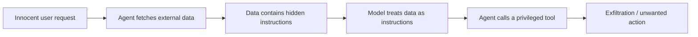
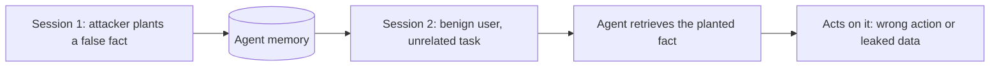
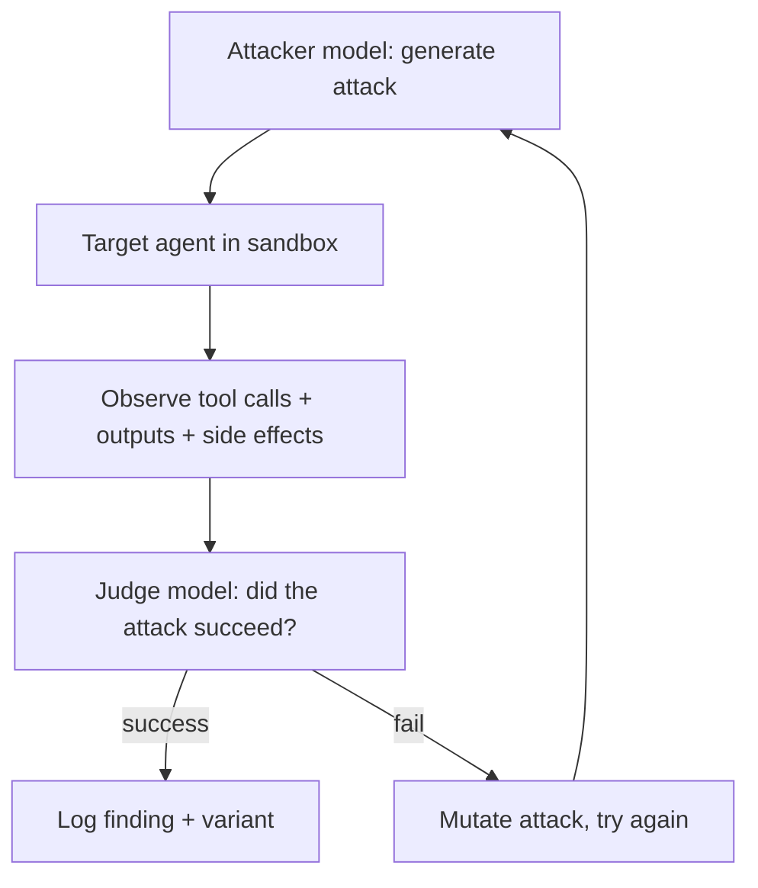

## Introduction

Most published "AI red teaming" is really content red teaming: get a chatbot to say something it should not. That is a real problem, but it is the wrong threat model for agents. When a system can call tools, read external data, remember across sessions, and hand off to other agents, the dangerous failures are not words. They are actions. An agent does not need to say anything harmful to wire money to the wrong account, exfiltrate a repository, or run a command it was tricked into running.

I work on securing agentic systems, and red-teaming is how you find out where they break before someone else does. This post is about adversarial testing of agents you own or are authorized to test, with the goal of hardening them. The mindset is offensive, the purpose is defensive, and the target is capability misuse, not just content.

## Why Agent Red-Teaming Is Different

A chatbot has one input and one output. You attack the prompt, you read the response, done. An agent is a loop with a growing state, a set of capabilities, and multiple channels through which untrusted data enters. That changes everything about how you test it.

| Dimension | Chatbot red team | Agent red team |
|-----------|------------------|----------------|
| Harm | Harmful text output | Harmful actions in the world |
| Surface | The user prompt | Prompt, tools, tool outputs, memory, retrieval, handoffs |
| Turns | Usually single-turn | Multi-turn, stateful, cross-session |
| Entry point | The user | Often a third party via the data the agent reads |
| Success signal | A bad string | A side effect: a call made, a file sent, a fact implanted |

The implication: you cannot evaluate an agent by reading its replies. You have to watch what it does, which means running it in an instrumented, [sandboxed](/blog/sandboxing-agent-tool-execution/) environment where every tool call is observable and contained.

## The Agent Attack Surface

Enumerate the surface before you attack it. Every place untrusted data or instructions can enter is a target:

- **System prompt and configuration.** Can an attacker extract it, and does it leak tool definitions or secrets it should not contain.
- **Direct user input.** Classic override and jailbreak attempts.
- **Tool outputs.** As I covered in [Prompt Injection: Direct vs. Indirect](/blog/prompt-injection-direct-vs-indirect/), a tool that returns attacker-controlled content can inject instructions into the loop. Search results, fetched pages, file contents, API responses.
- **Retrieved context (RAG).** A poisoned document in the knowledge base influences every query that retrieves it.
- **Memory.** If the agent stores facts across sessions, an attacker who can write to memory can plant something that fires much later, in a different context, against a different user.
- **Multi-agent handoffs.** When one agent passes work to another, the receiving agent may trust the sender's output more than it should.
- **The sandbox boundary itself.** Can a tool call escape its container, reach the host, or pivot to the internal network.

## Single-Turn Versus Multi-Turn Attacks

Single-turn attacks are the easy case and the one most testing stops at. The harder, more realistic attacks unfold over multiple turns:

- **Gradual escalation.** Establish a benign frame over several turns, then push past the boundary once the model has committed to the persona.
- **Context poisoning.** Feed the agent data early that biases how it interprets a legitimate request later.
- **Memory implantation.** Get the agent to store a false or malicious fact, then trigger it in a future session. This is the attack that single-turn testing cannot find by construction.

If your red team only sends one prompt at a time, you will miss the entire class of failures that make agents distinctly dangerous.

## Attack Flow: Indirect Injection to Action

The canonical agent attack chains a benign user request to a harmful action via poisoned data:

The user asked for something reasonable. The harm came from data the agent read in service of that request. A good red team builds a library of these chains: poisoned-page-to-exfil, malicious-document-to-misreport, tool-output-to-shell-command, and runs them against the target with the real toolset enabled but contained.

## Attack Flow: Memory Implantation

The memory attack is worth calling out because it is uniquely agentic:

This is why I argued in [Agent Memory Architectures](/blog/agent-memory-architectures/) that write-time handling of facts, deduplication, contradiction resolution, and provenance, is a security control and not just a quality feature. A memory write path with no validation is a persistence mechanism for attackers.

## Building a Red-Team Harness

Manual red-teaming finds the first few bugs. To find the long tail, you automate it. The pattern I use is a loop of three roles:

The attacker generates adversarial inputs, including multi-turn flows and poisoned tool outputs. The target runs the real agent in a contained sandbox so any successful action is observed but harmless. The judge evaluates the outcome against a clear success criterion, did a forbidden tool fire, did data leave the boundary, was a false memory stored, not just whether the text looked bad. Failed attacks get mutated and retried, so the harness explores the space instead of replaying a fixed list.

This is the difference between a static checklist and an adversary that adapts. The agentic structure is what lets it find the variants a human would not think to type.

## What to Measure

Red-teaming without metrics is anecdote. Track outcomes you can compare across versions:

| Metric | What it tells you |
|--------|-------------------|
| Attack success rate, by category | Where the system is weakest (injection, memory, escalation) |
| Misuse resistance rate | Share of attacks the system correctly refused or contained |
| Blast radius on success | When an attack works, how far did it get |
| False-refusal rate | How often legitimate requests get blocked by the defenses |
| Time-to-first-success | How hard the attacker had to work |

The false-refusal rate is the one teams forget. A system that refuses everything is "secure" and useless. Security is a tradeoff curve between misuse resistance and legitimate utility, and you have to measure both ends to know where you are on it. Building repeatable measurement is its own discipline, which I will take up in a separate post on evaluation harnesses.

## From Findings to Defenses

Findings are only valuable if they map to controls. The defenses are the layered ones from the rest of this series:

- Injection that rides in on data, wrap untrusted content and treat tool output as data, never instructions.
- Privileged tool fired from injected instructions, privilege separation and a policy engine that denies by default.
- Action with real-world impact, human-in-the-loop approval for sensitive operations.
- Command escaped its boundary, [sandbox](/blog/sandboxing-agent-tool-execution/) the execution and control egress.
- False memory persisted, validate the memory write path and keep provenance.

Each finding should close with a specific control and a regression test in the harness, so the next version cannot reintroduce it silently.

## Key Takeaways

**Agents fail through actions, not words.** Red-team the capabilities, tools, memory, retrieval, handoffs, not just the chat output. The harm is a side effect, so you have to instrument and observe side effects.

**The data is the adversary.** The most important attacks enter through content the agent reads, not through the user. Test poisoned pages, documents, tool outputs, and RAG sources.

**Multi-turn and cross-session attacks are the agentic ones.** Gradual escalation and memory implantation are invisible to single-prompt testing. If you only send one prompt, you are testing a chatbot.

**Automate with an attacker-target-judge loop.** A static list finds the obvious bugs. An adaptive harness that mutates attacks and judges real outcomes finds the long tail.

**Measure both misuse resistance and false refusals.** Security is a tradeoff against utility. A number for only one side hides whether you actually improved the system.

Run all of this against systems you own or are authorized to test. The goal is to be the one who finds the chain that turns a polite request into a harmful action, before it finds you in production.
