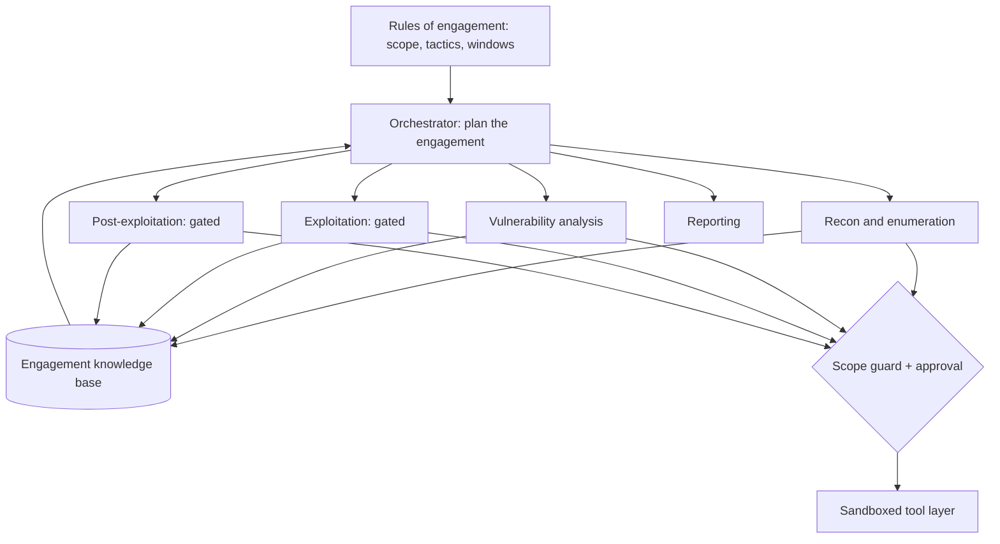

## Introduction

Most of this series looks at agents as the thing under attack: how to sandbox them, how they get injected, how to harden them. This post flips the direction. A red-team engagement is a long, adaptive, tool-heavy process: discover what is there, figure out what is weak, try to validate it, move, and report. That shape, observe and decide and act and repeat, is an agent loop. So the question is whether you can build an agentic system that runs that loop, and what it takes to do it without building a weapon.

I build red-team tooling, and the honest answer is that the offensive capability is the easy part. The hard part, and the part that separates a useful red-team agent from a liability, is scope enforcement, containment, and human control. So this post covers both: the agent architecture that maps to a real engagement, and the guardrails that keep it inside the rules of engagement. Everything here assumes you are testing systems you own or are explicitly authorized to test.

## Why Red Teaming Is an Agent Problem

A traditional engagement is not a fixed script. The operator observes (recon), orients (what does this tell me), decides (what is the highest-value next move), and acts (run a tool), then loops on whatever came back. You cannot pre-list the steps because they depend on what you find. That is exactly the profile of an [agent loop](/blog/anatomy-of-an-agent-loop/): a model that plans, calls tools, reads results, and continues until an objective is met. Of the [agent patterns](/blog/building-effective-agents-in-practice/), red teaming lives at the autonomous end, an orchestrator over an open loop, because the subtasks are discovered, not predefined.

That is also why it is hard to do safely. An open-ended agent holding offensive tools is powerful and unpredictable, so the safety story has to come from containment and control, not from a fixed workflow.

## Scope and Authorization Are the Architecture

Put this first, because it is what separates a red-team tool from something you should not build. Before any capability, the agent needs:

- **Rules of engagement as enforced config.** An explicit target allowlist (domains, IP ranges, accounts), permitted tactics, time windows, and excluded systems. Not a prompt instruction the model can be talked out of, a hard gate.
- **A scope guard on every action.** Every tool call is checked against the allowlist before it runs. An action against an out-of-scope target is denied at the runtime layer, the same way a [policy engine](/blog/building-an-ai-agent-platform-from-scratch/) gates tool calls, never left to the model's judgment.
- **Human approval gates** for anything destructive or high-impact. The agent proposes; an operator approves.
- **A kill switch and a full audit log.** Every action, target, and result recorded, with the ability to stop the engagement instantly.

If the model is the part that decides what to try, the runtime is the part that decides what is allowed. Keep those separate and the agent cannot wander out of scope no matter how it is prompted or what a tool returns.

## The Architecture

A red-team agent is an orchestrator over phase workers, sharing an engagement knowledge base, with every tool call passing through the scope guard and, where required, a human gate.

The orchestrator owns the plan and decides which phase to advance. Each phase is a worker agent with a focused toolset and prompt. Findings flow into a shared knowledge base that later phases query. Every tool call is mediated by the scope guard and, for impactful actions, an approval gate.

## The Capability Layer

The tools are where the offensive capability lives, and where most of the safety engineering goes. Organize them by phase, and treat each as a scoped, sandboxed interface that returns structured findings rather than raw, unbounded power:

- **Reconnaissance:** asset and service discovery, returning a structured inventory of hosts, ports, and technologies.
- **Enumeration:** deeper probing of discovered services for configuration and version detail.
- **Vulnerability analysis:** correlating findings against known-issue data to rank what is worth attention.
- **Exploitation (gated):** attempting to validate a finding, behind an approval gate and confined to scope.
- **Post-exploitation (gated):** controlled validation of impact, with destructive actions disabled by default.
- **Reporting:** turning the knowledge base into a structured, evidence-backed report.

Two engineering rules matter here. First, tools return structured data, not free text, so the orchestrator reasons over findings instead of parsing prose. Second, the dangerous tools sit behind the scope guard and approval gate by construction, so the model cannot invoke them out of bounds. The agent's job is to decide what is worth trying and to chain findings together; the tools and gates decide what is actually permitted.

This is the architecture of such a system, not a how-to for any individual exploit. The specifics of validating a given vulnerability belong to the vetted tools a professional already uses under authorization, not to an autonomous agent's open-ended discretion.

## Planning With a Standard Taxonomy

Red teams already share a language for tactics: [MITRE ATT&CK](https://attack.mitre.org/). Using it as the planning taxonomy gives the orchestrator a structured space to reason over (reconnaissance, initial access, privilege escalation, lateral movement, exfiltration, impact) and gives the report a mapping defenders already understand. The plan becomes "advance coverage across these tactics, within scope," and every finding gets tagged to a technique, which is exactly what a blue team needs to act on.

## The Engagement Knowledge Base

A red-team agent is only as good as what it remembers. As phases run, findings accumulate: hosts, services, credentials discovered, vulnerabilities, and the relationships between them. This is the same [agent memory](/blog/agent-memory-architectures/) problem with a security twist: the store is the engagement state, and later phases query it ("which hosts expose this service", "what could reach this segment"). Structured, queryable memory is what lets the agent chain a finding from recon into a hypothesis in exploitation, which is the part that actually mimics how an operator works.

## Containment and Honesty

Even fully authorized, the agent must be contained:

- **Sandbox the agent's own execution** and route egress through a controlled path, so it cannot reach beyond the engagement network. The same [sandboxing](/blog/sandboxing-agent-tool-execution/) that protects a host from an agent keeps a red-team agent inside its lane.
- **Dry-run by default.** Impactful actions are proposed and logged before they can run, and require an explicit approval to execute.
- **No silent failure.** If the agent could not complete a step, the report says so rather than inventing a result. A red-team agent that hallucinates vulnerabilities is worse than none.
- **Evidence for every finding.** Each claim ties to captured output, so a human can verify it.

## Does the Agent Actually Help?

The point of a red-team agent is operational uplift, and that has to be measured, not assumed. On a known target with known issues, track coverage (how much of the scope it actually exercised), finding quality (true positives versus noise), false-positive rate, time-to-first-finding, and how often a human had to intervene. An agent that surfaces ten findings, eight of which are noise, has negative value, because triage costs more than it saves. Building that measurement is its own discipline, which I cover in [Evaluation Harnesses for Agent Behavior](/blog/evaluation-harnesses-for-agent-behavior/).

## Key Takeaways

**Red teaming is an agent-shaped problem.** Observe, orient, decide, act, repeat, over a path you cannot predict, is an agent loop with offensive tools and an engagement memory.

**Scope enforcement is the architecture, not a setting.** A target allowlist and a runtime scope guard on every action, plus human gates for impactful steps, are what separate a red-team tool from a weapon. The model decides what to try; the runtime decides what is allowed.

**Gate the dangerous capabilities by construction.** Exploitation and post-exploitation sit behind approval and scope checks, sandboxed and egress-controlled, so the agent cannot act out of bounds regardless of prompt or input.

**Memory is the engagement state.** Structured, queryable findings are what let the agent chain recon into exploitation the way an operator would.

**Measure operational uplift.** Coverage, finding quality, false positives, and human-intervention rate decide whether the agent helps or just makes noise.

Build this only against systems you own or are explicitly authorized to test. Done right, an agentic red-team system is force multiplication for an operator who is already authorized to do the work, not a substitute for authorization or judgment.
